##  常见的MIME类型

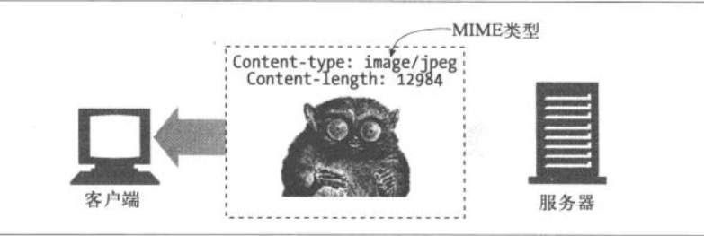

- HTML的格式由text/html类型标记
- 普通的ASCII文本由text/plain类型标记
- JPEG的图片为image/jpeg类型
- GIF的图片为image/gif类型

##  URL的标准格式

1. URL的第一部分被称为方案，说明了访问资源所使用的协议类型，这个通常是http协议；
2. 第二部分给出了服务器的因特网地址（比如：www.baidu.com）；
3. 其余部分指定了服务器的某个资源（例如：xxx.com/index.html)。

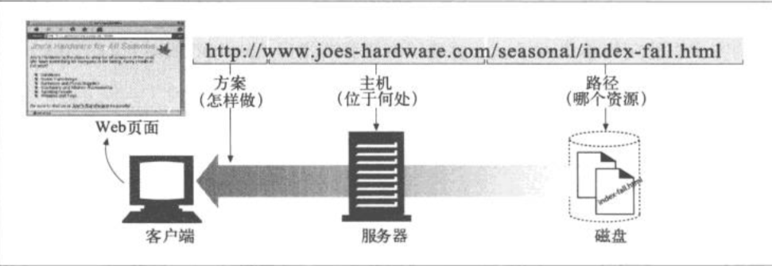

URL提供了一种统一的资源命名方式，“方案：//服务器位置/路径“结构。

##  HTTP事务

我们把一条（从客户端发往服务器的）请求命令和一条（服务器发往客户端的）响应结果称为一条HTTP事务，这种通信是通过名为HTTP报文的格式化数据块进行的。应用程序在完成一项任务时通常会发布多个HTTP事务，比如会发布一个事务来获取页面布局的HTML“框架”、发布一个事务来获取图片、静态资源等。

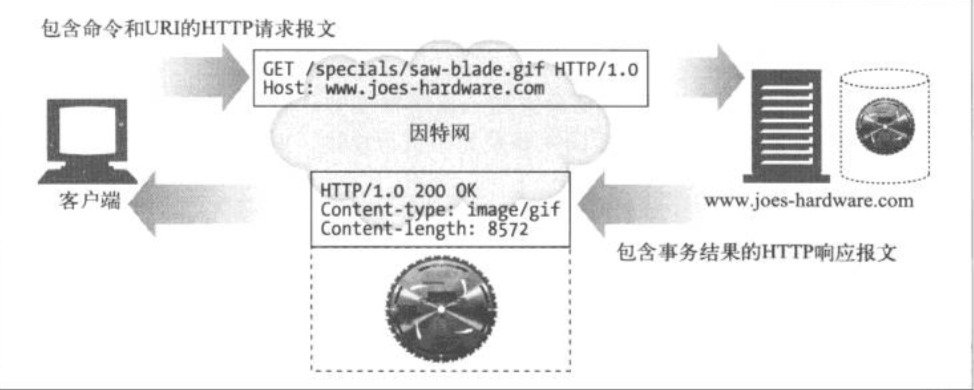

##  输入一个URL后发生了什么

1. 浏览器从URL中解析出服务器的主机名；
2. 浏览器将服务器的主机名转换成服务器的IP地址（DNS）；
3. 浏览器将端口（if exist)从URL中解析出来；
4. 浏览器建立一条与Web服务器的TCP连接；
5. 浏览器向服务器发送一条HTTP请求报文；
6. 服务器向浏览器回送一条HTTP响应报文；
7. 关闭连接，浏览器显示报文。

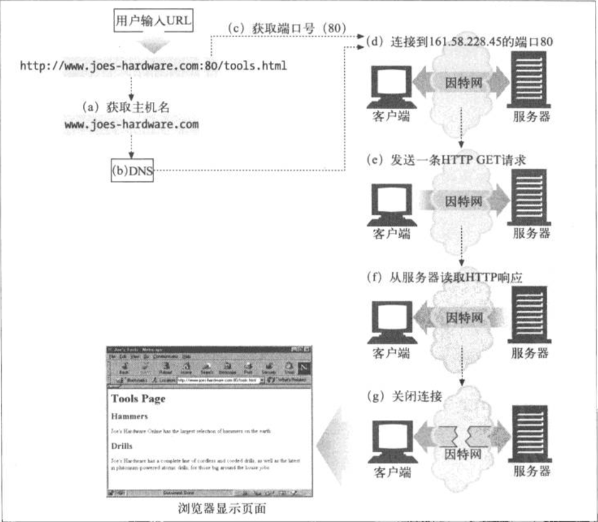

##  自动扩展URL

###  主机名扩展

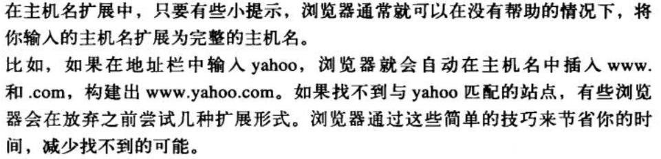

###  历史扩展

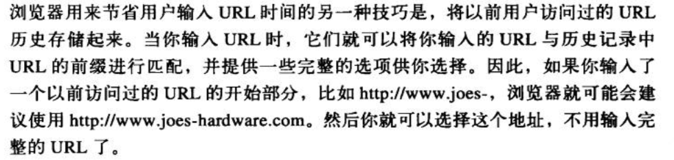

##  报文向下游流动

HTTP报文会像河水一样流动，不管是请求报文还是响应报文，所有报文都会向下游（downstream）流动，所有报文的发送者都在接收者的上游。

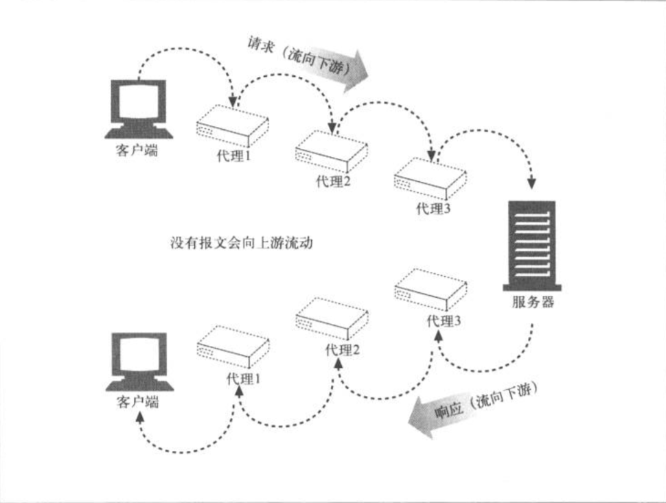

##  报文的组成部分

HTTP报文是简单的格式化数据块，由三个部分组成，对报文进行描述的起始行、包含属性的首部块，以及可选的、包含数据的主体（body）部分。

ps：content-type说明了主体是什么，content-length说明了主体有多大。

###  报文的格式

请求报文格式：
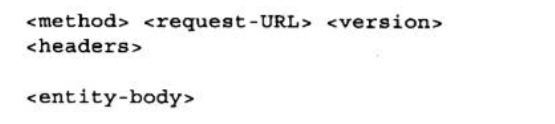

- method：请求方法，例如GET/POST/DELETE等

- request-URL：请求资源

- version：报文所使用的http版本

响应报文格式：
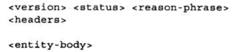

- status_code：响应状态码
- reason-phrase：响应状态码的可读版本
- header：首部
- entity-body：实体的主体部分

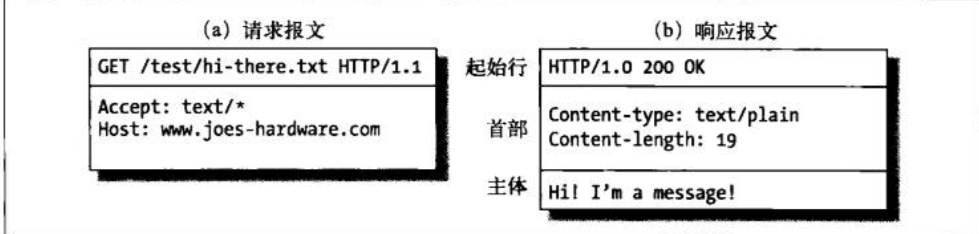

##  TCP连接

世界上几乎所有的HTTP通信都是由TCP/IP承载的，客户端应用程序可以打开一条TCP/IP连接，连接到可以运行在世界任何地方的服务器应用程序，一旦连接建立起来了，在客户端和服务器的计算机之间交换的报文就永远不会丢失、受损或失序。

HTTP要传送一条报文时，会以流的形式将报文数据的内容通过一条打开的TCP连接按序传输，TCP收到流之后，会将数据流砍成被称作段的小数据块，并将段封装在IP分组中，通过因特网来进行传输。每个TCP段都是由IP分组承载，从一个IP地址发送到另一个IP地址。

TCP连接是通过4个值来进行识别的，<源IP地址、源端口号、目的IP地址、目的端口号>，这4个值唯一标识了一条连接
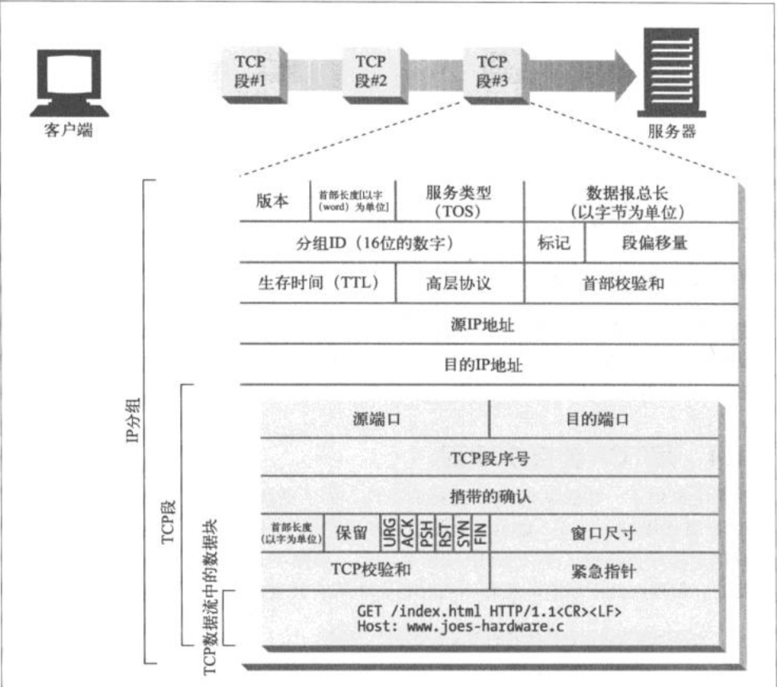

##  TCP编程

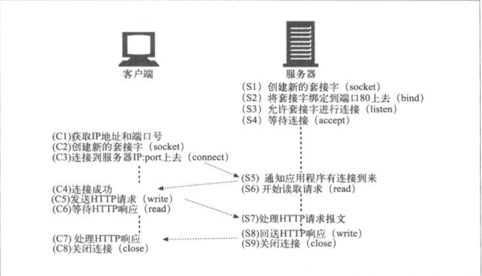

ps：tcp连接是有时延的。

##  连接方式

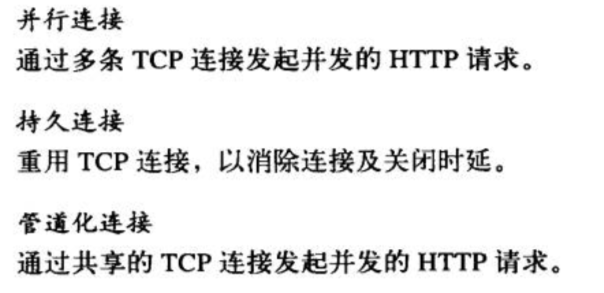

先看一下串型加载，可以看到用户对于装载的进度一无所知，面对的很可能是一片空白。
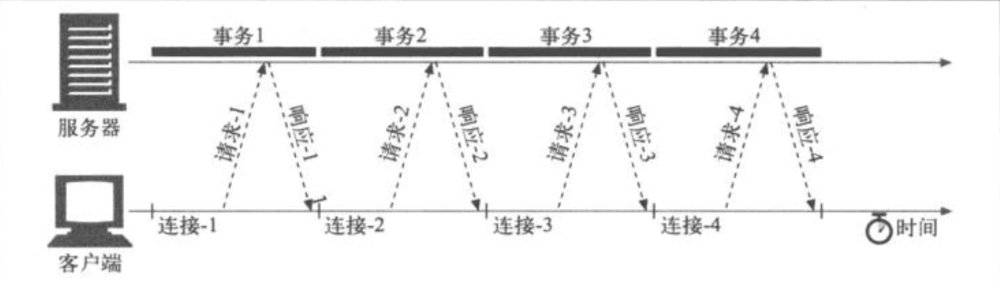

###  并行连接

HTTP允许客户端打开多条连接，并行地执行多个HTTP事务，可以看出用户可以看到不同事务的响应的进度都在加载，会让“用户”感觉快一点：

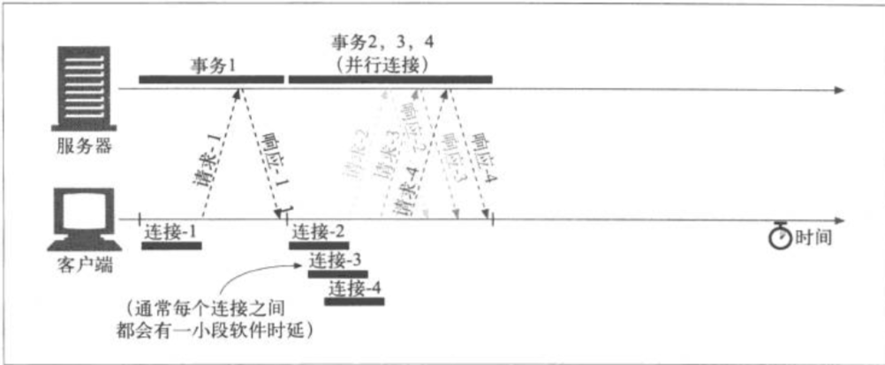

从图片上看并行只有在连接时会有一小段时延，整体速度相比于串型提升了不少，但是如果在大量用户大量连接下，这样的方式会造成服务器的性能严重下降。

###  持久连接

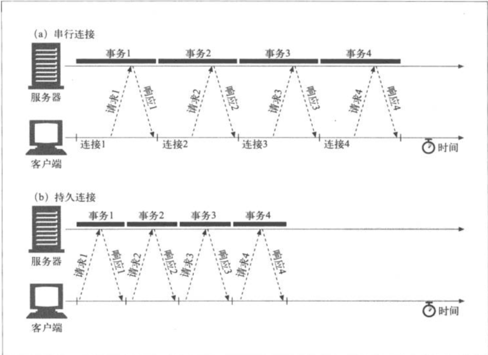
HTTP1.1（以及HTTP1.0的各种增强版本）允许HTTP在事务处理结束之后将TCP连接保持在打开状态，以便未来的HTTP请求重用现存的连接，在事务处理完成之后仍然保持连接在打开状态的TCP连接称为持久连接，直到客户端或服务器决定其关闭为止。

持久连接降低了时延和连接建立的开销，将连接保持在已调谐状态，而且减少了打开连接的潜在数量，但是管理持久连接时要非常小心，不然就会累积出大量的空闲连接，耗费本地客户端以及远程服务器的资源。

持久连接有两种类型，一种是HTTP/1.0+keep-alive，一种是HTTP/1.1。

1. 实现HTTP/1.0 keep-alive连接的客户端可以通过包含Connection：Keep-Alive首部请求将一条连接保持在打开状态。如果服务器愿意为下一条请求将连接保持在打开状态，就在响应中包含相同的首部，如果没有，客户端就会认为服务器不支持keep-alive，则在收到响应报文后关闭连接。
   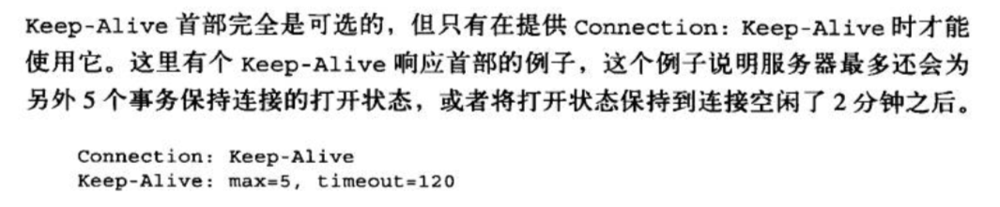

2. HTTP1.1在默认情况下是激活持久连接的，除非特别指明，否则则假定所有连接都是持久的，要在事务处理结束之后关闭，则必须显示添加一个Connection：close首部，这是与之前很重要的区别。并不是说必须收到Connection: close才能关闭，客户端和服务器仍然可以随时关闭空闲的连接。

###  管道化连接

HTTP1.1允许在持久化连接上可选地使用管道连接，这是在keep-alive上的进一步优化，在响应到达之前，可以将多条请求放入队列，当第一条请求发送时，第二条第三条也可以开始发送了
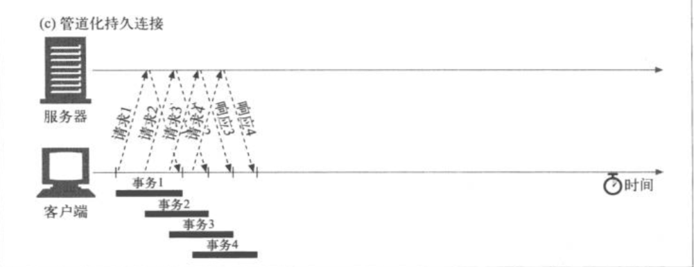

管道化连接的要求：

1. 必须是持久连接；
2. 必须按照与请求相同的顺序回送响应；
3. 客户端必须做好连接随时关闭的准备，还要准备好重发所有未完成的管道化请求；
4. 不应该用管道化的方式发送会产生副作用的请求（POST、DELETE）。

缺点：

客户端将大量请求放入到队列里，如果此时服务器关闭连接那么就会剩下大量未处理的请求，需要重新调度，此时客户端也不知道有多少请求被服务器正确处理，而如果管道化连接不要求4，则会出现POST请求多次执行，出现重复下订单的情况。所以此时一定要保证幂等性。

ps：幂等性：一个事务不管执行一次还是多次，得到的结果都相同。

##  代理

代理使用同一种协议，网管则将不同的协议连接起来，代理既是服务器，又是客户端。
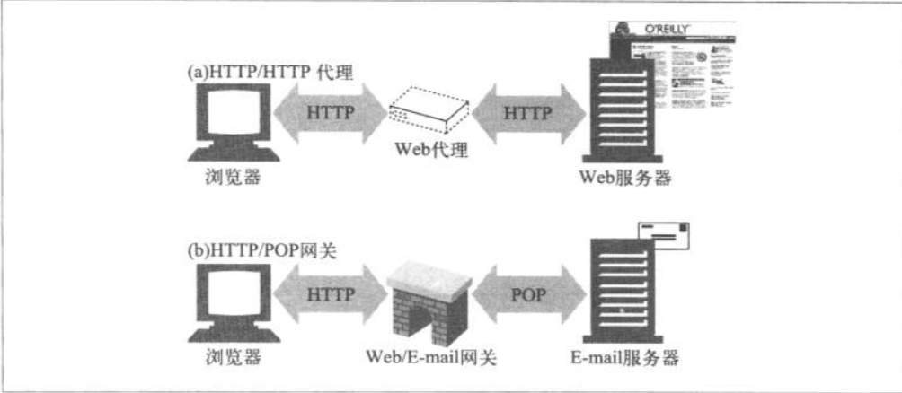

代理服务器可以改善安全性、提高性能、可以看到并接触所有流过的HTTP流量。

###  反向代理

通常会被部署在网络边缘，在Web服务器之前，作为替代物（也被称为反向代理），可以处理所有传送给服务器的请求，并只在必要时向Web服务器请求资源，替代物可以提高Web服务器的安全特性，或者将快速的服务器缓存放在处理比较慢的服务器前来提升访问速度，毕竟所有的请求都是发给代理而不是服务器。

##  缓存

1. 减少了冗余的数据传输，减少了网络费用
2. 缓解了网络瓶颈的问题，不需要更多的带宽就能够更快地加载页面
3. 降低了对原始服务器的要求，服务器可以更快地响应，避免过载的出现

