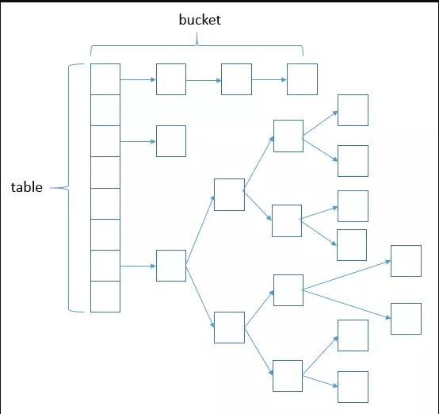
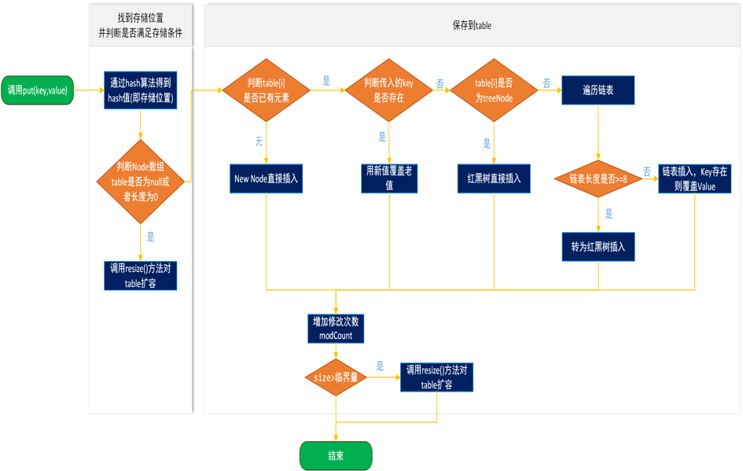
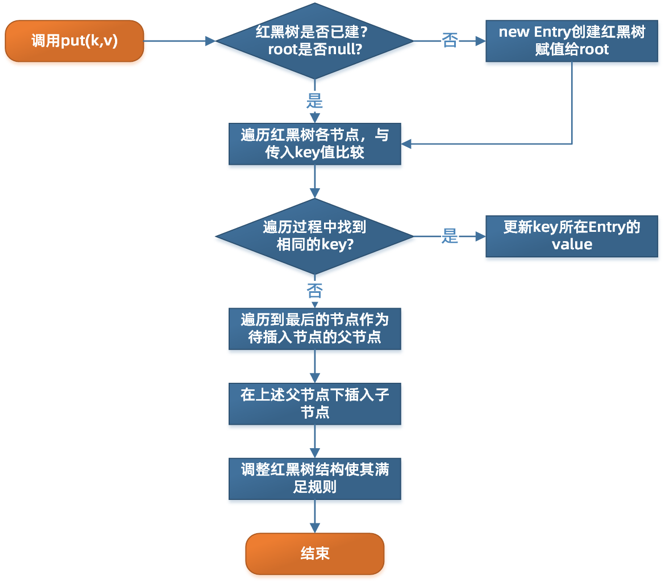

#  HashMap

##  源码详细分析



###  构造函数

```java
//无参构造方法
//构造一个空的HashMap，初始容量为16，负载因子为0.75
public HashMap() {
  this.loadFactor = DEFAULT_LOAD_FACTOR;
}
public HashMap(int initialCapacity) {
}
public HashMap(int initialCapacity, float loadFactor) {
  if(initialCapacity < 0) 
    throw Exception;
  if(initialCapacity > MAXIMUM_CAPACITY) 
    initialCapacity = MAXIMUM_CAPACITY;
  if(loadFactor <= 0 || FLoat.isNaN(loadFactor)) 
    throw Exception;
  this.loadFactor = loadFactor;
  this.threshold = tableSizeFor(initialCapacity);
}
```

###  tableSizeFor

```java
static final int tableSizeFor(int cap) {
  int n = cap - 1;
  n |= n >>> 1;
  n |= n >>> 2;
  n |= n >>> 4;
  n |= n >>> 8;
  n |= n >>> 16;
  return (n < 0) ? 1 : (n >= MAXIMUM_CAPACITY) ? MAXIMUM_CAPACITY : n+1;
}
```

###  成员变量

```java
transient Node<K,V>[] table;
transient int size;
transient int modCount;
int threshold;
final float loadFactor;
static final int MIN_TREEIFY_CAPACITY = 64;

/*
 HashMap 采用链表法避免哈希冲突，当链表长度大于TREEIFY_THRESHOLD(默认为8)并且当前数组长达大于MIN_TREEIFY_CAPACITY时，将链表转换为红黑树，否则就会进行table数组的扩容(resize)。
 当小于UNTREEIFY_THRESHOLD(默认为6)时，又会转回链表以达到性能平衡，
*/
```


###  key的hash

```java
static final int hash(Object key) {
  int h;
  return (key == null) ? 0 : (h = key.hashCode()) ^ (h >>> 16);
  //能够将hashCode高位和低位的值进行混合做异或运算，而且混合后，低位的信息中加入了高位的信息，能够使每一位数字都能够得到使用，那么生成的hash值的随机性会增大。
}
```

### resize

```java
final Node<K,V>[] resize() {
  //保存当前table
  Node<K,V> oldTab = table;
  int oldCap = (oldTab == null) ? 0 : oldTab.length;
  //保存当前阈值
  int oldThr = threshold;
  //初始化新的table容量和阈值
  int newCap, newThr = 0;
  if(oldCap > 0) {
    //若table容量已超过最大容量，更新阈值为Integer.MAX_VALUE，这样以后就不会自动扩容了
    if(oldCap >= MAXIMUM_CAPACITY) {
      threshold = Integer.MAX_VALUE:
      return oldTab;
    }
    //double oldCap
    else if((newCap = oldCap << 1) < MAXIMUM_CAPACITY && oldCap >= DEFAULT_INITIAL_CAPACITY)  {
      new Thr = oldThr << 1; //double threshold
    }
    //是指用户自己定义的
    else if(oldThr > 0) {
      newCap = oldThr;
    }
    //当table为空被调用
    else{
      newCap = DEFAULT_INITIAL_CAPACITY;
      newThr = (int)(DEFAULT_LOAD_FACTOR * DEFAULT_INITIAL_CAPACITY);
    }
  }
  Node<K,V>[] newTab = (Node<K,V>[]) new Node[newCap];
  table = newTab;
  if(oldTab != nul) {
    //把oldTab中的节点reHash到newTab中去
    for(int j = 0; j < oldTab; ++j) {
      Node<K,V> e;
      if((e = oldTab[j]) != null) {
        oldTab[j] = null;
        //若节点是单个节点，直接在newTab中进行重定位
        if(e.next == null) newTab[e.hash & (newCap - 1)] =e;
        //若节点是TreeNode节点，要进行红黑树的rehash操作
        else if(e instanceof TreeNode) 
          ((TreeNode<K,V>)e).split(this, newTab, j, oldCap);
        //若是链表，进行链表的rehash操作
        else{
          Node<K,V> loHead = null, loTail = null;
          Node<K,V> hiHead = null, hiTail = null;
					Node<K,V> next;
          ...
        }
      }
    }
  }
  return newTab;
}
```

我们使用的是2次幂的扩展，所以，与元素的位置要么是在原位置，要么是在原位置再移动2次幂的位置。

####  什么时候扩容？

通过HashMap源码可以看到是在put操作时，即向容器中添加元素时，判断当前容器中元素的个数是否达到阈值（当前数组长度 * 加载因子）的时候，就要自动扩容（重新计算容量，计算出所需容量的大小之后重新定义一个新的容器，将原来容器中的元素放入其中）了。

###  putval

```java
 final V putVal(int hash, K key, V value, boolean onlyIfAbsent,
                   boolean evict) {
        Node<K,V>[] tab; Node<K,V> p; int n, i;
        //如果table为空或者长度为0，则resize
        if ((tab = table) == null || (n = tab.length) == 0)
            n = (tab = resize()).length;
   			//确定插入table的位置，算法是(n-1) & hash,在n为2的幂时，相当于取余
   			//找到key值对应的槽并且是第一个，直接加入
        if ((p = tab[i = (n - 1) & hash]) == null)
            tab[i] = newNode(hash, key, value, null);
   			//在table的i位置发生碰撞，1.key值一样，替换value值
   			//2.key值不一样，链表或红黑树
        else {
            Node<K,V> e; K k;
            //第一个node的hash值即为要加入元素的hash
            if (p.hash == hash &&
                ((k = p.key) == key || (key != null && key.equals(k))))
                e = p;
            else if (p instanceof TreeNode)
                e = ((TreeNode<K,V>)p).putTreeVal(this, tab, hash, key, value);
            else {
              	//不是TreeNode，即为链表，遍历链表
                for (int binCount = 0; ; ++binCount) {
                    //链表的尾端也没有找到key值相同的节点，则生成一个新的Node
                  	//然后判断链表的节点个数是不是达到转换成红黑树的上届，如果达到则转换成红黑树
                    if ((e = p.next) == null) {
                      	//创建节点并插入到尾部
                        p.next = newNode(hash, key, value, null);
                      	//超过了链表的设置长度8就转换成红黑树
                        if (binCount >= TREEIFY_THRESHOLD - 1) // -1 for 1st
                            treeifyBin(tab, hash);
                        break;
                    }
                  	//如果e不为空就替换旧的oldValue值
                    if (e.hash == hash &&
                        ((k = e.key) == key || (key != null && key.equals(k))))
                        break;
                    p = e;
                }
            }
            if (e != null) { // existing mapping for key
                V oldValue = e.value;
                if (!onlyIfAbsent || oldValue == null)
                    e.value = value;
                afterNodeAccess(e);
                return oldValue;
            }
        }
        ++modCount;
        if (++size > threshold)
            resize();
        afterNodeInsertion(evict);
        return null;
    }
```

先通过hash算法得到hash值，hash & (n-1)得到存储位置，判断Node数组table是否为null或者长度是否为0，如果是则进行resize对table进行初始化，否则判断table[i]是否有元素，如果没有则直接进行插入，否则判断传入的key是否存在，如果存在用新值覆盖旧值，不存在则判断是否为TreeNode，是则进行红黑树插入，否则进行链表插入，插入后判断是否需要扩容，如果需要则进行扩容，否则结束。





###  hash冲突发生的几种情况

- 两节点key值相同（hash值一定相同），导致冲突
- 两节点key值不同，由于hash函数的局限性导致hash值相同，冲突
- 两节点key值不同，hash值不同，但hash值对数组长度取模后相同，冲突

##  为什么是线程不安全的

HashMap在并发时可能出现的问题主要是两方面：

1. put的时候导致多线程数据不一致
   比如有两个线程A和B，首先A希望插入一个key-value对到HashMap中，首先计算记录所要落到的hash桶的索引坐标，然后获取到该桶里面的链表头节点，此时线程A的时间片用完了，而B被执行时会将A的值进行覆盖，而A再次运行时，还是用之前的数据，就会造成数据不一致的行为。
2. resize而引起死循环
   这种情况发生在HashMap自动扩容时，当2个线程同时检测到元素个数超过数组大小 * 负载因子，此时2个线程会在put()方法中调用了resize()，两个线程同时修改一个链表结构会产生循环链表（JDK1.7中，会出现resize前后元素倒置的情况），但最终只有一个线程扩容后的数组会赋给table，也就是说其他线程的都会丢失，并且各自线程put的数据也丢失。


##  为什么红黑树转链表的阈值是6？

1. 因为TreeNode占用空间是普通Nodes的两倍，所以只有当bin包含足够多的节点时才会转成TreeNode。

2. 当链表长度为6时，平均长度为n/2=3（最好+最坏/2），和此时结点数量为8的红黑树时间复杂度一样，随着结点的增加，红黑树花的时间远远比链表少。

3. 将put进去的key进行计算hashCode时只要选择计算的hash算法足够好，从而遵循泊松分布，使得桶中挂载的bin数量等于8的概率非常小，反之则概率大。

   ```java
   The first values are:
   0:    0.60653066
   1:    0.30326533
   2:    0.07581633
   3:    0.01263606
   4:    0.00157952
   5:    0.00015795
   6:    0.00001316
   7:    0.00000094
   8:    0.00000006
   more: less than 1 in ten million
   ```

##  1.7和1.8的HashMap实现区别总结

1. JDK1.7用的是头插法，而JDK1.8及之后都是尾插法，采用头插法利用了单链表的纵向延伸，当采用头插法的时候能够提高插入的效率，但是也会容易出现逆序、环形链表死循环及数据丢失等问题。但是在1.8之后因为加入了红黑树使用尾插法，能够避免出现逆序且链表死循环的问题，但仍然无法避免数据丢失。
2. JDK1.7采用数组+单链表，1.8及之后采用数组+链表+红黑树，把时间复杂度从O(N)变成O(logN)。
3. 在插入时，1.7先判断是否需要扩容再插入，1.8是先插入再扩容


```java
public class HashMap<K,V> extends AbstractMap<K,V>
    implements Map<K,V>, Cloneable, Serializable {

    private static final long serialVersionUID = 362498820763181265L;
    static final int DEFAULT_INITIAL_CAPACITY = 1 << 4; 	// aka 16
    static final int MAXIMUM_CAPACITY = 1 << 30;		   //最大容量
    static final float DEFAULT_LOAD_FACTOR = 0.75f;	       //默认负载因子
    static final int TREEIFY_THRESHOLD = 8; 	          //树化阈值
    static final int UNTREEIFY_THRESHOLD = 6;			//链化阈值
    static final int MIN_TREEIFY_CAPACITY = 64;			//树化最小容量 & 达到树化阈值
    static class Node<K,V> implements Map.Entry<K,V> {		//Node数组（底层实现）
        final int hash;
        final K key;
        V value;
        Node<K,V> next;																		//采用拉链法处理hash冲突

        Node(int hash, K key, V value, Node<K,V> next) {
            this.hash = hash;
            this.key = key;
            this.value = value;
            this.next = next;
        }

        public final K getKey()        { return key; }
        public final V getValue()      { return value; }
        public final String toString() { return key + "=" + value; }

        public final int hashCode() {
            return Objects.hashCode(key) ^ Objects.hashCode(value); 	//key和value的hashCode异或
        }

        public final V setValue(V newValue) {				//setValue时会将旧value返回
            V oldValue = value;
            value = newValue;
            return oldValue;
        }

        public final boolean equals(Object o) {
            if (o == this)
                return true;
            if (o instanceof Map.Entry) {
                Map.Entry<?,?> e = (Map.Entry<?,?>)o;
                if (Objects.equals(key, e.getKey()) &&
                    Objects.equals(value, e.getValue()))
                    return true;
            }
            return false;
        }
    }

    /* ---------------- Static utilities -------------- */
    static final int hash(Object key) {		
        int h;
      	//无符号右移16位是为了让每一位都参与运算，尽可能避免hash冲突，int为32位，让低16位和高16位都能参与运算
        return (key == null) ? 0 : (h = key.hashCode()) ^ (h >>> 16);
    }

  
    static Class<?> comparableClassFor(Object x) {
        if (x instanceof Comparable) {
            Class<?> c; Type[] ts, as; Type t; ParameterizedType p;
            if ((c = x.getClass()) == String.class) // bypass checks
                return c;
            if ((ts = c.getGenericInterfaces()) != null) {
                for (int i = 0; i < ts.length; ++i) {
                    if (((t = ts[i]) instanceof ParameterizedType) &&
                        ((p = (ParameterizedType)t).getRawType() ==
                         Comparable.class) &&
                        (as = p.getActualTypeArguments()) != null &&
                        as.length == 1 && as[0] == c) // type arg is c
                        return c;
                }
            }
        }
        return null;
    }

    /**
     * Returns k.compareTo(x) if x matches kc (k's screened comparable
     * class), else 0.
     */
    @SuppressWarnings({"rawtypes","unchecked"}) // for cast to Comparable
    static int compareComparables(Class<?> kc, Object k, Object x) {
        return (x == null || x.getClass() != kc ? 0 :
                ((Comparable)k).compareTo(x));
    }

    //返回一个总是2的整数幂的容量。
  	/**
  	* 假设cap=34,n=33-->100001
  	* 右移1位  得到010000  或运算后: 110001 
  	* 右移2位  得到001100  或运算后: 111101
  	* 右移4位  得到000011  或运算后: 111111  此时已经得到结果63，+1即为的整数次幂
  	* 右移8位  得到000000  或运算后: 111111
  	* 右移16位 得到000000  或运算后: 111111
  	* 利用了2的整数幂-1后完全为1的特性，假设cap=32，那么减1后31，最高位为1的位置为第五位，所以2的5次方-->32,*     * 因为总会将最高位的1传递给低位，使得低位数字都为1
  	*/
    static final int tableSizeFor(int cap) {
        int n = cap - 1;
        n |= n >>> 1;
        n |= n >>> 2;
        n |= n >>> 4;
        n |= n >>> 8;
        n |= n >>> 16;
        return (n < 0) ? 1 : (n >= MAXIMUM_CAPACITY) ? MAXIMUM_CAPACITY : n + 1;
    }

    /* ---------------- Fields -------------- */

		
    transient Node<K,V>[] table;							// 实际实现。table数组
    transient Set<Map.Entry<K,V>> entrySet;   // 可以通过该entrySet进行一个遍历
    transient int size;												// 当前map中的数据个数
    transient int modCount;										//可以理解为对map的操作个数，每当有put都会加1，对应有fail-fast机制，即当集合在遍历时，如果内容发生变化就会改变modCount的值，然后在遍历下一个元素时，会比较modCount是否为expectedmodCount，如果是，继续遍历，否则就抛出异常。
    int threshold;														//表示当前容量大于该值会扩容
    final float loadFactor;										//负载因子

  /*----------------------------构造函数-----------------------------*/
    public HashMap(int initialCapacity, float loadFactor) {
        if (initialCapacity < 0)
            throw new IllegalArgumentException("Illegal initial capacity: " +
                                               initialCapacity);
        if (initialCapacity > MAXIMUM_CAPACITY)
            initialCapacity = MAXIMUM_CAPACITY;
        if (loadFactor <= 0 || Float.isNaN(loadFactor))
            throw new IllegalArgumentException("Illegal load factor: " +
                                               loadFactor);
        this.loadFactor = loadFactor;
        this.threshold = tableSizeFor(initialCapacity);
    }
 
    public HashMap(int initialCapacity) {
        this(initialCapacity, DEFAULT_LOAD_FACTOR);
    }
    public HashMap() {
        this.loadFactor = DEFAULT_LOAD_FACTOR; // all other fields defaulted
    }
    public HashMap(Map<? extends K, ? extends V> m) {
        this.loadFactor = DEFAULT_LOAD_FACTOR;
        putMapEntries(m, false);
    }
/*------------------------------------------------------------------*/

  //将指定的map插入到当前map中
  final void putMapEntries(Map<? extends K, ? extends V> m, boolean evict) {
        int s = m.size();
        if (s > 0) {
            if (table == null) { // pre-size
                float ft = ((float)s / loadFactor) + 1.0F;
                int t = ((ft < (float)MAXIMUM_CAPACITY) ?
                         (int)ft : MAXIMUM_CAPACITY);
                if (t > threshold)
                    threshold = tableSizeFor(t);
            }
            else if (s > threshold)
                resize();
            //遍历待插入map，插入到当前map
            for (Map.Entry<? extends K, ? extends V> e : m.entrySet()) {
                K key = e.getKey();
                V value = e.getValue();
                putVal(hash(key), key, value, false, evict);
            }
        }
    }

    
  	//获取当前的node节点数量
    public int size() {
        return size;
    }

 		//通过判断map是否为空。
    public boolean isEmpty() {
        return size == 0;
    }
  	//获取value，将当前key的hash值计算出后传给getNode()方法，然后再接收传回的node，返回node.value
    public V get(Object key) {
        Node<K,V> e;
        return (e = getNode(hash(key), key)) == null ? null : e.value;
    }

   
    final Node<K,V> getNode(int hash, Object key) {
        Node<K,V>[] tab; Node<K,V> first, e; int n; K k;
    		//首先判断table是否为null & 是否初始化 & 首节点是否为null
        if ((tab = table) != null && (n = tab.length) > 0 &&
            (first = tab[(n - 1) & hash]) != null) {
          	//先判断首节点是否为待查找节点，通过hash值、hashcode、equals比较
            if (first.hash == hash && 
                ((k = first.key) == key || (key != null && key.equals(k))))
                return first;
          	//如果不是则判断是否为TreeNode，如果是按照红黑树的规则进行查找。
            if ((e = first.next) != null) {
                if (first instanceof TreeNode)
                    return ((TreeNode<K,V>)first).getTreeNode(hash, key);	
              	//否则通过链表遍历的方式查找节点
                do {
                    if (e.hash == hash &&
                        ((k = e.key) == key || (key != null && key.equals(k))))
                        return e;
                } while ((e = e.next) != null);
            }
        }
      	//最后未找到会返回null
        return null;
    }
		//containsKey就是调用getNode方法，如果返回node则包含，否则为false
    public boolean containsKey(Object key) {
        return getNode(hash(key), key) != null;
    }
	
  	//put的实现  
    public V put(K key, V value) {
        return putVal(hash(key), key, value, false, true);
    }

   	
    final V putVal(int hash, K key, V value, boolean onlyIfAbsent,
                   boolean evict) {
      // hash，通过该值计算出要插入的table位置
      // key，放入的key值
      // value，放入的value值
      // onlyIfAbsent，表示不可覆盖，为false时表示当前value可以被覆盖
      // evict：为true表示允许后续继续操作
        Node<K,V>[] tab; Node<K,V> p; int n, i;
      	//判断是否为null，是否初始化
        if ((tab = table) == null || (n = tab.length) == 0)
            n = (tab = resize()).length; 	//n为初始化后的table数组长度
        if ((p = tab[i = (n - 1) & hash]) == null)
            tab[i] = newNode(hash, key, value, null); //如果table[i]没有元素，就初始化节点并赋值
        else {
          	//如果有元素
            Node<K,V> e; K k;
          	//先判断key值是否相等，如果相等则进行替换
            if (p.hash == hash &&
                ((k = p.key) == key || (key != null && key.equals(k))))
                e = p;
          	//否则判断是否为红黑树节点，然后按照红黑树的遍历规则进行判断
            else if (p instanceof TreeNode)
                e = ((TreeNode<K,V>)p).putTreeVal(this, tab, hash, key, value);
          	//根据链表的规则进行判断
            else {
                for (int binCount = 0; ; ++binCount) {
                    if ((e = p.next) == null) {
                      	//先判断是否有链，如果没，则直接new节点
                        p.next = newNode(hash, key, value, null);
                        if (binCount >= TREEIFY_THRESHOLD - 1) 
                          	//如果达到树化阈值，就会进行链表-->红黑树的转换
                            treeifyBin(tab, hash);
                        break;
                    }
                  	//说明有链，并且判断是否key相等，如果找到了就会跳出循环
                    if (e.hash == hash &&
                        ((k = e.key) == key || (key != null && key.equals(k))))
                        break;
                    p = e;
                }
            }
            if (e != null) { //进行值的更替
                V oldValue = e.value;
                if (!onlyIfAbsent || oldValue == null)
                    e.value = value;
                afterNodeAccess(e);
                return oldValue;
            }
        }
        ++modCount;
        if (++size > threshold) //判断是否需要扩容
            resize();
        afterNodeInsertion(evict); //以允许LinkedHashMap后置操作
        return null;
    }

    final Node<K,V>[] resize() {
      	//获取旧元素数组的各种信息，长度，扩容临界值
        Node<K,V>[] oldTab = table;
        int oldCap = (oldTab == null) ? 0 : oldTab.length;
        int oldThr = threshold;
      	//定义新数组的长度及扩容的临界值
        int newCap, newThr = 0;
        if (oldCap > 0) {
            if (oldCap >= MAXIMUM_CAPACITY) {
                threshold = Integer.MAX_VALUE;
                return oldTab;
            }
          	//进行扩容，左移一位
            else if ((newCap = oldCap << 1) < MAXIMUM_CAPACITY &&
                     oldCap >= DEFAULT_INITIAL_CAPACITY)
                newThr = oldThr << 1; 
        }
        else if (oldThr > 0) 
            newCap = oldThr; //先判断原先的扩容临界值，>0则表示有，
        else {               
            newCap = DEFAULT_INITIAL_CAPACITY; 
            newThr = (int)(DEFAULT_LOAD_FACTOR * DEFAULT_INITIAL_CAPACITY);
        }
        if (newThr == 0) {	//如果临界值还为0，则设置临界值
            float ft = (float)newCap * loadFactor;
            newThr = (newCap < MAXIMUM_CAPACITY && ft < (float)MAXIMUM_CAPACITY ?
                      (int)ft : Integer.MAX_VALUE);
        }
        threshold = newThr;
        @SuppressWarnings({"rawtypes","unchecked"})
        Node<K,V>[] newTab = (Node<K,V>[])new Node[newCap];
        table = newTab;
        if (oldTab != null) {	 //更新后要调整红黑树/链表的转向
            for (int j = 0; j < oldCap; ++j) {
                Node<K,V> e;
                if ((e = oldTab[j]) != null) {
                    oldTab[j] = null;
                    if (e.next == null)
                      	//计算出节点在新table中的位置
                        newTab[e.hash & (newCap - 1)] = e;
                    else if (e instanceof TreeNode) //红黑树调整
                        ((TreeNode<K,V>)e).split(this, newTab, j, oldCap);
                    else { // preserve order
                      	//链表调整
                        Node<K,V> loHead = null, loTail = null;
                        Node<K,V> hiHead = null, hiTail = null;
                        Node<K,V> next;
                        do {
                            next = e.next;
                            if ((e.hash & oldCap) == 0) {
                                if (loTail == null)
                                    loHead = e;
                                else
                                    loTail.next = e;
                                loTail = e;
                            }
                            else {
                                if (hiTail == null)
                                    hiHead = e;
                                else
                                    hiTail.next = e;
                                hiTail = e;
                            }
                        } while ((e = next) != null);
                        if (loTail != null) {
                            loTail.next = null;
                            newTab[j] = loHead;
                        }
                        if (hiTail != null) {
                            hiTail.next = null;
                            newTab[j + oldCap] = hiHead;
                        }
                    }
                }
            }
        }
        return newTab;
    }

    
    final void treeifyBin(Node<K,V>[] tab, int hash) {
        int n, index; Node<K,V> e;
      	//注意，树化并不是链表长度等于8时树化，而是还要满足此map中所有的节点数量>=MIN_TREEIFY_CAPACITY
        if (tab == null || (n = tab.length) < MIN_TREEIFY_CAPACITY)
            resize();
        else if ((e = tab[index = (n - 1) & hash]) != null) {
            TreeNode<K,V> hd = null, tl = null;
            do {
                TreeNode<K,V> p = replacementTreeNode(e, null);
                if (tl == null)
                    hd = p;
                else {
                    p.prev = tl;
                    tl.next = p;
                }
                tl = p;
            } while ((e = e.next) != null);
            if ((tab[index] = hd) != null)
                hd.treeify(tab);
        }
    }

  
    public void putAll(Map<? extends K, ? extends V> m) {
        putMapEntries(m, true);
    }

   
  	//查找并删除节点，如果有则返回value，否则返回null
    public V remove(Object key) {
        Node<K,V> e;
        return (e = removeNode(hash(key), key, null, false, true)) == null ? null : e.value;
    }

 
    final Node<K,V> removeNode(int hash, Object key, Object value,
                               boolean matchValue, boolean movable) {
        Node<K,V>[] tab; Node<K,V> p; int n, index;
        if ((tab = table) != null && (n = tab.length) > 0 &&
            (p = tab[index = (n - 1) & hash]) != null) {
            Node<K,V> node = null, e; K k; V v;
            if (p.hash == hash &&
                ((k = p.key) == key || (key != null && key.equals(k))))
                node = p;
            else if ((e = p.next) != null) {
                if (p instanceof TreeNode)
                    node = ((TreeNode<K,V>)p).getTreeNode(hash, key);
                else {
                    do {
                        if (e.hash == hash &&
                            ((k = e.key) == key ||
                             (key != null && key.equals(k)))) {
                            node = e;
                            break;
                        }
                        p = e;
                    } while ((e = e.next) != null);
                }
            }
            if (node != null && (!matchValue || (v = node.value) == value ||
                                 (value != null && value.equals(v)))) {
                if (node instanceof TreeNode)
                    ((TreeNode<K,V>)node).removeTreeNode(this, tab, movable);
                else if (node == p)
                    tab[index] = node.next;
                else
                    p.next = node.next;
                ++modCount;
                --size;
                afterNodeRemoval(node);
                return node;
            }
        }
        return null;
    }
		//遍历table赋null
    public void clear() {
        Node<K,V>[] tab;
        modCount++;
        if ((tab = table) != null && size > 0) {
            size = 0;
            for (int i = 0; i < tab.length; ++i)
                tab[i] = null;
        }
    }

    //先遍历table再遍历tabe上的链表
    public boolean containsValue(Object value) {
        Node<K,V>[] tab; V v;
        if ((tab = table) != null && size > 0) {
            for (int i = 0; i < tab.length; ++i) {
                for (Node<K,V> e = tab[i]; e != null; e = e.next) {
                    if ((v = e.value) == value ||
                        (value != null && value.equals(v)))
                        return true;
                }
            }
        }
        return false;
    }

    public Set<K> keySet() {
        Set<K> ks = keySet;
        if (ks == null) {
            ks = new KeySet();
            keySet = ks;
        }
        return ks;
    } 
}

```

