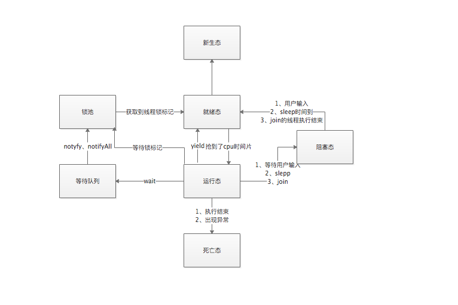
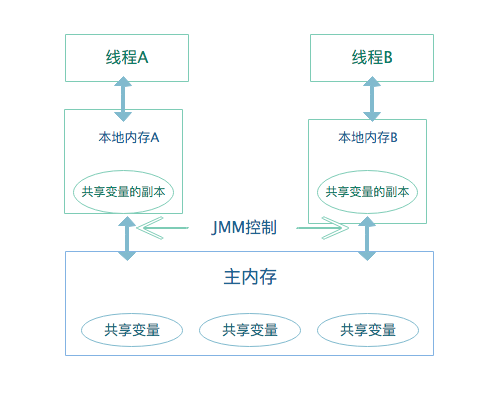
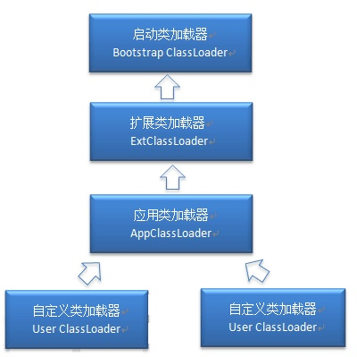

#  Java基础

##  Java基础部分

###  面向对象和面向过程的区别

####  面向过程

1. 优点：性能比面向对象高，因为类调用时需要实例化，开销比较大，比较消耗资源，所以当性能是最重要的考量因素时，采用面向过程开发
2. 缺点：没有面向对象易维护、易复用、易扩展

####  面向对象

1. 优点：易维护、易复用，可以设计出低耦合的系统，使系统更加灵活，更加易于维护
2. 缺点：性能比面向过程低

###  Java有哪些特性？

封装、继承、多态，平台无关性、可靠性、安全性、支持多线程、网络编程等。

- 继承：一种联结类的层次模型，并且允许和鼓励类的重用，它提供了一种明确表述共性的方法。新类可以从现有的类中派生，这个过程为类继承，新类继承了原始类的特性，新类则为原始类的派生类，原始类则为基类。
  - 子类拥有父类对象的所有的属性和方法（包括私有属性和私有方法），无权访问，仅拥有
  - 子类可以拥有自己的属性和方法，即子类可以对父类进行扩展
  - 子类可以用自己的方式实现父类的方法（重写）
- 封装：把数据和实现过程隐藏起来，仅对外公开调用接口，可以保证代码的安全。
- 多态：指允许不同类的对象对同一消息作出响应，即同一消息可以根据发送对象的不同而采用多种不同的行为方式。

###  Java中的多态

Java中的多态分为编译型多态和运行时多态。编译时多态是静态的，主要是指方法的重载，根据参数列表的不同来区分不同的方法。运行时多态是动态的，它是通过动态绑定来实现的，也就是通常所说的多态性。

Java实现多态有3个必要条件：继承、重写和向上转型。只有满足这3个条件，开发人员才能够在同一个继承结构中使用统一的逻辑实现代码处理不同的对象，从而执行不同的行为。

- 继承：在多态中必须存在有继承关系的子类和父类。
- 重写：子类对父类的方法进行重新定义，在调用这些方法时就会调用子类的方法。
- 向上转型：在多态中需要将子类的引用赋给父类对象，只有这样该引用才既能可以调用父类的方法，又能调用子类的方法。

```java
1.父类有，子类没有，调用父类;
2.父类有，子类有，调用子类;
3.父类没有，子类有，编译错误，需将引用转换为子类对象的引用。
```


###  什么是JVM？什么是字节码？

1. JVM：是运行Java字节码的虚拟机，JVM有针对不同系统的特定实现(Windows、Linux、macOS)

2. 字节码：在Java中，JVM可以理解的代码就叫做字节码(.class文件)，它不面对任何特定的处理器，只面向虚拟机。Java语言通过字节码的方式，在一定程度上解决了传统解释型语言执行效率低的问题，同时又保留了解释型语言可移植的特点。所以Java程序运行时比较高效，并且，由于字节码并不针对一种特定的机器，因此，Java程序无须重续编译便可在多种不同操作系统的计算机上运行。

###  Java和C++的区别

- 都是面向对象的语言，支持封装、继承、多态
- Java不提供指针来直接访问内存，程序内存更加安全
- Java的类是单继承的，接口可以多继承，C++中支持多重继承
- Java有自动内存管理机制，不需要程序员手动释放无用内存

###  Java中，什么是构造函数？什么是构造函数重载？什么是复制构造函数？

当一个对象被创建时，构造函数就会被调用，每一个类都有构造函数。在程序员没有给类提供构造函数的情况下，Java编译器会为这个类创建一个默认的构造函数。Java中构造函数重载和方法重载相似，可以为一个类创建多个构造函数。Java不支持像C++中那样的复制构造函数。

###  为什么重写equals()还要重写hashCode() ？

HashMap中，如果要比较key是否相等，要同时使用这两个方法，因为自定义的类的hashCode()方法继承于Object类，其hashCode()为默认的内存地址，这样即便有两个相同的对象，比较也是不相等的。HashMap中先检查key的hashCode()是否相等，如果相等再equals()，若相等则认为这两个key时相等的，这样比是因为我们可以重写hashCode()值使相同的key计算的hashCode()值相同，而Object中的equals()比的就是hashcode值，所以会存在判断出错，所以需要重写再进行一次判断。(即重写hashCode()必须重写equals())重写后如果两个对象的hashCode()值不同肯定这两个对象不相同，就不必再equals()。

- 相等的对象必须具有相同的哈希码
- 如果两个对象的hashCode相同，它们并不一定相等

```java
public boolean equals(Object obj) {
  return (this == obj); //如果两个对象的引用完全相同则返回true，如果是基本类型，就比较数值是否相等
}
```

### 一个十进制的数在内存中是怎么存的？

在计算机中是以补码的形式存储的，而二进制的小数无法精确的表达10进制小数，则在计算的过程中会产生误差 。

```java
float f = 4.0 - 3.6; //0.40000001则会出现误差
```

###  Java中的八大基本类型

byte（8位）、short（16位）、int（32）、long（64）、float（单精度，32位）、double（64位）、char（16位）、boolean（1位）。在Java中万物皆对象，对象抽象类，所以会有它们的包装类，分别对应（Byte）、（Short）、（Integer）、（Long）、（Float）、（Double）、（Character）、（Boolean）。故有自动装箱和拆箱，装箱即从基本数据类型转换为对应的包装类型，反之为拆箱。

```java
Integer integer = Integer.valueOf(1);
int i = integer.intValue();
/**
int和Integer的区别？
除了上述，还有一个就是Integer默认值为null，比如当一个考生缺考，此时就应该为null，而不是为0。
*/

/**
这里需要注意缓冲池的概念，当值在-128～127之间，会从缓冲池中返回，不在这个范围，初始化时则会在堆内存中新建对象并返回引用（地址不同，即hashCode()不同，可以重写hashCode()），至于为什么设计缓冲池这里不做概述。
相应的还有
ByteCache、ShortCache、LongCache、CharacterCache
*/
```

###  Java中到底是值传递还是引用传递？

在Java中没有引用传递，因为Java舍弃了指针，所有传参方式都是值传递，如果是基本型变量，则传递的是一个副本，改变副本不改变原值，而当传入一个对象型变量时，就是一个“引用传递”，此时传递的是对象地址的一个副本，对这个地址进行操作就会同时改变原对象，就类似于两个引用指向一个对象（浅拷贝）。

###  数组(Array)和列表(ArrayList)有什么区别？

- Array可以包含基本类型和引用类型，List只能包含对象类型
- Array大小是固定的，ArrayList大小是动态变化的（ArrayList初始化容量为10，每次扩容1.5倍 10->15->22...)
- ArrayList中提供了更多的方法和特性，比如add()、addfirst()等等
- ArrayList的底层实现就是一个动态的Array

###  String、StringBuffer、StringBuilder的区别？

Java平台提供。。。存储和操作字符串，即包含多个字符的字符数据，String是不可变得，其它两个是可变，并且StringBuffer为线程安全，当如果知道字符串数据要改变的时候并且线程安全就可使用StringBuffer。当改变String时，反编译可知道new了StringBuilder对象再进行append()。扩容机制：默认为16，当需要扩容时，先检查2*当前容量+2，如果不满足，则当前容量+准备存储的长度。

```java
int newCapacity = (value.length << 1)+2;
StringBuilder(int capacity)；
/*通过上面这个构造方法，如果初始容量为0，那么<<1会一直为0，那么扩容就失去了它的本质了*/
```

###  String为什么是不可变的？

不可变是指一个对象在创建完成后它的状态不能再改变，那么这个对象就是不可变的。我们知道String是被定义为final的，所以它是不可继承，而String的内部实现是一个char数组，这个数组是private final，即外部不可访问，一旦赋值后不可再更改。

1. 字符串常量是Java堆内存中一个特殊的存储区域，当创建一个String对象时，假如此字符串值已经存在于常量池中，则不会创建一个新的对象，而是引用已经存在的对象，假如字符串对象允许改变，那么将会导致各种逻辑错误，比如改变一个对象会影响到另一个独立对象，严格来说，常量池的思想是一种优化手段，如果String为可变，那么随着Java 程序的启动，堆内存中的对象越来愈多，性能将会急速下降。
2. Java中String对象的哈希码被频繁调用（HashMap），字符串不变性保证了hashCode的唯一性，因此可以放心的进行缓存，这样就不必每次都去计算进行新的hashCode

3. String被所有的类用来当作参数，例如URL，Path等等，如果不是不可变得，将会引起各种安全隐患

###  讲一讲Java中的final关键字怎么用的？

1. 当用final修饰一个类时，表明这个类不能被继承，也就是说如果一个类你永远不会让他被继承，就可以用final进行修饰。final类中的成员变量可以根据需要设为final，但是要注意final类中的所有成员方法都会被隐式地指定为final方法。

2. 使用final时修饰方法会把方法锁定，以防任何继承类修改它的含义。

3. 修饰变量时，如果是基本类型的变量，则其数值一旦在初始化之后便不能更改，如果是引用类型的变量，那么在对其初始化之后便不能再让其指向另一个对象，但是可以更改对象内存里的值，例如map、list、array、stringbuilder。

###  重载和重写的区别，相同参数不同返回值能重载吗？

重载（OverLoading）

1. 方法重载是让类以统一的方式处理不同类型数据的一种手段，多个同名方法同时存在，具有不同的参数个数/类型。
2. 方法的重载就是在类中可以创建多个方法，具有相同的名字，但具有不同的参数和定义。
3. 重载的时候，方法名要一样，但是参数类型和个数不一样，返回值类型可以相同也可以不相同。无法以返回类型作为重载函数的区分标准。

重写（Overriding）

  父类与子类之间的多态性，对父类的函数进行重新定义，如果再子类中定义某方法与其父类有相同的名称和参数，我们就说该方法被重写。重写也叫方法覆盖。

###  static关键字是什么意思？Java中是否可以覆盖一个private或者是static的方法？

static关键字表明一个成员变量或者是成员方法可以在不需要一个实例变量的情况下被访问。Java中private方法被继承后但是不能被访问，所以不能覆盖；方法覆盖是基于运行时动态绑定的，而static方法是编译时静态绑定的，static方法跟类的实例不相关，所以概念上不适用。

###  泛型

####  什么是范型？范型的好处是什么？

范型是指在定义时就指定了类型参数，提供了编译器的类型安全，确保只能把正确类型的对象放入集合中，避免了在运行时出现的ClassCastException。

#### Java中的范型是如何工作的？什么是类型擦除？

范型是通过类型擦除来实现的，编译器在编译时擦除了所有类型相关的信息，所以在运行时不存在任何类型相关的信息，比如List<String>在运行时仅用一个List来表示。这样做的目的是确保能和Java5之前的版本开发二进制类库进行兼容。

####  什么是类型中的限定通配符和非限定通配符？

限定通配符有两种<？ extends T> 通过确保类型必须是T的子类来设定类型的上界，另一种是<? Super T> 通过确保类型必须是T的父类来设定类型的下届。泛型类型必须用限定的类型来进行初始化，否则会编译错误。 

<?>表示非限定通配符，它可以用任意类型来替代。

###  如何通过反射创建对象？

1. 通过类对象调用newInstance()方法，例如：String.class.newInstance()
2. 通过类对象的getConstructor()或getDeclaredConstructor()获得构造器 String.class.getConstructor(String.class).newInstance("Hello");

###  接口和抽象类的区别

- 抽象类可以有构造方法，接口中不能有构造方法
- 抽象类中可以有普通成员变量，接口中不能有普通成员变量，默认为public static final
- 抽象类中可以包含非抽象的普通方法，接口中的所有方法必须是抽象的
- 抽象类中的抽象方法的访问类型可以是public、protected和default，接口中的方法默认为public abstract
- 抽象类中可以包含静态方法，接口中不能
- 一个类可以实现多个接口，但只能继承一个抽象类
- jdk8接口就可以有默认实现了，需在方法前加default或static。如果是static，那么不需要实例化实现这个接口的类可以通过接口名+方法调用，否则需要实例化，但是不需要重写

1. 接口可以理解为一种规范，所有实现这个接口的类都要按照这个规范去执行；而抽象类理解为把类当作对象，抽象的类叫做抽象类，抽象类更多的是定义在一系列紧密相关的类间。(vector, arraylist -> abstractlist -> abstractcollection)
2. 接口是对动作的抽象，抽象类是对根源的抽象。接口表示的是这个对象可以做什么，抽象类表示的是这个对象是什么。

###  在Java中定义一个空构造的作用

Java程序在执行子类的构造方法之前，如果没有用super()来调用父类特定的构造方法，则会默认调用父类中“没有参数的构造方法”。因此，如果父类中只定义了有参数的构造方法，而在子类的构造方法中又没有用super()来调用父类中特定的构造方法，则编译时将发生错误，因为在父类找不到没有参数的构造方法可供执行，解决方法就是在父类里加上一个不做事且没有参数的构造方法。

###  finla、finally、finalize的区别

- final用于声明属性、方法和类，表示属性不可变，方法不可覆盖，类不可继承
- finally是异常处理语句结构的一部分，表示在该异常体系中总是执行
- finalize是Object类中的一个方法，在垃圾收集器执行的时候会调用被回收的此方法，可以覆盖此方法提供垃圾收集时的其它资源回收（尽量不要覆盖）

###  Java语言如何进行异常处理？关键字分别代表什么意义？

Java通过面向对象的方法进行异常处理，把各种不同的异常进行分类，并提供了良好的接口。在Java 中，每个异常都是一个对象，是Throwable类或其它子类的实例。当一个方法出现异常后便抛出一个异常对象，该对象中包含有异常对象，调用这个对象的方法可以捕获到这个异常并进行处理。

用try执行一段程序，如果出现异常，系统会抛出一个异常，这时你可以通过它的类型来catch它，或finally由缺省处理器来处理。throws用来标明一个成员函数可能抛出的各种异常，throw用来明确地抛出一个异常。

###  JDK中的设计模式

- Singleton：Runtime

  ```java
  /**
  Every Java application has a single instance of Class Runntime that allows the application to interface with the environment in which the application is running.
  */
  private static Runntime currentRuntime = new Runtime(); //懒汉式
  ```

- Builder：StringBuilder，StringBuilder可以扩展原对象，不同的字符串也可以按照不同的顺序拼接

- Factory：ThreadPool，线程池中由线程工厂创建线程，一般用默认的

- Adapter：Arrays.asList，将数组转换为list，将一个类的接口转换为客户希望的另一个接口，使得原本接口不兼容而不能一起工作的那些类可以一起工作

- Iterator迭代器模式：java.util.Iterator，提供一个一致的方法来顺序访问集合中的对象，这个方法与底层的集合的具体实现无关

- FlyWeight享元模式：String，享元模式尝试重用现有的同类对象，如果未找到匹配的对象，则创建新对象，--->String的常量池

###  什么是fail- -fast

fail-fast机制时Java集合中的一种错误机制。当多个线程对同一个集合的内容进行操作时，就可能会产生fail-fast事件。

```java
final void checkForComodification() {
  if (modCount != expectedModCount) {
    throw new ConcurrentModificationException();
  }
}
```

可以知道在进行add、remove、clear等涉及到修改集合中的元素个数的操作时，modCount就会++，所以会抛出异常。

为了避免fail-fast，可以使用迭代器的remove方法，或者使用juc包下的类来替代。

###  List、Map、Set三个接口，存取元素时，各有什么特点？

List与Set具有相似性，它们都是单列元素的集合，所以，它们有一个共同的父接口Collection。Set里不允许有重复的元素，add方法里会有boolean，如果没有某个元素，返回true，此时就可成功加入，否则不能加入，Set取元素时不能保证和插入的顺序相等，只能通过Iterator接口取得所有的元素，再统一遍历各个元素。

List是有先后顺序的集合，FIFO，一个对象可以反复存储进List中，并且可以进行插队，这个插队并不是说这个对象本身存储进了集合中，而是在集合中用一个索引变量指向这个对象，当这个对象被add多次时，即相当于集合中有多个索引指向了这个对象。

Map与它两不同，Map是双列的集合，其中有put方法，不能存储的重复的key，通过hashCode和equals比较是否相同。

###  ArrayList和Vector的区别

- Vector是线程安全的，ArrayList线程非安全
- ArrayList和Vector都可以设置初始的空间大小，Vector还可以设置增长的空间大小，而ArrayList没有提供设置增长空间的方法

###  ArrayList和LinkedList的区别，如果一直在ArrayList的尾部添加元素，用哪个效率高？

ArrayList是采用数组实现的，查找效率比LinkedList高，LinkedList采用双向循环链表实现，插入和删除的效率比ArrayList高。

###  红黑树的定义

- 本身也是一个二叉查找树，每一个节点都大于或等于它的左子树的所有节点，并且小于等于右子树的所有节点
- 每个节点要么是红色，要么是黑色
- 根结点永远是黑色
- 所有的叶子结点都是黑色
- 每个红色节点的两个子节点都是黑色
- 从任一节点到其子树中的叶子节点的路径都包含相同数量的黑色节点

###  ConcurrentHashMap工作原理、1.7和1.8的区别？

####  工作原理

ConcurrentHashMap为了提高本身的并发能力，在内部采用了一个叫做Segment的结构，一个Segment其实就是一个类HashTable的结构，Segment内部维护了一个链表数组，ConcurrentHashMap定位一个元素的过需要两次Hash操作，第一次Hash定位到Segment，第二次Hash定位到元素所在的链表的头部，因此，带来的副作用是Hash的过程比普通的HashMap要长，好处是写操作的时候可以只对元素所在的Segment进行操作即可，不会影响到其它的Segment，这样，在理想的情况下，ConcurrentHashMap可以最高同时支持Segment数量大小的写操作，所以可以大大提高ConcurrentHashMap的并发能力。

####  区别

1.7之前采用的是锁机制，在对某个Segment进行操作时，将该Segment锁定，不允许对其进行非查询操作，而在1.8之后采用Node + CAS + Synchronized无锁算法， 进行了良好的优化。

###  Collection和Collections的区别

Collection是集合类的上层接口，继承于	它的接口主要有Set和List。它拥有基础的方法（add、addAll、remove、removeAll、iterator、size等等）

Collections是针对集合类的一个帮助类，它提供如下三类方法：

- 让集合不可变，当增删改的时候会报异常；
- 给集合加上锁，即方法上锁，安全但是效率低；
- 各种通用方法，二分查找、排序、逆序、打乱等等。

###  Java中的异常

Throwable是所有异常的父类，它有两个直接的子对象，分别是Error和Exception。其中Error是指我们无法处理的错误，比如说虚拟机异常、虚拟机内存溢出等无法控制的错误。Exception分为编译时异常和运行时异常，编译时常见的比如说ClassNotFoundException、IOException、SQLException等，运行时异常常见的就是空指针异常、数组越界、除0等在运行时才可以发现的异常。

我们必须对编译时异常进行处理，否则程序无法运行。但对运行时异常可以不处理，那么出现运行时异常后要么是线程终止，要么是主程序终止，如果不想终止，则必须捕捉所有的运行时异常。

####  异常处理关键字

try：用来监听所有可能出现异常的代码。

catch：用来匹配出现的异常，并执行相应的处理措施，注意匹配时一定要注意层次关系。

finally：代表在该异常体系中总是执行。

throws：用于声明该方法可能抛出的异常。

throw：抛出异常，后面不可再跟代码。

####  finally一定会执行吗

1. 在执行异常处理代码之前程序就已经返回

   ```java
   public static boolean getTrue(boolean flag) {
     if(flag) return flag;
     try {
       flag = true;
       return flag;
     }finally {
       System.out.println("我一定会被执行？");
     }
   }
   //当flag为true时不会被执行
   ```

2. 在执行异常代码之前抛出异常

   ```java
   public static boolean getTrue(boolean flag) {
     int i = 1/0;
     try {
       flag = true;
       return flag;
     } finally {
       System.out.println("我是一定会执行的代码？");
     }
   }
   //这里会抛出异常，原理同1，只有当finally相对应的try执行的情况下，finally才会执行
   ```

3. finally之前执行了System.exit()

   ```java
   public static boolean getTrue(boolean flag) {
     try {
       flag = true;
       System.exit(1);
       return flag;
     } finally {
       System.out.println("我是一定会执行的代码？");
     }
   }
   //System.exit是用于结束当前正在运行中的java虚拟机，参数为0代表程序正常退出，非0代表非正常退出。
   ```

4. 所有后台线程终止时，后台线程会突然终止

   ```java
   public static void main(String[] args) {
     Thread t1 = new Thread(new Runnable(){
       @Override
       public void run() {
         try {
           Thread.sleep(5);
         }catch (Excepetion e) {
           
         }finally {
           System.out.println("我是一定会执行的代码？");
         }
       }
     });
     t1.setDaemon(true);
     t1.start();
     System.out.println("我是主线程的代码，主线程是非后台线程");
   }
   ```

   

###  ArrayList

ArrayList是一个动态数组，因为它可以动态的扩充自己的容量，这个容量我们是看不见的，但是可以通过反射来进行访问。ArrayList的初始容量是10，扩容因子是1.5，也就是10->15->22->33，当第十一个元素插入时会进行扩容，底层是一个elementData数组，类型为Object。

如果初始容量定义为0，则返回一个空的elementData，当第一次add元素时会进行扩容，它的扩容就是一次拷贝，即Arrays.copyOf() /*即对数组进行拷贝*/，会消耗资源，所以尽量在初始化的时候就预计好容量以防资源浪费。ArrayList的删除和增加都是先检查插入或者删除的位置是否越界，越界了就抛出异常，插入会检查是否需要扩容，然后进行相关操作。

###  LinkedList

LinkedList是一个双向循环链表，有三个主要的属性，size、first和last，size即为链表当前有多少个节点，first为它的头节点（不放数据），last为尾节点。

add(index，element）先检查index是否越界，再检查index是否等于size，如果等于，就调用add(e) ，然后new一个节点，将新节点索引到index位置处的节点，把index节点添加到new节点的后面。

get首先判断是否越界，因为它有头节点和尾节点，所以会判断是从头节点开始遍历还是从尾节点开始遍历，判断方法是用index和size/2比，如果小于的话从first遍历，否则从last开始遍历。

###  TreeMap

TreeMap 是一个有序的key-value集合，基于红黑树的NavigableMap。该映射根据其键的自然顺序进行排序，或者根据创建时提供的Comparator进行排序，取决于构造方法。

```java
TreeMap<Integer,Integer> treeMap = new TreeMap<>(new Comparator<Integer>(){
  @Override
  public int compare(Integer o1, Integer o2) {
    return o1 - o2;
  }
});
```

TreeMap底层是红黑树，也是一颗自平衡的排序二叉树，就可以保证快速检索指定节点，插入、删除、遍历时间复杂度都为O(lgN)。

###  LinkedHashMap

是HashMap的一个子类，保证了记录的插入顺序，在用Iterator遍历的时候，先得到的记录肯定是先插入的，遍历时会比HashMap慢，LinkedHashMap的遍历速度只和实际数据有关，和容量无关，而HashMap的遍历速度和它的容量有关。

```java
static class Entry<K,V> extends HashMap.Node<K,V> {
  Entry<K,V> before,after;
  Entry(int hash, K key, V value, Node<K,V> next) {
    super(..);
  }
}
```


##  Java高级部分

###  线程和进程的区别

- 线程作为任务调度和执行的基本单位，进程作为资源分配的基本单位
- 不仅进程可以并发，线程也可以并发
- 线程不拥有资源，线程可访问进程的资源
- 进程之间切换资源较大，线程直接切换较小

###  多线程中的i++线程安全吗？为什么？

不安全。i++不是原子性操作，i++分为取值、加1、再赋值，执行期中任何一步都是有可能被其他线程抢占的。

###  Java中有几种线程池

1. newFixedThreadPool：创建一个指定工作线程数量的线程池，每当提交一个任务就创建一个工作线程，如果工作线程数量达到线程池初始的最大数，则将刚提交的任务存入到队列中。因为是指定工作线程数量，所以适合使用在任务量大但耗时少的任务。
2. newCachedThreadPool：创建一个可根据实际情况调整线程数量的线程池。线程池的线程数量不稳定，但若有空闲线程可以复用，则会优先使用可复用的线程。若所有线程都在工作，又有新的任务提交，则会创建新的线程处理任务，所有线程在当前任务执行完毕后，将返回线程池进行复用。 因为会复用并且即时创建，所以适合使用在任务量大但耗时少的任务。
3. newSingleThreadPool：创建只有一个线程的线程池。 适合在多个任务顺序执行的场景。
4. newScheduleThreadPool：创建一个定长的线程池，而且支持定时的以及周期性的任务执行。  适合使用在执行定时任务和具体固定周期的重复任务。

###  线程池参数

```java
public ThreadPoolExecutor(int corePoolSize, int maximumPoolSize, long keepAliveTime, TimeUnit unit, BolckingQueue<Runnable> workQueue, ThreadFactory threadFactory, RejectExecutionHandler handler);
/*
corePoolSize : 指定了线程池中的核心线程数量，没有添加任务时，线程数量为0，当达到核心线程数时，无论是否向池子里提不提交任务，线程池里至少会保持核心线程数量。 假设设定核心为2，添加4个任务，当任务执行完成后，线程池里存活的线程为2。
maximumPoolSize : 指定了线程池中的最大线程数量，是在已经达到核心线程池参数并且任务队列已经满的情况下，才去判断该参数。     当任务提交时，如果线程数量达到了核心线程数，并且任务队列已满，不能再向任务队列中添加任务时，这时会检查任务是否达到了最大线程数，如果未达到，则创建新线程执行任务，否则执行拒绝策略。
keepAliveTime : 当线程池线程数量超过corePoolSize时，多余的空闲线程的存活时间
unit : keepAliveTime的单位
workQueue : 任务队列，被提交但尚未被执行的任务，等待队列去执行
threadFactory : 线程工厂，用于创建线程，一般用默认的
handler : 拒绝策略，当任务太多时来不及处理，如何拒绝任务
*/


public void execute (Runnable command) {
  if (command == null) {
    throw new NullPointerException();
  }
  int c = ctl.get();
  if (workerCountOf(c) < corePoolSize) {
    if (addWorker(command, true)) {
      return;
    }
    c = ctl.get();
  }
  if (isRunning(c) && workQueue.offer(command)) {
    int recheck = ctl.get();
    if (! Running(check) && remove(command)) {
      reject(command);
    }else if (workerCountOf(recheck) == 0) {
      addWorker(null, false);
    }
  }
  else if (! addWorker(command, false)) {
    reject(command);
  }
}
```

###  一般设多少个线程？

需要根据具体任务和机器性能来综合考虑，通过不断的性能测试，分析出最佳线程数量。

1. CPU密集型：CPU利用率较高，设置线程数量和CPU核心数一样，使CPU得到充分利用
2. IO密集型：主要进行长时间的IO操作，CPU利用率不是很高，一般设置为CUP两倍。

###  线程池是什么时候创建线程的？

1. 在任务提交的时候创建线程
2. 每一个任务先放到队列中
3. 当worker中的runWorker()一个任务完成后，会取下一个任务

###  线程池有什么好处

- 降低资源消耗。通过重复利用已创建的线程降低线程创建和销毁造成的消耗。
- 提高响应速度。当任务到达时，任务可以不需要等到线程创建就能执行。
- 提高线程的可管理性。线程是稀缺资源，如果无限制的创建，不仅会消耗系统资源，还会降低系统的稳定性，使用线程池可以统一分配、调优和监控。

###  线程的所有状态

```java
public enum State {
  NEW,             //刚刚创建的线程，还没开始执行
  RUNNABLE,        //当调用start方法时，线程开始执行 
  BLOCKED,         //遇到了synchronized同步块
  WAITING,         //无时间限制的等待
  TIMED_WAITING,   //有时限的等待
  TERMINATED;      //线程执行完成
}
```



###  如何保证线程安全

通过合理的时间调度，避开贡献资源的存取冲突。另外，在并行任务设计上可以通过适当的策略，保证任务与任务之间不存在共享资源，设计一个规则来保证客户的计算工作和数据访问只会被一个线程或一台工作机完成，而不是把一个客户的计算工作分配给多个线程去完成。

###  Java中的对象锁、类锁是什么？

对象锁

当一个对象中有synchronized method或synchronized block的时候调用此对象的同步方法或进入其同步区域时，就必须先获得对象锁。如果此对象的对象锁已被其他调用者调用，则需要等待锁被释放。

同步静态方法/静态变量互斥体

由于一个class不论被实例化多少次，其中的静态方法和静态变量在内存中都只有一份。所以，一旦一个静态的方法被声明为synchronized。此类所有的实例化对象再调用此方法，共用同一把锁，我们称之为类锁。一旦一个静态变量被作为同步块的同斥信号量。进入此同步区域时，都要先获得此静态变量的对象锁。

###  简述synchronized和ReentrantLock的异同

- 两者都是可重入锁，自己可以再次获取自己的内部锁，一个线程获得了某个对象的锁，此时这个对象锁还没有释放，当其再次想要获取这个对象的锁的时候还可以获取的，如果不可重入的话就会造成死锁。
- synchronized是依赖于JVM的，ReentrantLock是JDK层面实现的，需要手动加锁解锁。
- ReentrantLock增加了一些高级功能，可以使用lock.lockInterruptibly()来使正在等待的线程放弃等待，改为处理其他事情；公平锁，默认为非公平。

###  synchronized关键字

同步代码块，解决线程并发访问数据源造成的数据安全问题。

使用方式：

```java
public void method() {
  //修饰代码块
  synchronized (this) {
    //...
  }
}
```

```java
//修饰方法
public synchronized void method() {
  //...
}
```

```java
//修饰静态方法
public synchronized static void method() {
  //...
}
```

```java
//修饰类
class DemoClass {
  public void method() {
    synchronized(DemoClass.class) {
      //...
    }
  }
}
```

反编译后，可以看出synchronized同步语句块的实现使用的是monitorenter和monitorexit指令，其中monitorenter指令指向同步代码块的开始位置，monitorexit则是结束为止。当执行enter时线程试图获取锁，也就是获取monitor的对象头(monitor对象存在于每个Java对象的对象头中)，synchronized锁便是通过这种方式获取锁的，所以Java中任意对象都可以作为锁。当计数器为0则可以成功获取，获取后将锁计数器设为1，也就是加1。相应的，执行exit指令后，将锁计数器设为0，表明锁可以被释放。如果获取锁失败，当前线程就要阻塞等待，直到锁被另外一个线程释放为止。

synchronized应用在方法上时，在字节码中是通过方法的ACC_SYNCHRONIZED标志来实现的。其他线程进入这个方法就看是否有这个标志位，有就代表已经有线程进入了，自己就无法执行了。

```java
synchronized void test();
flags: ACC_SYNCHRONIZED
```

JDK1.6对锁的实现引入了大量的优化，锁主要存在四种状态：无锁、偏向锁、轻量级锁、重量级锁，锁的状态会随着竞争的激烈而逐渐升级。注意锁可以升级不可降级，这种策略是为了提高获得锁和释放锁的效率。

Mark word记录了对象和锁有关的信息，当某个对象被synchronized关键字当成同步锁的时候，那么围绕这个锁的一系列操作都和Mark work有关系，Mark Word里面会存储五种状态（无锁、偏向锁、轻量级锁、重量级锁、GC标记）

#####  偏向锁

偏向锁会偏向于第一个获得它的线程，如果在接下来的执行中，该锁没有被其他线程获取，那么持有偏向锁的线程就不需要进行同步。但是对于锁竞争很激烈的场合，就会失效。失效后就会升级为轻量级锁。

1. 首先会获取对象的Mark word，判断是否处于可偏向状态（blased_lock =1，且ThreadId为空）
2. 如果是可偏向状态，则通过CAS操作，把当前线程的ID写入到Mark word，如果成功表示已经获得了锁对象的偏向锁，接着执行同步代码；否则说明已经有其他线程获得了偏向锁，这说明存在锁竞争，需要撤销已获得偏向锁的线程，并且把它持有的锁升级
3. 如果是已偏向状态，需要检查Mark word中存储的ThreadID是否等于当前线程的ThreadID，如果相等，不需要再次获得锁，直接执行同步代码块；否则说明当前锁偏向于其他线程，需要撤销偏向锁并升级到轻量级锁

#####  轻量级锁

在没有多线程竞争的前提下，减少传统的重量级锁使用操作系统互斥量产生的性能消耗，因为使用轻量级锁时，不需要申请互斥量。另外，轻量级锁的加锁和解锁都使用到了CAS。在有锁竞争的情况下，轻量级锁比传统的重量级锁更慢，如果锁竞争激烈，那么轻量级锁将很快膨胀为重量级锁。

升级为轻量级锁之后，对象的Mark word也会进行相应的变化，轻量级锁在加锁的过程中用到了自旋锁。

#####  自旋锁

为了让一个线程等待，会让这个线程在原地循环等待，而不是把该线程阻塞，直到获得锁的线程释放锁之后，这个线程就可以马上获得锁。锁在循环的时候，是会消耗cpu的，就相当于执行了一个啥都没有的for循环。

#####  锁消除

虚拟机即时编译器在运行时，如果检测到哪些共享数据不可能存在竞争，那么就执行锁消除。锁消除可以节省毫无意义的请求锁的时间。

###  volatile

通俗来说就是一个字段被volatile修饰，java的内存模型确保所有的线程看到的这个变量值是一致的，但是不能保证多线程的原子操作，这就是所谓的线程可见性。

####  内存模型相关概念

Java线程之间的通信由Java内存模型（JavaMemoryModel）控制，JMM决定一个线程对共享变量的修改何时对另外一个线程可见。JMM定义了线程与主内存的抽象关系：线程之间的变量存储在主内存（Main Memory）中，每个线程都有一个私有的本地内存（Local Memory）保存着共享变量的副本。



如果线程A与线程B通信：

1. 线程A要先把本地内存A中更新过的共享变量刷写到主内存中
 	2. 线程B到主内存中读取线程A更新后的共享变量

####  内存屏障与volatile

进入写操作时，会在写后面加入一条store指令，将本地内存中的共享变量值立即刷新到主内存；在进行读操作时，会在读后面加上一条load指令。

####  volatile实现原理

将volatile修饰的共享变量进行写操作的时候会多出Lock前缀的指令，该指令在多核处理器下会引发两件事情。

1. 将当前处理器缓存行数据刷新到系统主内存。

2. 这个操作会使其它CPU缓存的该共享变量内存地址的数据无效。

####  MESI协议

MESI协议保证了每个缓存中使用的共享变量的副本是一致的。核心的思想是：当CPU写数据时，如果发现操作的变量是共享变量，即在其它CPU中也存在该变量的副本，会发出信号通知其它CPU将该变量的缓存行置为无效状态。因此当其他CPU读取这个变量时，发现自己缓存中缓存该变量的缓存行是无效的，那么它就会从内存重新获取。

###  为什么synchronized是一个悲观锁，乐观锁的实现原理又是什么？什么是CAS？

synchronized的并发策略是悲观的，不管是否会发生竞争，任何的数据操作都必须要加锁、维护锁计数器和检查是否有被阻塞的线程需要被唤醒等操作。

乐观锁的核心算法是CAS，涉及到内存值、预期值、新值。当且仅当预期值和内存值相等时才将内存值修改为新值。如果不一样则该内存值已经被别的线程修改过，舍弃本次操作。

### 反射的实现与作用

Java语言编译后会生成一个.class文件，反射就是通过字节码文件找到某一个类，类中的方法以及属性等。反射的实现主要借助以下四个类：

- Class：类的对象
- Constructor：类的构造方法
- Field：类中的属性对象
- Method：类中的方法对象

作用：反射机制指的是程序在运行时能够获取自身的信息。在Java中，只要给定类的名字，那么就可以通过反射机制来获取类的所有信息。

### 负载均衡算法

- 随机

  ```java
  public class Server {
      public List<String> list = new ArrayList<String>() {
          {
              add("192.168.0.1");
              add("192.168.0.2");
              add("192.168.0.3");
              add("192.168.0.4");
          }
      };
  }
  ```

  ```java
  public class FullRandom {
      static Server server = new Server();
      static Random random = new Random();
      static int[] array = new int[4];
  
      public static int[] go() {
          int number = random.nextInt(server.list.size());
          array[number]++;
          return array;
      }
      public static void main(String[] args) {
          for (int i = 0; i < 1000; i++) {
              go();
          }
          for (int i = 0; i < array.length; i++) {
              System.out.println("192.168.0." +(i+1) + ":" + array[i]);
          }
      }
  }
  ```

- 加权随机

  ```java
  public class Server {
      public HashMap<String,Integer> map = new HashMap<String,Integer>(){
          {
              put("192.168.0.1",2);
              put("192.168.0.2",9);
              put("192.168.0.3",3);
              put("192.168.0.4",15);
          }
      };
  }
  ```

  ```java
  public class RandomWeight {
      static Server server = new Server();
      static Random random = new Random();
  
      public static String go() {
          int weight_sum = server.map.values().stream().mapToInt(a -> a).sum();
          int number = random.nextInt(weight_sum);
          for (Map.Entry<String,Integer> item : server.map.entrySet()) {
              if (item.getValue() > number) {
                  return item.getKey();
              }
              number -= item.getValue();
          }
          return "";
      }
  
      public static void main(String[] args) {
          for (int i = 0; i < 10; i++) {
              System.out.println(go());
          }
      }
  }
  
  ```

  

- 轮询：完全轮询、加权轮询、平滑加权轮询。

- 完全轮询

  ```java
  //Server参考 随机算法。
  public class FullRound {
      static Server server = new Server();
      static int index;
  
      /**
       * 1->2->3->4->1->2....
       * @return
       */
      public static String go() {
          if (index == server.list.size()) {
              index = 0;
          }
          return server.list.get(index++);
      }
  
      public static void main(String[] args) {
          for (int i = 0; i < 10; i++) {
              System.out.println(go());
          }
      }
  }
  
  ```

- 加权轮询

  ```java
  //Server参考 加权随机算法。
  public class RoundWeight {
      static Server server = new Server();
      static int index;
  
      public static String go() {
          int sum_weight = server.map.values().stream().mapToInt((a -> a)).sum();
          int number = (index++) % sum_weight;
          for (Map.Entry<String,Integer> item : server.map.entrySet()) {
              if (item.getValue() > number) {
                  return item.getKey();
              }
              number -= item.getValue();
          }
          return "";
      }
  
      public static void main(String[] args) {
          int[] array = {0,0,0,0};
          for (int i = 0; i < 10000; i++) {
              switch (go()) {
                  case "192.168.0.1" : array[0]++; break;
                  case "192.168.0.2" : array[1]++; break;
                  case "192.168.0.3" : array[2]++; break;
                  case "192.168.0.4" : array[3]++; break;
              }
          }
          for (int i = 0; i < array.length; i++) {
              System.out.println("192.168.0." + (i+1) + "\t" + array[i]);
          }
      }
  }
  //观察大概率会导致一个或多个服务器的压力突然上升，有一个或者几个压力极小。
  ```

- 原地址散列

  ```java
  public class Hash {
      public static String go(String client) {
          int count = 20;
          TreeMap<Integer,String> treeMap = new TreeMap<Integer,String>();
          for (String s : new Server().list) {
              for (int i = 0; i < count; i++) {
                  treeMap.put((s + "--服务器--" + i).hashCode() , s);
              }
          }
          int clientHash = client.hashCode();
          SortedMap<Integer,String> sortedMap = treeMap.tailMap(clientHash);
          Integer firstHash;
          if (sortedMap.size() > 0) {
              firstHash = sortedMap.firstKey();
          }else {
              firstHash = treeMap.firstKey();
          }
          String s = treeMap.get(firstHash);
          return s;
      }
  
      public static void main(String[] args) {
          System.out.println(go("为啥要吃蝙蝠？"));
          System.out.println(go("为什么"));
          System.out.println(go("0"));
          System.out.println(go("-110000"));
          System.out.println(go("风雨交加"));
      }
  }
  
  ```

  

##  JVM

下面将主要针对HotSpot VM，HotSpot是JVM规范的一种实现，是目前使用范围最广的Java虚拟机。

###  JVM5大内存

根据JVM规范，JVM内存共分为虚拟机栈、堆、方法区、程序计数器、本地方法栈五个部分。

####  虚拟机栈

线程私有，每个方法在执行的时候会创建一个栈帧，存储了局部变量表、操作数栈、动态链接、方法返回地址等；每个方法从调用到执行完毕，对应一个栈帧在虚拟机栈中的入栈和出栈。

####  堆

线程共享，被所有线程共享的一块内存区域，在虚拟机启动时创建，用于存放对象实例。

####  方法区

线程共享，被所有线程共享的一块内存区域；用于存储已被虚拟机加载的类信息、常量、静态变量等。

####  程序计数器

线程私有，是当前线程所执行的字节码的行号指示器，每条线程都要有一个独立的程序计数器，这类内存也称为“线程私有”的内存。

####  本地方法栈（C栈）

线程私有，主要为虚拟机使用到的Native方法服务。

###  JVM的堆内存分配

JVM的堆内存分为新生代和老年代。新生代 ：旧生代 = 1 ：2，新生代存储的都是新创建的比较小的对象，而老年代存的都是比较大的、活的久的对象，所以老年代占JVM堆内存较大。

新生代又分为Eden区和Survivor区。Eden区 ：Survivor区 = 8  ：1 : 1，Survivor中存储的是GC之后幸存的对象，实际上只有很少一部分会幸存，所以占比例较小。

###  对象的内存布局

在HotSpot虚拟机中，对象的内存布局分为对象头(Header)、实例数据(Instance Data)、对齐填充(Padding).

- 对象头记录了对象在运行过程中所需要使用的一些数据：哈希码、GC分代年龄、锁状态标志、线程持有的锁、偏向线程ID等，对象头可能包含类型指针，通过该指针能确定对象属于哪个类，如果对象是一个数组，那么对象头还会包括数组长度。
- 实例数据：实例数据部分就是成员变量的值，其中包括父类成员变量和本类成员变量。
- 对齐填充：用于确保对象的总长度为8字节的整数倍。HotSpotVM的自动内存管理系统要求对象的大小必须是8字节的整数倍。而对象头部分正好是8字节的倍数，因此，当对象实例数据部分没有对齐时，就需要通过对齐填充来补全。

###  四种引用

####  强引用

如果一个对象具有强引用，它就不会被垃圾回收器回收。即使当前内存空间不足，JVM也不会回收它，而是抛出OOM错误，使程序异常终止。

```java
String str = "hello";		//强引用
str = null;							//取消强引用
```

####  软引用

在使用软引用时，如果内存的空间足够，软引用就能继续被使用，而不会被垃圾回收器回收；只有在内存空间不足时，软引用才会被回收。

```java
SoftReference<String> softName = new SoftReference<>("张三");
```

####  弱引用

具有弱引用的对象拥有的生命周期更短暂，因为当JVM进行垃圾回收，一旦发现弱引用对象，无论当前内存空间是否充足，都会将弱引用回收。不过由于垃圾回收器是一个优先级较低的线程，所以并不一定能迅速发现弱引用对象。

```java
WeakReference<String> weakName = new WeakReference<String>("hello");
```

####  虚引用

如果一个对象仅持有虚引用，那么它相当于没有引用，在任何时候都可能被垃圾回收器回收。虚引用必须要和引用队列关联使用，当垃圾回收器准备回收一个对象时，如果发现它还有虚引用，就会把这个虚引用加入到与之关联的引用队列中。程序可以通过判断引用队列中是否已经加入了虚引用，来了解被引用的对象是否将要被垃圾回收。如果程序发现某个虚引用已经被加入到引用队列，那么就可以在所引用的对象的内存被回收之前采取必要的行动。

```java
ReferenceQueue<String> queue = new ReferenceQueue<String>();
PhantomReference<String> pr = new PhantomReference<String>(new String("hello"), queue);
```


###  JVM回收算法

####  标记-清除算法

将垃圾回收分为两个阶段：标记阶段和清除阶段。在标记阶段首先标记出所有需要回收的对象（可达性分析），在标记完成后统一清理掉所有被标记的对象。

存在两个问题：

- 效率问题：标记和清除效率不高。
- 空间问题：标记清除后产生大量不连续的内存碎片，空间碎片太多可能会导致在运行过程中需要分配较大对象时无法找到足够的连续内存而不得不提前触发另一次垃圾收集。

####  复制算法

该算法的核心是将可用内存按容量划分为大小相等的两块，每次只用其中一块，当这一块的内存用完，就将还存活的对象（非垃圾）复制到另外一块上，然后把已使用过的内存空间一次清理掉。

优点：不用考虑碎片问题，方法简单高效。

缺点：内存浪费严重。

####  标记-整理算法

标记-清除算法会产生内存碎片的问题，而复制算法需要有额外的内存担保空间，于是针对老年代的特点，又有了标记-整理算法，标记-整理算法标记过程与标记-清除算法相同，但是后续不再对可回收对象直接清理，而是让所有存活的对象都向一端移动，然后清理掉边界以外的内存。

###  可达性算法中，哪些对象可以作为GC Roots对象

- 虚拟机栈中引用的对象
- 方法区静态成员引用的对象
- 方法区常量引用的对象
- 本地方法栈JNI引用的对象

###  GC垃圾回收机制

1. 堆区有两个Survivor区，新建的对象会存活在Eden中，Eden区如果没有足够的空间时会引发一次young区的GC。
2. 在经历一次Minor GC后，Eden中的存活对象就会被移动到第一块survivor（to）区，此时Eden被清空。
3. 等Eden再次填满，就再触发一次Minor GC，Eden和S0中的存活对象又会被复制送入第二块survivor区，此时to和Eden被清空，然后下一轮to和from互换角色。
4. 如果survovor的空间不足或经历16次Minor GC还能在新生代中存活的对象会通过分配担保机制被送入老年代。
5. 老年代负责分配担保让survivor无法容纳的对象直接进入老年代，如果剩余空间大小小于转移对象大小，将直接进行Full GC。

###  什么时候进行Minor GC和Full GC

Minor GC：当Eden区满时

Full GC

- 调用System.gc时，系统建议执行Full GC，但是不会一定执行
- 老年代空间不足
- 方法区空间不足
- 通过Minor GC后进入老年代的平均大小大于老年代的剩余空间
- 堆中分配很大的对象，而老年代没有足够的空间

###  永久代可以被回收吗

永久代中存放生命周期较长的类信息、常量、静态变量，每次垃圾收集只有少量的垃圾被清除。方法区中主要清除两种垃圾：废弃常量和无用的类。

1. 判定废弃常量
   只要常量池中的常量不被任何变量或对象引用，那么这些常量就会被清除掉。比如，一个字符串“bingo”进入了常量池，但是当前系统没有任何一个String对象引用“bingo”常量，必要的话，该常量就会被清理出常量池。
2. 无用的类
   - 该类的所有对象都已经被清除
   - 加载该类的ClassLoader已经被回收
   - 该类的java.lang.Class对象没有在任何地方被引用，无法在任何地方通过反射访问该类的方法

###  垃圾收集器

最小化地使用内存和并行开销，请选Serial GC；最大化应用程序的吞吐量，请选Parallel GC；最小化GC的中断或停顿时间，请选CMS GC。

####  Serial收集器

Serial收集器是一个基本的，古老的新生代垃圾收集器。这个垃圾收集器是一个单线程的收集器，在它进行垃圾回收的时候，其他的工作线程都会被暂停，直到它收集结束。这也就是说，如果JVM参数配置有问题或者内存不够，导致频繁的GC，可能每隔一段时间应用就会暂停响应。如果暂停的时间太长，用户就无法接受了，而且这个过程是不可控制的，是虚拟机在后台自动发起和自动完成的。Serial收集器虽然有缺点，但是它是一个简单高效的收集器，没有线程切换的开销等，在一般应用中需要回收的内存不是很大，垃圾回收停顿的时间不是很长，是可以接受的。

#### ParNew收集器

ParNew收集器是Serial收集器的多线程版本，除了使用多线程进行垃圾收集之外，其余行为包括Serial收集器可用的所有控制参数、收集算法、StopTheWorld、对象分配规则、回收策略等都与Serial收集器完全一样。它是许多运行在Server模式下的虚拟机首选的新生代收集器，其中有一个与性能无关但很重要的原因是，除了Serial收集器外，目前只有它能与CMS收集器配合工作。

虽然ParNew是多线程收集，但是它的性能并不一定比Serial收集器好，因为线程切换等开销的元素，在单CPU环境中它的性能是不如Serial收集器的，就算有2个CPU也不能说绝对比Serial好。

#### CMS收集器

CMS收集器是一种以获取最短回收停顿时间为目标的收集器。是基于“标记--清除“算法实现的，它的运作过程相对于前面几种收集器来说更复杂一些，分为四个步骤：

- 初始标记
- 并发标记
- 重新标记
- 并发清除

其中初始标记和重新标记这两个步骤仍然需要“Stop The World”，初始标记仅仅只是标记一下GC Roots能直接关联到的对象，速度很快，并发标记阶段就是GC Roots Tracing的过程，而重新标记阶段则是为了修正并发标记期间因用户程序继续运作而导致标记产生变动的那一部分对象的标记记录，这个阶段的停顿时间一般会比初始标记阶段稍长一些，但远比并发标记的时间短。

由于整个过程中耗时最长的并发标记和并发清除过程收集线程都可以与用户线程一起工作，所以从总体上来说，CMS收集器的内存回收过程是用户线程一起并发执行的。

缺点：

- 并发阶段会占用一部分线程而导致应用程序变慢，总吞吐量会降低
- 基于标记-清除算法实现的收集器，会产生大量的空间碎片

####  G1收集器

G1垃圾收集器采用的是区域化、分布式的垃圾回收器。堆被划分成许多个连接的区域(region)。每个区域大小相等，在1M～32M之间。JVM最多支持2000个区域，区域的大小可以在JVM初始化的时候决定，也可以用-XX: G1HeapreginSize设置。

它仍然是分代收集器。新生代的垃圾收集仍然采用线程的方式，将存活对象拷贝到老年代或者Survivor空间。老年代也分成很多个区域，G1收集器通过将对象从一个区域复制到另外一个区域，完成了清理工作，也就意味着在正常的处理过程中，G1完成了堆的压缩，也就不会有CMS内存碎片问题的存在了。

在G1中，还有一种特殊的区域，叫做Humongous区域。如果一个对象占用的空间超过了分区容量50%以上，G1收集器就认为这是一个巨型对象。这些巨型对象，默认直接会被分配在老年代，但是如果它是一个短期存在的巨型对象，就会对垃圾收集器造成负面影响。为了解决这个问题，G1划分了一个Humongous区，它用来专门存放巨型对象，如果1个H区装不下一个巨型对象，那么G1就会寻找连续的H分区来存储。

#####  G1 Mix GC

Mix GC不仅进行正常的新生代垃圾收集，同时也回收部分后台扫描线程标记的老年代分区。GC步骤分为2步：全部并发标记、拷贝存活对象。

在执行Mix GC之前，会先进行global concurrent marking（全局并发标记），步骤如下：

- 初始标记：在此阶段，G1 GC对根进行标记。该阶段与常规的年轻代垃圾回收密切相关。
- 根区域扫描：G1 GC在初始标记的存活区扫描对老年代的引用，并标记被引用的对象。该阶段与应用程序同时进行，并且只有完成该阶段后，才能开始下一次STW年轻代垃圾回收。
- 并发标记：G1 GC在整个堆中查找可以访问的对象。该阶段与应用程序同时运行，可以被SWT年轻代垃圾回收中断。 <三色标记算法>
- 最终标记：该阶段是STW回收，帮助完成标记周期。G1 GC清空缓冲区，跟踪未被访问的存活对象，并执行引用处理。
- 清除垃圾：在这个最后阶段，G1 GC执行统计和RSet净化的STW操作。在统计期间，G1 GC会识别完全空闲的区域和可供进行混合垃圾回收的区域。清理阶段在将空白区域重置并返回到空闲列表时为部分并发。

#####  三色标记算法

它是并发标记的一种算法，它是描述追踪式回收器的一种有用的方法，利用它可以推演回收器的正确性。

- 黑色：根对象，该对象与它的子对象都被扫描
- 灰色：对象本身被扫描，还没有扫描完该对象中的子对象
- 白色：未被扫描对象，扫描完成所有对象之后，最终为白色的为不可达对象，即垃圾对象

步骤如下：

1. 根对象被置为黑色，子对象被置为灰色
2. 从灰色开始遍历，将已扫描了子对象的对象置为黑色
3. 遍历了所有可达的对象之后，所有可达的对象都变成了黑色，不可达的即为白色


#####  G1和CMS的区别

- CMS用标记--清除算法，G1用标记--整理算法。CMS容易出现内存碎片，G1不会，所以CMS回收完垃圾后要压缩内存，可以配置，否则会因为碎片太多内存不够导致Full GC
- CMS只能回收老年代，G1可以回收整个堆，因为G1有分代回收的配置
- CMS使用并发回收，所以导致用户停顿，但是对CPU非常敏感，所以回收时会占用一部分线程，使应用变慢，总吞吐量降低，G1用了并行收集和并发收集，发挥了多个CPU的优势，可以精确地控制停顿时间，而且不牺牲吞吐量

###  内存申请过程

- JVM会试图为相关Java对象在年轻代Eden区中初始化一块内存区域。
- 当Eden区空间足够时，内存申请结束，否则执行下一步。
- JVM试图释放在Eden区中所有不活跃的对象（YoungGC），释放后若Eden空间仍然不足以放入新对象，JVM则试图将部分Eden区中活跃对象放入Survivor区。
- Survivor区被用来作为Eden区及年老代的中间交换区域。当年老代空间足够时，Survivor区中存活了一定次数的对象会被移动到年老代。
- 当年老代空间不足时，JVM会在年老代进行完全的垃圾回收（Full GC）。
- Full GC后，若Survivor区及年老代仍然无法存放从Eden区复制过来的对象，则会导致JVM无法在Eden区为新生成的对象申请内存，即“OOM”。

###  OOM出现的原因

1. 年老代溢出
   - 设置的内存参数过小或程序的内存泄漏及使用不当问题
   - 循环上万次的字符串处理
   - 创建千万个对象
   - 在一段代码内申请上百M或者上G的内存
2. 持久代溢出
   通常由于持久代设置过小，动态加载了大量Java类而导致溢出。

###  GC参数

-Xms128M : 设置Java程序启动时堆内存128M（默认为物理内存1/64，小于1G）

-Xmx256M : 设置最大堆内存256M，超出后会出现OOMError（默认为物理内存1/64，小于1G）

-XX:Max Tenuring Threshold = 15; 对象进入老年代的年龄(Parallel是15，CMS是16)

-XX:+UseSerialGc 在年轻代和老年代使用串行回收器

-XX:ParallelGCThreads=4 设置用于垃圾回收的线程数为4（默认与CPU数量相同）

-XX:+UseConcMarkSweepGC 使用CMS收集器（老年代）

-XX:G1HeapRegionSize=16M 使用G1收集器时设置每个Region的大小

-XX:PrintGCDetails 打印GC信息

-XX:+PrintHeapAtGC 每次GC时，都会打印日志

###  优化JVM

优化JVM一定要抓住两点。第一，怎样缩短单次GC的时间；第二，怎样缩短GC频率

**将新对象预留在年轻代**

   众所周知，由于FullGC的成本远远高于Minor GC，因此某些情况下需要尽可能将对象分配在年轻代，这在很多情况下是一个明智的选择。虽然在大部分情况下，JVM会尝试在Eden区分配对象，但是由于空间紧张等问题，很可能不得不将部分年轻对象提前向年老代压缩。因此，在JVM参数调优时可以为应用程序分配一个合理的年轻代空间，以最大限度避免新对象直接进入老年代的情况发生。 

**让大对象进入年老代**

我们在大部分情况下都会选择将对象分配在年轻代。但是，对于占用内存较多的大对象而言，它的选择可能就不是这样的。因为大对象出现在年轻代很可能扰乱年轻代GC，并破坏年轻代原有的对象结构。因为尝试在年轻代分配大对象，很可能导致空间不足，为了有足够的空间容纳大对象，JVM不得不将年轻代中的年轻对象挪到年老代。因为大对象占用空间多，所以可能需要移动大量小的年轻对象进入年老代，这对GC相对不利。基于以上原因，可以将大对象直接分配到年老代，保持年轻对象结构的完整性，这样可以提高GC的效率。如果一个大对象同时又是一个短命的对象，假设这种情况出现很频繁，那对于GC来说会是一场灾难。原本应该用于存放永久对象的年老代，被短命的对象塞满，这也意味着对堆空间进行了洗牌，扰乱了分代内存回收的基本思路。因此，在软件开发过程中，应该尽可能避免使用短命的大对象。

###  内存泄漏和内存分类

####  内存泄漏（Memory Leak）

程序在申请内存后，无法释放已申请的内存空间，一次内存泄漏不会有大的影响，但内存泄漏堆积后的后果就是内存溢出。

####  内存溢出（Out Of Memory）

程序在申请内存时，没有足够的内存供申请者使用，或者说给了一个存储int类型数据的空间，但实际存储long类型的数据，结果就是内存不够用，此时就会报错OOM，即内存溢出。

####  关系

- 内存泄漏的堆积会导致内存溢出。
- 内存溢出就是要的内存空间超出了系统实际分配的空间，此时无法满足需求，就会报错OOM。
- 内存泄漏是指向系统申请资源用完后不归还，自己也不能访问，系统也不能将它分配给需要的程序。
- 分配的内存不足以放下数据项序列，称为内存溢出。

####  内存溢出的原因

- 内存中加载的数据量过于庞大，如一次从数据库中取出大量数据。
- 集合类中有对对象的引用，使用完后未清空，使得JVM不能回收。
- 代码中存在死循环或循环产生过多重复的对象实体。
- 启动参数内存值设定的过小。

####  解决方案

- 修改JVM启动参数，直接增加内存
- 检查错误日志，查看“OOM”错误前是否有其它异常或错误
- 对代码进行分析，找出可能发出内存溢出的位置
- 重点排查：
  1. 检查对数据库查询中，是否有一次获得全部数据的查询，查询尽量采用分页的方式。
  2. 检查代码中是否有死循环或递归调用。
  3. 检查代码中是否有大循环重复产生新对象实体。
  4. 检查集合对象使用完后是否有未清楚的问题。
  5. 使用jconsole、jvisualvm动态查看内存使用情况。

###  Java类加载的过程

把Java 的类加载过程分为三个主要步骤：加载，连接，初始化。

**加载**：将字节码数据从不同的数据源读取到JVM中，并映射为JVM认可的数据结构（Class对象），这里的数据源可能是各种各样的形态，比如jar文件、class文件、甚至是网络数据源等；如果输入数据不是ClassFile结构，则会抛出ClassFormatError。加载阶段是用户参与的阶段，我们可以自定义类加载器，去实现自己的类加载过程。

**连接**：这时核心的步骤，简单说是把原始的类定义信息平滑地转入JVM运行的过程中。这里可进一步细分成三个步骤：

1. 验证：这是虚拟机安全的重要保障，JVM需要核验字节信息是符合java虚拟机规范的，否则就被认为是VerifyError，这样就防止了恶意信息或者不合规信息危害JVM的运行，验证阶段有可能触发更多class的加载。
2. 准备：创建类或者接口中的静态变量，并初始化静态变量的初始值。这里的初始化侧重点在于分配所需要的内存空间，不会去执行更进一步的JVM指令。
3. 解析：在这一步会将常量池中的符号引用替换为直接引用（得到类或者字段、方法在内存中的指针或者偏移量，以便直接调用该方法）。可以认为是一些静态绑定的会被解析，动态绑定则只会在运行时进行解析；静态绑定包括一些final方法、static方法、构造器。

**初始化** ：这一步真正去执行类初始化的代码逻辑，包括静态字段赋值的操作，以及执行类定义中的静态初始化块内的逻辑，编译器在编译阶段就会把这部分逻辑整理好，父类型的初始化逻辑优先于当前类型的逻辑。 

###  类加载器



- 启动类加载器：Bootstrap ClassLoader，负责加载存放在jdk/jre/lib（jdk代表jdk的安装目录，下同）下，如r t.jar，或被Xbootclasspath参数指定的路径中的，并且能被虚拟机识别的类库。
- 扩展类加载器：Extension ClassLoader，负载加载jdk/jre/lib/ext目录中，或者由java.ext.dirs系统变量指定的路径中的所有类库，开发者可以直接使用扩展类加载器。
- 应用程序类加载器：Application ClassLoader，负责加载用户类路径所指定的类，开发者可以直接使用。
- 自定义类加载器：用户自定义的类加载器

####  自定义类加载器的常见场景

实现类似进程内隔离，类加载器实际上用作不同的命名空间，以及提供类似容器，模块化的效果。例：1.两个模块依赖于某个类库的不同版本，如果分别被不同的容器加载，就可以互不干扰；2.需要从不同的数据源获取类定义信息，例如网络数据源，而不是本地文件系统。

###  双亲委派模型

####  什么是双亲委派模型

是描述类加载器之间的层次关系，它要求除了顶层的启动类加载器外，其余的类加载器都应当有自己的父类加载器。（父子关系一般不会以继承的关系实现，而是以组合关系来复用父加载器的代码）

####  工作过程

如果一个类加载器收到了类加载的请求，它首先不会自己去尝试加载这个类，而是把这个请求委派给自己的父类加载器去完成，每一个层次的类加载器都是如此，因此所有的加载请求最终都应该传送到顶层的启动类加载器中，只要当父加载器反馈自己无法完成这个加载请求时，子加载器才会尝试自己去加载。

####  为什么使用双亲委派模型

像java.lang.Object这些存放在rt.jar中的类，无论使用哪个类加载器加载，最终都会委派给最顶端的启动类加载器加载，从而使得不同加载器加载的Object类都是同一个。想法，如果没有双亲委派模型，由各个类加载器自行去加载的话，如果用户编写了一个java.lang.Object的类，并放在classpath下，那么系统将会出现多个不同的Object类，Java类型体系中最基础的行为也就无法保证。

###  实例化过程

1. JVM会去读取指定路径下的Person.class文件，并加载进内存
2. 会先加载Person的父类（如果有直接父类的情况下）
3. 在堆内存中开辟地址，分配空间
4. 并在对象空间中，对对象的属性进行默认初始化
5. 调用对应的构造函数，进行初始化
6. 在构造函数中，第一行会先调用父类中的构造函数进行初始化
7. 父类初始化完毕后，再对子类的属性，进行显示初始化
8. 指定构造函数的特定初始化
9. 初始化完毕后，将堆内存中的地址值赋给引用变量

##  topK问题

1. 全部排序，在筛选前10000个，假设用快排，时间复杂度为O(nlogn)，但内存需要400M（4B*1000000000），方法不高效。
2. 局部淘汰法，保存前10000个数，将剩余的所有数字与当前最小数字比，如果后续都比10000个小，那么这10000个数就是最大的。若大于，则进行替换，重新找最小。（O(n+m2) ，n为99990000，m为10000)
3. 分治法，将一亿个数组分成100份，每份100万个数据。找出最大的，然后在剩下的100x10000中找出最大的10000个。问题分割成从100万中找出最大的10000个，以此类推。内存空间需要100万 * 4 = 4M，一共需要101次。
4. hash法，通过hash进行去重，然后通过分治或者最小堆的方法，最小堆可以参考局部淘汰，空间复杂度(1000)，时间复杂度nmlogm （m为10000)

如果是单机+单核+足够大内存

直接排序，顺序遍历。或者通过HashMap求出每个词的频率。

单机+多核+足够大内存

用hash将数据分为c * n个区，考虑到线程的处理速度不同，当处理速度快的线程执行完后会继续执行，直至处理完成，最后一个线程将结果合并。

单机+单核+受限内存

采用hash(x) % M，将原文件中的数据切割成M个文件，如果小文件仍大于内存，继续hash，然后放到内存处理。

