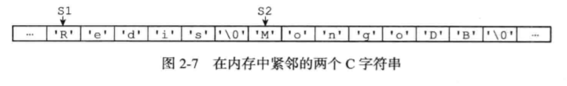

#  Redis

##  为什么要用缓存？

主要从“高性能”和“高并发”来看待这两个问题

###  高性能

假如用户第一次访问数据库中的某些数据，这个过程会比较慢，因为是从硬盘上读取的。将该用户访问的数据存放在缓存中，下一次再访问数据的时候就可以直接从缓存中拿去了，操作缓存就是直接操作内存，所以速度相当快。

###  高并发

直接操作缓存能够承受的请求是远远大于直接访问数据库的，所以我们可以考虑把数据库中的部分数据复制到缓存中，这样用户的一部分请求会直接到缓存这里而不用经过数据库。

##  Redis是什么

Redis是C语言开发的一个开源的高性能键值对的内存数据库，可以用作数据库、缓存、消息中间件等。Redis作为一个内存数据库，具有以下优点：

- 性能优秀，数据在内存中，读写速度非常快，支持并发10W QPS。
- 单进程单线程，是线程安全的，采用IO多路复用机制。
- 丰富的数据类型，有string、hash、list、set、sorted set等。
- 支持数据持久化，可以将内存中数据保存在磁盘中，重启时加载。
- 主从复制、哨兵、高可用。
- 可以作为消息中间件使用，支持发布订阅。

###  Redis数据类型

Redis内部使用一个redisObject对象来表示所有的key和value。


type表示一个value对象具体是何种数据类型，encoding是不同数据类型在Redis内部的存储方式。比如type = string表示value存储的是一个普通字符串，那么encoding可能是raw或者int。

1. string是Redis最基本的类型，可以理解成与Memcached一模一样的类型，一个key对应一个value，value不仅可以是string，也可以是数字。string类型是安全的，也就是说string可以包含任何数据，string类型的值最大能存储512M。
2. hash是一个键值集合，Redis的hash是一个string的key和value的映射表，hash特别适合存储对象。
3. list是简单的字符串列表，按照插入顺序排序，可以添加一个元素到列表的头部或或者尾部，底层实现是一个双向链表，可以用来当队列用。
4. set是string类型的无序集合，集合是通过hashtable实现的，set中的元素没有顺序且没有重复。
5. zset和set一样是string类型的，但是可以通过score来对成员排序，并且插入是有序的，即自动排序。它的实现方式是内部使用HashMap和跳跃表(skiplist)来保证数据的存储和有序，HashMap里放的是成员到score的映射，跳跃表里放的是所有的成员，排序依据是HashMap里存的score，使用跳跃表的结构可以获得比较高的查找效率，并且在实现上比较简单。

####  C字符串与SDS(简单动态字符串)的区别

1. SDS获取字符串长度为O(1)，SDS在len属性中记录了SDS本身的长度，而C字符串则是通过O(n)遍历，去找结束符'\0'

2. 杜绝缓冲区溢出，在C里如果进行了替换，那么就可能会影响紧邻的字符串的数据，造成缓冲区溢出

   
   

   而SDS则在每次进行操作之前，先检查空间是否足够，如果不够就会先扩展

3. 减少修改字符串时带来的内存重分配次数

   - 当增长字符串，程序需要先通过内存重分配来扩展底层数组的空间大小，如果忘了就会造成缓冲区溢出
   - 当缩短字符串，程序需要先通过内存重分配来释放字符串不再使用的空间，如果忘了就会造成内存泄漏

   SDS实现了空间预分配和惰性空间释放两种优化策略

   - 空间预分配：用于优化SDS的字符串增长操作，当SDS的API对一个SDS进行修改，程序不仅会为SDS分配修改所必要的空间，还会为SDS分配额外的未使用空间
   - 惰性空间释放：用于优化SDS的字符串缩短操作，当SDS的API需要缩短SDS保存的字符串时，程序并不立即使用内存重分配来回收多出来的字节，而是先使用free属性将这些字节的数量记录起来，等待将来使用

##  Redis的过期时间

Redis中可以对数据设置过期时间，应用场景：token过期、短信验证码等。

###   怎么查看过期时间？

redisDb结构的expires字典保存了数据库中所有键的过期时间，我们称这个字典为过期字典：

- 过期字典的键是一个指针，这个指针指向键空间中的某个键对象
- 过期字典的值是一个long long类型的整数，这个整数保存了键所指向数据库的过期时间--毫秒精度的UNIX时间戳

###  定期删除

定期删除会在规定的时间内，分多次遍历服务器中的各个数据库，从数据库的expires字典中随机检查一部分键的过期时间，并删除其中的过期键.

函数每次运行时，都从一定数量的数据库中取出一定数量的随机键进行检查，并删除其中的过期键。会有全局变量current_db记录当前检查的进度，下一次再进行处理时，会根据上次处理的进度接着处理。（10 ---> 11)

###  惰性删除

定期删除可能会导致很多过期key到了时间并没有被删除掉。惰性删除即当获取数据时检查key是否过期，如果过期就删除。

如果定期删除漏掉了很多key，然后也没有及时去查，就会导致大量key堆积在内存里，导致Redis内存块耗尽了，所以就有了Redis内存淘汰机制。

- 当键存在时，命令安装键存在的情况执行
- 当键不存在或者键因为过期而被expireIfNeeded删除时，命令安装键不存在的情况执行


##  Redis数据库

每个Redis客户端都有自己的目标数据库，每当客户端执行数据库写命令或者数据库读命令的时候，目标数据库就会成为这些命令的操作对象。

数据库主要由dict和expires两个字典构成，dict负责保存键值对，expires负责保存键的过期时间。

在初始化服务器时，程序会根据服务器状态的dbnum属性来决定应该创建多少个数据库：

````````c
struct redisServer {
    // ...
    
    // 服务器数据库数量，默认为16
    int dbnum;
    // ...
}
````````


###  如何切换数据库?

通过SELECT命令来切换目标数据库

````c
SELECT 1; //切换到1号数据库
SELECT 2; //切换到2号数据库
````


##  Redis内存淘汰机制

1. volatile-lru：从已设置过期时间的数据集中挑选最近最少使用的数据淘汰。
2. volatile-ttl：从已设置过期时间的数据集中挑选将要过期的数据淘汰。
3. volatile-random：从已设置过期时间的数据集中任意选择数据淘汰。
4. allkeys-lru：当内存不足以容纳新写入数据时，在键空间中，移除最近最少使用的key（最常用）
5. allkey-random：从数据集中任意选择数据淘汰。

##  Redis持久化机制

RDB文件是一个经过压缩的二进制文件。

###  RDB持久化

Redis通过创建快照来获得存储在内存里面的数据在某个时间点上的副本，存储在dump文件里。Redis创建快照后，可以对快照进行备份，可以将快照复制到其他服务器从而创建具有相同数据的服务器副本，还可以将快照留在原地以便重启服务器的时候使用。

默认Redis是会以快照“RDB”的形式将数据持久化到磁盘的一个二进制文件dump.rdb。工作原理是当Redis需要持久化时，Redis会fork一个子进程，子进程将数据写到磁盘上一个临时RDB文件中。

优点：这种文件非常适合用于备份：比如可以每个一小时备份一次，即使遇上问题，也可以随时将数据集还原到不同的版本。

缺点：如果需要尽量避免在服务器故障时丢失数据，那么RDB不合适，除非每秒都要进行一个备份。

####  实现

```python
def SAVE():
	rdbSave()    	# 创建RDB文件，会阻塞服务器进程
   
def BGSAVE():
    
    pid = fork() 	# 创建子线程
    
    if pid == 0:
        rdbSave()   # 子进程创建RDB文件
        signal_parent() # 完成后向父进程发送信号
    elif pid > 0:
        handle_request_and_wait_signal()  # 父进程继续处理命令请求，并通过轮询等待子进程信号
    else:
        handle_fork_error()  # 处理出错情况
```

ps： RDB的载入工作是在服务器启动时自动执行的，如果同时开启了AOF持久化功能，那么服务器先使用AOF文件来还原


####  自动间隔性保存

Redis允许用户通过设置服务器配置的save选项，让服务器每隔一段时间自动执行一次BGSAVE命令。

```c
save 900 1      # 在900秒之内对数据库进行了至少1次修改
save 300 10 	# 在300秒之内对数据库进行了至少10次修改
save 60  10000	# 在60秒之内对数据库进行了至少10000次修改
```

服务器维持了一个dirty计数器，以及一个lastsave属性：

- diry计数器记录距离上一次成功执行SAVE命令或者BGSAVE命令之后，服务器对数据库状态进行了多少次修改
- lastsave属性是一个UNIX时间戳，记录了服务器上一次成功执行SAVE命令或者BGSAVE命令的时间

维护了一个serverCron函数每隔100ms执行一次，该函数会遍历并检查所有保存条件，只要有任意一个条件被满足，就会执行BGSAVE命令

###  AOF持久化

AOF可以做到全程持久化，只需要在配置中开启appendonly yes。每执行一条会更改Redis中的数据的命令，Redis就会将该命令写入硬盘中的AOF文件。当Redis重启时，将会读取AOF文件进行重放，恢复到Redis关闭前的最后时刻。

优点：会让Redis变得非常耐久，可以设置不同的策略，默认是每秒一次，计算故障停机，也最多会丢失一秒钟的数据。

缺点：AOF的文件体积会大于RDB的体积，根据所使用的策略，AOF的速度可能会慢于RDB。

>appendfsync  always       每次有修改都会写入AOF文件，效率最低，最安全；每个事件循环都要将aof_buf缓冲区中的所有内容写到AOF文件，并且同步AOF文件。
>
>appendfsync. everysec    每秒钟同步一次，每隔一秒进行一次同步，假如出现故障停机，数据库也只丢失一秒钟的命令数据
>
>appendfsync  no              让操作系统决定何时进行同步，写入速度最快，同步时间最长。

####  AOF重写

为了解决体积膨胀的问题，Redis提供了AOF文件重写的功能，Redis可以新建一个AOF文件来替代现有的AOF文件，新旧两个所保存的数据库状态相同，但新AOF不会包含任何浪费空间的冗余命令，所以新AOF文件的体积会小得多。

####  AOF重写缓冲区

在服务器创建子进程之后开始使用，当Redis服务器执行完一个写命令之后，会同时将这个写命令发送给AOF缓冲区和AOF重写缓冲区， 在重写期间，服务器需要执行以下三个工作：

- 执行客户端发来的命令                                   
- 将执行后的写命令追加到AOF缓冲区
- 将执行后的写命令追加到AOF重写缓冲区

##  Redis事务

Redis事务是一次性、顺序性、排他性的执行一个队列中的一系列命令。

1. 没有隔离级别的概念：批量操作在发送EXEC命令前被放入队列缓存，并不会被实际执行。
2. 不保证原子性：单条命令是原子性执行的，但事务不保证原子性，且没有回滚；事务中任意命令执行失败，其余的命令仍会被执行。
3. 三个阶段：开始事务、命令入队、执行事务

##  缓存穿透

缓存穿透是指缓存和数据库中都没有的数据，而用户不断发起请求，如发起id为-1的数据或id为特别大不存在的数据。这时的用户很可能是攻击者，攻击者会导致数据库压力过大。

###  解决方案

1. 接口层增加校验，如权限校验、id<=0的直接拦截。
2. 从缓存取不到的数据，在数据库中也没有取到，这时也可以将key-value对写为key-null，缓存有效时间可以设置短点，这样可以防止攻击用户反复用同一个id暴力攻击。

##  缓存击穿

缓存击穿和缓存雪崩有点像，但有一点不同，缓存雪崩是因为大面积的缓存失效，打崩了DB，而缓存击穿是指一个key非常热点，在不停地扛着大量的请求，大并发集中对这一个点进行访问，当这个key在失效的瞬间，持续的大并发直接落到了数据库上，就在这个key上的点击穿了缓存。

###  解决方案

1. 设置热点数据永远不过期。

2. 加互斥锁，分布式锁。

   ```java
   public static String getData(String key) throws InterruptedException {
     String result = getDataFromRedis(key);
     if (result == null) {
       //获取锁
       if(reenlock.trylock()) {
         result = getDataFromMysql(key);
         if(result != null) {
           //放入缓存中
           setDataToCache(key, result);
         }
         reenlock.unlock();
       }
       else {
         //等100ms再重新获取
      		Thread.sleep(100);
         result = getData(key);
       }
     }
   }
   ```

##  缓存雪崩

缓存雪崩是指缓存中数据大批量到过期时间，而查询数据量巨大，引起数据库压力过大甚至宕机，和缓存击穿不同的是，缓存雪崩是所有数据都过期了。

###  解决方案

1. 缓存数据的过期时间设置随机，防止同一时间大量数据过期现象发生。
2. 如果缓存数据库是分布式部署，将热点数据均匀分布在不同的缓存数据库中。
3. 设置热点数据永不过期。

##  一致性Hash

在使用Redis的时候，为了保证Redis的高可用，或者Redis的读写性能，最简单的方式我们会做主从复制，组成Master-Slave的形式，或者搭建Redis集群，进行数据的读写分离。同样类似于数据库，当数据大于500w的时候就要分库分表，当数据量很大的时候同样可以对Redis进行类似的操作，就是分库分表。

当我们有2000w数据量时，就可以通过Hash值、取模、按照类别、按照某一个字段等等常见的规则进行分区，分库。但是如果按照这种方式有一种缺陷，就是当服务器的数量在变动的时候，所有的缓存位置都要发生改变。由于服务器在生产环境中随时会故障需要移除或者需要扩展时都会出现这种问题，那么就有了一致性Hash算法。

一致性Hash算法的原理是将节点hash值映射到hash环上，它具有如下特性：

- 单调性：指如果已经有一些请求通过哈希分派到了相应的服务器进行处理，又有新的服务器加入到系统的时候，应保证原有的请求可以被映射到原有或者新的服务器中，而不是映射到原来的其他的服务器上。
- 分散性：分布式环境中，客户端不知道服务器的存在，可能只知道其中一部分服务器，在客户端看来它看到的部分服务器就会形成一个完整的hash环，如果多个客户端都把部分服务器作为一个完整hash环，那么可能会导致，同一个用户的请求被路由到不同的服务器进行处理，这种情况显然是应该避免的，因为它不能保证同一个用户的请求落到同一个服务器，好的哈希算法应该尽量降低分散性。
- 平衡性：负载均衡，是指hash后的请求能够分散到不同的服务器上，一致性hash可以做到每个服务器都能处理请求，但是不能保证每个服务器处理的请求数量大致相同。

采用一致性hash算法的分布式集群中将新的机器加入，其原理是通过使用与对象存储一样的hash算法将机器也映射到环中（对机器的hash值是采用机器的ip或者机器唯一的别名作为输入值），然后以顺时针的方向计算，将所有对象存储到离自己最近的机器中。

但是这种情况也有他的缺点：如果节点hash值在hash环上分布不均匀，会导致缓存数据在每个节点不均匀分配；节点增加或减少，需要重新分布的缓存数据也不能均匀分配。此时就要采用虚拟节点，就要将原来的某个节点进行拆分再映射，此时计算就应该是机器的IP或者唯一的别名+序号作为输入值，再均衡分布。

```java
public class ConsistentHash<T> {
    private static String[] servers = {"192.168.0.1:8001","192.168.0.2:8001","192.168.0.3:8001","192.168.0.4:8001"};
  	//真实节点列表，因为服务器上下线很正常，所以用链表
    private static List<String> realNodes = new LinkedList<String>();
  	//key为虚拟节点的hash值，value为服务器名称
    private static SortedMap<Integer, String> virtualNodes = new TreeMap<Integer, String>();

  	//一个真实节点有8个虚拟节点
    private static final int V_NODE_NUM = 8;
    static {
        for (int i = 0; i < servers.length; i++) {
            realNodes.add(servers[i]);
        }

        for (String string : realNodes) {
            for (int i = 0; i < V_NODE_NUM; i++) {
                String vNodeName = string + "&&VN" + i;
                int hash = getHash(vNodeName);
                System.out.println("虚拟节点[" + vNodeName + "]被添加，hash值为:" + hash);
                virtualNodes.put(hash, vNodeName);
            }
        }
    }

    /**
     * FNV1_32_HASH算法
     * @param str
     * @return
     */
    private static int getHash(String str) {
        final int p = 16777619;
        int hash =  (int) 2166136261L;
        for(int i = 0; i< str.length(); i++)
            hash = (hash ^ str.charAt(i)) * p;
        hash += hash << 13;
        hash ^= hash >> 7;
        hash += hash << 3;
        hash ^= hash >> 17;
        hash += hash << 5;
        // 如果算出来的值为负数则取其绝对值
        if (hash < 0)
            hash = Math.abs(hash);
        return hash;
    }

  	//应该路由到那台服务器
    private static String getServer(String node) {
        int hash = getHash(node);
      	//得到大于该hash值的所有map
        SortedMap<Integer, String> subMap = virtualNodes.tailMap(hash);
        Integer i = subMap.firstKey();
      	//获取虚拟节点
        String vNodeName = subMap.get(i);
        System.out.println(vNodeName);
      	//截取真实节点
        return vNodeName.split("&&VN")[0];
    }


    public static void main(String[] args) {
        String[] nodes = { "127.0.0.1:1111", "221.226.0.1:2222", "102.211.0.122:3333" , "238.226.0.1:2222", "221.211.0.122:3333"};
        for (int i = 0; i < nodes.length; i++)
            System.out.println("[" + nodes[i] + "]的hash值为" + getHash(nodes[i]) + ", 被路由到结点[" + getServer(nodes[i]) + "]");
    }
}

```

##  主从复制

主从复制模式结合哨兵能解决单点故障问题，提高Redis可用性。从节点提供读，主节点提供写操作，对于读多写少的状况，可给主节点配置多个从节点，从而提高响应效率。

###  复制过程

1. 从节点执行slaveof[masterIP] [masterPort] ，保存主节点信息。
2. 从节点中的定时任务发送主节点信息，建立和主节点的socket连接。
3. 从节点发送ping信号，主节点返回pong，两边能互相通信。
4. 连接建立后，主节点将所有数据发送给从节点（数据同步）。
5. 主节点把当前的数据同步给从节点后，便完成了复制的建立过程。接下来，主节点就会持续地把写命令发送给从节点，保证主从数据一致性。

##  字典

###  数据结构

Redis的字典是通过哈希表实现的，一个哈希表有多个节点，每个节点代表一个键值对。

```c
typedef struct dictht {
  dictEntry **table;			// 哈希表数组
  unsigned long size;			// 哈希表大小
  unsigned long sizemask; // 大小掩码，总是等于size-1
  unsigned long used; 		// 已使用键值对数
}dictht;
```

```c
typedef struct dictEntry{
  void *key;
  union {
    void *key;
    uint64_t u64;		//uint64_t整数
    int64_t s64;		//int64_t整数
  }v;
  struct dictEntry * next; //采用拉链法解决hash冲突
}
```

完整的字典是由两个哈希表dictht构成的:

```c
typedef struct dict {
  dictType *type;    //类型特定函数
  void *privdata;    //私有数据
  dictht ht[2];  
  int rehashidx;     //rehash进度，当哈希表进行rehash的时候用到，其他情况下为-1
}dict;
```

###  插入过程

1. 计算key的哈希值，通过MurMurHash2算法

   ```c
   hash = dict->type->hashFunction(key)
   ```

2. 借助sizemask和哈希值，来计算出索引值

   ```c
   index = hash & dict->ht[0].sizemask 
   ```

3. 如果当前下标没有存放任何键值对，则直接存放，否则借助拉链法插入新的键值对

###  rehash

#### 什么时候会rehash

```c
load_factor = ht[0].used / ht[0].size
```

1. 当服务器目前没有执行的BGSAVE命令或者BGREWRUTEAOF命令，并且load_factor大于等于1
2. 当服务器目前正在执行BGSAVE命令或者BGREWRUTEAOF命令，并且load_factor大于等于5

ps: BGSAVE是redis进行RDB持久化用到的命令，BGREWRUTEAOF是redis进行AOF持久化的命令。也就是说当redis进行持久化的时候，可能会触发rehash。

####  rehash过程

1. rehash时需要开辟新哈希表，将旧哈希表的数据迁过来
2. 为dict的哈希表ht[1]分配空间，分配的空间大小取决于操作类型和当前键值对数量ht[0].used
   - 如果是扩展操作，ht[1]的大小为第一个大于等于**ht[0].used * 2 * 2^n**的整数
   - 如果是收缩操作，ht[1]的大小为第一个大于等于**ht[0].used * 2^n**的整数
3. 重新计算ht[0]中所有键的哈希值和索引值，将相应的键值对迁移到ht[1]的指定位置去（这个过程是渐进式的，否则redis服务器会不可用）
   - rehash时会有rehashidx来进行计数，每迁移一次进行+1，当 rehashidx == ht[0].size 时则表示迁移完成，置为-1
   - 在rehash的过程中，可能会存在同时查两个哈希表的情况，当插入新数据的时候，就直接在ht[1]上进行操作
4. 当ht[0]的所有键值对都迁移到ht[1]中后，将ht[1]设为ht[0]，并新建一个空表，为下次做准备

##  跳表

跳表（Skip List）是一种随机化的数据结构，基于并联的链表，实现简单，插入、删除、查找的复杂度均为O(logN)。简单说来跳表也是链表的一种，只不过它在链表的基础上增加了跳跃功能。


从skiplist的创建和插入过程中可以看出，每一个节点的层数是随机出来的，而且新插入一个节点不会影响其它节点的层数。因此，插入操作只需要修改插入节点前后的指针，而不需要对很多节点都进行调整。

###  redis中的skiplist

1. score允许重复，即skiplist的key允许重复
2. 在比较时，不仅比较分数，还比较数据本身，在redis的skiplist实现中，数据本身的内容为一标识这份数据，而不是由key来唯一标识
3. 第一层链表不是一个单向链表，而是一个双向链表，这是为了方便以倒序方式获取一个范围内的元素
4. 在skiplist中可以很方便地计算出每个元素的排名

```java
package com.xust.skip;

import java.util.Random;

public class SkipList{

    private static final int MAX_LEVEL = 16;       //节点的个数
    private int levelCount = 1;                    //索引层级数
    private SkipNode head = new SkipNode();
    private Random random = new Random();


    public SkipNode find(int value) {
        SkipNode p = head;
        for (int i = levelCount - 1; i >= 0; i--) {
            while (p.next[i] != null && p.next[i].data < value) {
                p = p.next[i];
            }
        }

        if (p.next[0] != null && p.next[0].data == value) {
            return p.next[0];
        }

        return null;
    }

    public void insert(int value) {
        int level = randomLevel();      //生成随机层数
        SkipNode node = new SkipNode();
        node.data = value;
        node.maxLevel = level;          //代表当前节点应该在的位置

        SkipNode update[] = new SkipNode[level];

        for (int i = 0; i < level; i++) {
            update[i] = head;
        }

        SkipNode p = head;
        // 找到待插入位置
        for (int i = level - 1; i >= 0; i--) {
            while (p.next[i] != null && p.next[i].data < value) {
                p = p.next[i];
            }
            update[i] = p;
        }
        // 更新
        for (int i = 0; i < level; i++) {
            node.next[i] = update[i].next[i];
            update[i].next[i] = node;
        }

        if (levelCount < level) {
            levelCount = level ;
        }
    }

    public void delete(int value) {
        SkipNode[] update = new SkipNode[levelCount];
        SkipNode p = head;

        // 找到待删除节点
        for (int i = levelCount - 1; i >= 0; i--) {
            while (p.next[i] != null && p.next[i].data < value) {
                p = p.next[i];
            }
            update[i] = p;
        }

        // 删除并更新
        if (p.next[0] != null && p.next[0].data == value) {
            for (int i = levelCount - 1; i >= 0; i--) {
                if (update[i].next[i] != null && update[i].next[i].data == value) {
                    update[i].next[i] = update[i].next[i].next[i];
                }
            }
        }
    }


    /**
     * 随机函数，生成待保存节点的层数
     * @return
     */
    public int randomLevel() {
        int level = 1;
        for (int i = 1; i <= MAX_LEVEL ; i++) {
            if (random.nextInt() % 2 == 1) {
                level++;
            }
        }
        return level;
    }


    public static class SkipNode {
        private int data = -1;
        private SkipNode next[] = new SkipNode[MAX_LEVEL];
        private int maxLevel = 0;

        @Override
        public String toString() {
            StringBuilder builder = new StringBuilder();
            builder.append("{data:");
            builder.append(data);
            builder.append("; leves: ");
            builder.append(maxLevel);
            builder.append(" }");
            return builder.toString();
        }
    }

    /**
    * 按层展示数据
    */
    public void display() {
        for (int i = 1; i < levelCount; i++) {
            SkipNode p = head;
            while (p.next[0] != null) {
                if (p.next[0].maxLevel == i)
                {
                    System.out.print(p.next[0] + " ");
                }
                p = p.next[0];
            }
            System.out.println();
        }
    }

}

```

##  zset

有序集合对象的编码可以是ziplist或者skiplist，同时满足以下条件时使用ziplist编码：

- 元素数量小于128个

- 所有member的长度都小于64字节

  ```
  ps: 如果不满足，可以通过Redis配置文件zset-max-ziplist-entries 选项和 zset-max-ziplist-value 进行修改
  ```

###  ziplist

ziplist编码的Zset使用紧挨在一起的压缩列表节点来保存，第一个保存member，第二个保存score。ziplist内的集合元素按score从小到大排序，其实质是一个双向链表。

ziplist的结构如下：


- zlbytes：存储一个无符号整数，固定四个字节长度，用于存储压缩列表所占用的字节，当重新分配内存的时候使用，不需要遍历整个列表来计算内存大小
- zltail：存储一个无符号整数，固定四个字节长度，表示ziplist中最后一项在ziplist中的偏移字节数，使得我们可以很方便地找到最后一项，从而可以在ziplist尾端快速地执行push或pop操作
- zlen：压缩列表包含的节点个数，固定两个字节长度（16bit），表示ziplist中数据项entry的个数
- entry：表示真正存放数据的数据项，长度不定。一个数据项（entry）也有它自己的内部结构
- zlend：ziplist最后一个字节，值固定等于255，一个结束标记

###  skiplist

skiplist编码的zset底层为一个被称为zset的结构体，包含一个字典和一个跳跃表，跳跃表按score从小到大保存所有集合元素，字典则保存着从member到score的映射，这样就可以用O(1)的时间复杂度来查找member对应的score值，虽然同时使用两种结构，但他们会通过指针来共享相同元素的member和score，因此不会浪费额外的内存。

```c
#define ZSKIPLIST_MAXLEVEL 32
#define ZSKIPLIST_P 0.25
 
typedef struct zskiplistNode {
robj *obj;
double score;
struct zskiplistNode *backward;
struct zskiplistLevel {
struct zskiplistNode *forward;
unsigned int span;
} level[];
} zskiplistNode;
 
typedef struct zskiplist {
struct zskiplistNode *header, *tail;
unsigned long length;
int level;
} zskiplist;
```

1. 当数据较少时，sorted set是由ziplist实现的
2. 当数据多的时候，sorted set是由dict + skiplist实现的，dict用来查询数据到分数的对应关系，skip用来根据分数查询数据

###  redis中的skiplist与经典不同之处

1. 分数score允许重复，即skiplist的key允许重复
2. 在比较时，不仅比较分数，还比较数据本身，在Redis的skiplist实现中，数据本身的内容唯一标识这份数据，而不是由key来唯一标识。另外，当多个元素分数相同的时候，还需要根据数据内容来进行字典排序
3. 第1层链表不是一个单向链表，而是一个双向链表，方便以倒序获取元素
4. 在skiplist中可以很方便计算出每个元素的排名

###  redis为什么使用skiplist而不用平衡树？

1. 不是非常消耗内存，实际上取决于生成层数函数里的函数p
2. 有序集合经常会进行zrange或zrevrang这种范围查找操作，双向链表可以十分方便地进行这类操作
3. 实现简单，zrank操作还有可能达到O(logn)的时间复杂度


##  Redis主从同步(配从不配主)

###  配置文件:

```conf
include /library/redis-5.0.4/redis.conf
pidfile /users/a/desktop/redis63**.pid
port 63**
dbfilename dump63**.rdb
```


###  配置主从

```conf
slave <ip> <port>  # 成为某个服务器的从服务器 
```

通过info replication来查看服务器状态
主：


从：


###  哨兵

Redis Sentinel是一个分布式的架构，它本身也是一个独立的Redis节点，不存储数据，支持部分命令，可以自动完成故障发现和故障转移，并通知应用方，从而实现高可用。

每个Sentinel节点会对数据节点和其它sentinel节点进行监控，Sentinel间会进行监控数据的共享，当发现节点异常时，会对节点做下线标识，如果被标识的是主节点，此时会与其它Sentinel节点进行协商，当大多数Sentinel节点都认为主节点不可达的时候，会发起选举，重新选举master节点。

Sentinel主要提供以下几个功能：

- 监控：定期检测Redis数据节点、其它Sentinel节点是否可达
- 通知：将故障转移的结果通知给应用方
- 主节点故障转移：实现从节点晋升为主节点，并维护后续正确的主从关系
- 配置提供者：客户端在初始化的时候连接Sentinel节点集合，从中获取主节点信息
  多个Sentinel节点来共同判断故障，可以有效防止误判，同时如果个别Sentinel节点不可用，整个Sentinel节点集合依然是高可用的。

###  如何选新的master

1. 较低的slave_priority(在配置文件中指定，默认配置为100)
2. 较大的replication offset(每个slave在与master同步后offset自动增加)
3. 较小的runid(每个redis实例，都会有一个runid，通常是一个40位的随机字符串，在启动时设置，重复概率非常小)
4. 如果以上条件都不足以区别出唯一的节点，则会看哪个slave节点处理之前master发送的command多就选谁


##  集群的通信方式是怎样的？

Redis集群采用P2P的Gossip（流言）协议，Gossip协议工作原理就是节点彼此不断通信交换，一段时间后所有的节点都会知道集群完整的信息，这种方式类似留言传播。

集群中的每个节点都会单独开辟一个TCP通道，用于节点之间彼此通信，通信端口号在基础端口上加1000。每个节点在固定周期内通过特定规则选择几个节点发送ping消息，接收到ping消息的节点用pong消息作为响应。

集群中每个节点通过一定规则挑选要通信的节点，每个节点可能知道全部节点，也可能知道部分节点，只要这些节点彼此可以正常通信，最终它们会达到一致的状态。当节点出故障、新节点加入、主从角色变化、槽信息变更等事件发生时，通过不断的ping/pong消息通信，经过一段时间后所有的节点都会知道整个集群全部节点的最新状态，从而达到集群状态同步的目的。

###  Gossip消息

Gossip协议的主要职责就是消息交换。消息交换的载体就是节点彼此发送的Gossip消息，常用的Gossip消息可分为：ping、pong、meet、fail

- meet消息：用于通知新节点加入，消息发送者通知接收者加入到当前集群，meet消息通信正常完成后，接收节点会加入到集群中并进行周期性的ping、pong消息交换
- ping消息：集群内交换最频繁的信息，集群内每个节点每秒向多个其它节点发送ping消息，用于检测节点是否在线和交换彼此状态信息。ping消息发送封装了自身节点和部分其它节点的状态数据