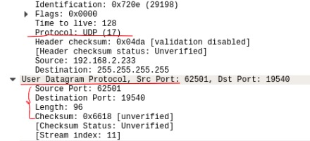

#  网络部分面试题

##  POST和GET的区别

###  GET

请求的数据会附加在URL之后，以 ? 分割URL和传输数据，多个参数用 & 连接。URL的编码格式采用的是ASCII编码，而不是Unicode。即所有的非ASCII字符都要编码之后再传输

###  POST

请求会把数据放置在http请求的包体中。

###  区别

- 传输数据的大小：在http请求中，没有对url的长度和传输的数据大小进行限制。但是在实际的开发过程中，对于GET，特定的浏览器和服务器对url的长度有限制。因此，在使用GET请求时，传输数据会收到url长度的限制。对于POST，理论上是不会受限制的，但是实际上各个服务器会规定对POST提交数据大小进行限制。比如tomcat在7.0版本之前默认是2m，如果大于2m就接受不到值，解决办法是在server.xml中修改maxPostSize。
- 安全性：POST比GET更安全，在进行登录操作时，密码和用户名就会被暴露在url上，并且登录页面有可能被浏览器缓存，此时密码就更容易被他人拿到了。

##  http常见状态码

### 10X

代表请求已被接受，正在处理，是临时响应。

###  20X

代表请求已被服务器接收、理解、接受。

- 200：请求成功，请求所希望的响应头或数据体将随此响应返回。表示正常状态。
- 201：请求已被实现，并且有新的资源依据请求的需要而建立。
- 202：接受请求，但尚未处理，可能会被拒绝或者不被执行。
- 203：成功处理了请求，返回的实体头部信息是来自本地或者第三方的拷贝。

###  30X

代表客户端需要采取进一步的操作才能完成请求，后续的请求地址在本次响应的Location域中指明。

- 300：针对请求，服务器可做多种操作。
- 301：永久移动，请求的页面已永久跳转到新的url。
- 302：临时移动，服务器目前从不同的网页响应请求，但请求仍继续使用原有位置来进行以后的请求。
- 303：查看其它位置，请求应当对不同的位置使用单独的GET请求来检索响应。

###  40X

代表客户端可能发生了错误，妨碍了服务器的处理。

- 400：错误请求，服务器不理解请求的语法。
- 401：未授权，请求要求用户的身份验证。
- 403：服务器拒绝请求。
- 404：服务器找不到请求的页面。
- 405：请求方法不被允许。

###  50X

服务端在处理请求的过程中有错误或者异常状态发生，也有可能是服务器意识到当前的软硬件资源无法完成对请求的处理。

- 500：一般会在源代码出现错误时出现。
- 501：服务器不具备完成请求的功能。
- 502：服务器作为网关或者代理出现错误。
- 503：服务器目前无法使用。
- 504：网管或代理服务器，未及时获取请求。

##  Cookie和Session的区别

###  session

由于http协议是无状态的协议，所以当服务端需要记录用户的状态时，就需要用某种机制来识别具体的用户，这个机制就是session，典型的场景比如购物车，当点击收藏按钮时，由于http协议无状态，所以不知道是哪个用户操作的，所以服务端需要创建session来标识这个用户并且跟踪用户，这样才可以知道购物车里的东西。session是保存在服务端的，会有一个唯一的sessionID来识别。

###  cookie

sessionID是存在cookie中的，而cookie存放在客户端，当cookie把sessionID发送到服务器，服务器就会识别出指定的客户。即大多数的应用都是用cookie来实现session跟踪的，但如果浏览器禁用了cookie，一般会使用URL重写的技术(胖URL)来进行会话跟踪，（url+sid=xxx），服务端据此来识别用户。

- session存在服务器端（文件、数据库、内存里），cookie在客户端（浏览器）
- session的运行依赖sessionID，而sessionID是存在cookie中的
- 用户验证一般会用session
- cookie不是很安全，可以进行cookie欺骗

当请求第一次来时会先检查有没有cookie，如果没有则生成cookie，在响应中添加cookie后返回。第二次请求来临时服务器就会识别出是哪个请求。

##  ICMP

互联网控制消息协议，承担网络层通信差错检测和报告机制的协议，ping命令就是基于ICMP协议来验证网络层连通性的工具。

ICMP的主要功能包括，确认IP包是否成功送达目标地址，通知在发送过程当中IP包被废弃的具体原因，改善网络设置等。有了这些功能后，就可以获得网络是否正常、设置是否有误以及设备有何异常等信息，从而便于进行网络上的问题诊断。

- 0 : 回送应答 （Echo Reply）
- 3 : 目标不可达（ Destination Unreachable）
- 5 : 重定向或改变路由（Redirect）
- 8 : 回送请求（Echo Request）

##  TCP协议

TCP协议能够对自己提供的连接实施控制，是一种可靠的传输层协议，传输层协议最本质的任务就是把网络层协议提供的终端之间的通信服务，扩展到终端系统中运行的应用程序之间。也就是说在为应用进程建立通信之前，TCP需要首次建立传输数据所需的连接，一旦TCP连接建立成功，应用进程之间就可以通过这条TCP连接相互发送上层数据了。 

###  TCP是通过什么方式来提供可靠传播的

- 对数据进行分割和重组：TCP能够将数据分割为适当大小进行传输。
- 确保数据按顺序传输：会为自己发出的数据标明序列号。
- 同时为多个应用程序提供传输服务：通过端口号把应用进程和数据的对应关系搞清楚。
- 确保接收方收到数据并按需重传：TCP要求接收方在接收到数据后，对发送方进行确认，如果发送方未收到确认标志或超出时间（当TCP发出一个段后，会启动一个定时器），那么发送方将会再次发送数据。
- 控制传输速率：使用滑动窗口机制，使接收方能够调节发送方的发送速率。
- 拥塞控制：当网络拥塞时，减少数据的发送。

####  拥塞控制

若对网络中某一资源的需求超过了该资源所能提供的可用部分，网络的性能就要变坏，这种情况就叫做拥塞。拥塞控制就是为了防止过多的数据注入到网络中，这样就可以使网络中的路由器或链路不致过载。拥塞控制所要做的都有一个前提，就是网络能够承受现有的网络负荷。

为了进行拥塞控制，TCP发送方要维持一个拥塞窗口的状态变量，拥塞控制窗口的大小取决于网络的拥塞程度，并且动态变化，发送方让自己的发送窗口取为拥塞窗口和接收方的接收窗口中较小的一个。

TCP的拥塞控制采用了四种算法，即慢启动、拥塞避免、快重传和快恢复。

- 慢启动：限制了一个TCP端点在任意时刻可以传输的分组数，每成功接收一个分组，发送端就有了发送另外两个分组的权限，以此类推，这种方式被称为“打开拥塞窗口“。
- 拥塞避免：让拥塞窗口cwnd缓慢增大，每经过一个往返时间就把发送方的cwnd+1。
- 快重传与快恢复：能够快速恢复丢失的数据包，如果接收方接收到一个不按顺序的数据段，会立即给发送方发送一个重复确认，如果发送方收到三个重复确认，它会假定数据段丢失了，并立即重传这些丢失的数据段。如果没有该算法，就会有定时器来进行确认，会耽误时间。

###  TCP头部

- 源端口：源设备上应用进程所使用的TCP端口号（2）
- 目的端口：指明目的设备上应用进程所使用的TCP端口号（2）
- 序列号：表示发送数据的位置（初始值并非为0，而是在建立连接以后由随机数生成，后面则是对每一字节加1）（4）
  - 保证报文按序到达
  - 保证可靠性
  - 保证效率
  - 精确的报告哪些收到，哪些需要重传
- 确认号：确认已收到的数据（4）
- 头部长度：标识TCP头部的总长度
- 窗口大小：接收多少字节的数据

###  TCP Flags

- ACK：确认序号标志
- SYN：同步序号，用于建立连接过程
- FIN：finish标志，用于释放连接

###  TCP连接

TCP建立的是双向连接，当客户端与服务器之间数据传输完毕后，TCP会拆除已建立的连接。状态会从CLOSED ---> ESTABLISHED

####  三次握手过程

- 刚开始服务器和客户端都是CLOSED状态
- 客户端发送SYN包（syn=j）到服务器，并进入SYN_SEND状态，等待服务器确认；
- 服务器收到SYN包，必须确认客户的SYN（ack=j+1），同时自己也发送一个SYN包（syn=k），即SYN+ACK包，此时服务器进入SYN_RECV状态；
  ps:  报文不一定会按发送的时序到达目标，所以要加一。

- 客户端收到服务器的SYN+ACK包，向服务器发送确认包ACK（ack=k+1），此包发送完毕，客户端和服务器进入ESTABLISHED状态，完成三次握手。

####  意义

- 确保接收方收到了发送方的数据
- 发送方按照接收方的处理能力发送数据，避免不必要的丢包重传

####  为什么要三次握手

1. 为了初始化Sequence Number的初始值。保证应用层接收到的数据不会因为传输问题而乱序，TCP也会因为sequence number排序。

2. 三次握手最主要的目的就是双方确认自己与对方的发送和接收是正常的。

- 第一次：Client什么都不能确认；Server确认对方发送正常，自己接收正常。
- 第二次：Client确认自己发送、接收正常，对方发送、接收正常；Server确认对方发送正常，自己接收正常。
- 第三次：Client确认自己发送、接收正常，对方发送、接收正常；Server确认对方发送、接收正常，自己发送、接收正常。

####  为什么要传回SYN

传回SYN是为了告诉发送端，我收到的信息就是你发送的信号。

####  建立连接后，Client出现故障怎么办

保活机制

- 向对方发送保活探测报文，如果未收到响应则继续发送
- 尝试次数达到保活探测数仍未收到响应则中断连接

####  连接第三步Server端未收到ACK

Server端会不断重试直至超时，Linux默认等待63秒才断开连接，每次成倍数增加等待时间（1-->2-->4.......。

####  四次挥手过程

- 客户端向服务器发送请求中断连接（FIN），**客户端进入到FIN-WAIT-1状态**
- 服务器向客户端发送ACK表示请求收到，确认序号为收到序号+1，**客户端进入FIN-WAIT-2状态**
- 服务器向客户端发送中断请求FIN，用来关闭服务器向客户端的数据传输，**服务器进入CLOSE-WAIT状态**
- 客户端收到FIN后发送ACK表示收到，客户端进入**TIME_WAIT**状态，然后发送ACK给Server，确认序号为收到序号+1（如果服务器没有收到ACK则重传，等待时间到后没有收到重传信息，则说明服务器已经关闭），**服务器进入LAST-ACK状态**
- 断开后Server进入CLOSED状态

####  为什么TIME_WAIT状态必须要等2*MSL之后才能返回到CLOSED状态呢？

1. 为了保证客户端发送的最后一个ACK报文段能够达到服务器。这个ACK报文段可能丢失，因而使服务器收不到确认。服务器会重传一次FIN+ACK报文段，客户端就能在2MSL时间内收到这个重传的FIN+ACK报文段，接着客户端重传一次确认，重启计时器。最后，客户端和服务器都进入到CLOSED状态。
2. 防止已失效的连接请求报文段出现在本连接中。客户端在发送完最后一个ACK确认报文段后，再经过时间2MSL，就可以使本连接持续的时间内所产生的所有报文段都从网络中消失。这样就可以使下一个新的连接中不会出现这种旧的连接请求报文段。

Client关闭socket连接，Server忙于读或者写，没有及时关闭连接，需要检查代码，特别是释放资源的代码。

###  应用场景

当对网络通讯质量有要求的时候，比如：整个数据要准确无误的传递给对方，这往往用于一些要求可靠的应用，比如HTTP、HTTPS、FTP等传输文件的协议，POP、SMTP等邮件传输的协议

####  滑动窗口

TCP使用滑动窗口做流量控制与乱序重排，主要是为了保证TCP的可靠性和流控特性。发送方主要分为四部分：已发送已确认、已发送未确认、未发送允许接收、未发送不允许接收（超出了窗口的最大值）；发送方只有在接收到接收方的确认接收标志后才会移动左边界，接收方只有在前面的所有的段都确认的情况下才会移动左边界

##  UDP协议

用户数据报协议，是一种无连接的传输层协议，提供面向事务的简单不可靠信息传送服务，提供了无连接通信，且不对传送数据包进行可靠性保证，适合一次传输少量数据，UDP的可靠性由应用层负责。

在发送端UDP传输数据的速度仅仅是受应用程序生成数据的速度、计算机的能力和传输带宽的限制，在接收端UDP把每个消息段放在队列中，应用程序从队列中读取消息段

###  特点

- UDP无连接，时间上不存在建立连接需要的时延。不维护连接状态，也不跟踪这些参数，开销小，可以同时给多个客户端发送消息。
- UDP首部开销小：TCP首部20字节，UDP8个字节。
- UDP没有拥塞控制：应用层能够更好的控制要发送的数据和发送时间，能容忍一些数据的丢失，但是不能允许有较大的时延。
- UDP提供最大努力的交付：不保证可靠交付，所有维护传输可靠性的工作需要用户在应用层完成。
- UDP是面向报文的：对应用层交下来的报文，添加首部后直接向下交付给网络层，对网络层传输上的数据报去除首部后就原封不动交给上层。
- UDP常用一次性传输比较少量数据的网络应用：如DNS、SNMP等，若采用TCP，为连接的创建、维护和拆除带来不小的开销。



可以看到，UDP其实就是在IP报文中添加了端口信息，使数据到达主机后送达相应端口的应用程序。

###  UDP使用

在选择使用协议的时候，选择UDP必须要谨慎。在网络质量令人十分不满意的环境下，UDP协议数据包丢失会比较严重。但是由于UDP的特性：它不属于连接型协议，因而具有资源消耗小、处理速度快的特点，所以通常音频、视频和普通数据在传送时使用UDP较多，因为它们即使偶尔丢失一两个数据包，也不会对接收结果产生太大影响。

TCP协议中植入了各种安全保障功能，但是在实际执行的过程中会占用大量的系统开销，无疑使速度受到严重的影响。反观UDP由于排除了消息可靠传递机制，将安全和排序等功能移交给上层应用来完成，极大降低了执行时间，使速度得到了保证。

##  各层功能简述

- 应用层：为应用程序提供服务并规定应用程序中通信相关的细节。包括文件传输、电子邮件、远程登录等协议。
- 表示层：将应用处理的信息转换为适合网络传输的格式，或将来自下一层的数据转换为上层能够处理的格式。因此它主要负责数据格式的转换。
- 会话层：负责建立和断开通信连接，以及数据的分割等数据传输相关的管理。
- 传输层：解决了主机间的数据传输，端对端的通信。解决了传输质量的问题，同时进行流量控制，使得接收方可以控制发送方的速率，能够将数据包进行分割并加上序列号以保证按顺序充足。
- 网络层：将网络地址翻译成对应的物理地址，并决定如何将数据从发送方路由到接收方，来决定从发送方到接收方的最佳路径。
- 数据链路层：因为物理层会出现错传或者漏传，所以数据链路层定义了数据如何传输，通常提供错误检测和纠正。交换机工作在这一层。
- 物理层：负责0、1比特流的传输并转换成电流强弱来进行传输。

##  http和https的区别

- https需要到ca申请证书（证书颁发机构，是负责发放和管理数字证书的权威机构），需要一定经济成本。
- http是明文传输，https是加密的安全传输。
- 连接的端口不一样，http是80，https是443。
- http连接简单，没有状态。
- HTTPS是HTTP的安全版，即HTTP加入SSL层，SSL依靠证书来验证服务器的身份，并为浏览器和服务器之间的通信加密。

##  HTTPS的数据传输流程

1. client向server发送请求https://baidu.com，然后连接到server的443端口，发送的信息主要是随机值1和客户端支持的加密算法。
2. server接收到信息之后给予client响应握手信息，包括随机值2和匹配好的协商加密算法，这个加密算法一定是client发送给server加密算法的子集。
3. 随即server给client发送第二个响应报文是数字证书。服务端必须要有一套数字证书，可以自己制作，也可以向组织申请。区别就是自己颁发的证书需要客户端验证通过，才可以继续访问，而使用受信任的公司申请的证书则不会弹出提示页面，这套证书其实就是一对公钥和私钥。传送证书，只是包含了很多信息，如证书的颁发机构，过期时间、服务端的公钥，第三方证书认证机构(CA)的签名，服务端的域名信息等内容。
4. 客户端解析证书，这部分工作是由客户端的TLS来完成的，首先会验证公钥是否有效，比如颁发机构，过期时间等等，如果发现异常，则会弹出一个警告框，提示证书存在问题。如果证书没有问题，那么就生成一个随机值（预主秘钥）。
5. 客户端认证证书通过之后，接下来是通过随机值1、随机值2和预主秘钥组装会话秘钥。然后通过证书的公钥加密会话秘钥。
6. 传送加密信息，这部分传送的是用证书加密后的会话秘钥，目的就是让服务端使用秘钥解密得到随机值1、随机值2和预主秘钥。
7. 服务端解密得到随机值1、随机值2和预主秘钥，然后组装会话秘钥，跟客户端会话秘钥相同。
8. 客户端通过会话秘钥加密一条消息发送给服务端，主要验证服务端是否正常接受客户端加密的消息。
9. 同样服务端也会通过会话秘钥加密一条消息回传给客户端，如果客户端能够正常接受的话表明SSL层连接建立完成了。

###  为什么要有数字签名

数字签名是用来验证发送方的身份并帮助保护数据的完整性。而用公钥加密这个行为任何人都可以做，所以起到的作用是加密传输的文本，而无法起到验证发件人身份的作用。

发送的过程中，bob的邮件是明文发送的，意思是bob不怕别人看到这封信的信息，但是怕中途被人修改，所以用了数字签名。

在这个情景下数字签名其实起到了两个作用：

1. 证明邮件来源一定为bob，因为别人没有bob的密钥，无法得到能用bob的公钥解密的密文
2. 确保邮件的信息在传输的途中没有被篡改，或者说篡改了接收方很容易察觉到。因为一旦篡改了邮件内容，邮件内容对应的哈希值不同，但是别人没有bob的密钥，就无法改动这个哈希值，所以无法伪造。

###   私钥和公钥

1. 每个用户都有一对私钥和公钥
   - 私钥用来解密和签名，是给自己用的；
   - 公钥由本人公开，用于加密和验证签名，是给别人用的。
   - 当该用户发送文件时，用私钥签名，别人用它给的公钥加密，可以保证该信息是由它发送的。即数字签名。
   - 当该用户接收文件时，别人用它的公钥加密，它用私钥解密，可以保证该信息只能由它看到。即安全传输。

##  HTTP1.1和1.0的区别

- 缓存处理，http1.0中主要使用header里的If-Modified-Since，Expires来作为缓存判断的标准，http1.1则引入了更多的缓存控制策略如Entity tag，If-Unmodified-Since，If-Match，If-None-Mathch等更多可供选择的缓存头来控制缓存策略。
- 带宽优化及网络连接的使用，在1.0中，存在带宽浪费的现象，比如客户端只需要某个对象的一部分，但是服务器却将整个对象送过来，并且不支持断点续传功能，1.1则在请求头引入了range头域，它允许只请求资源的某个部分，这样就方便了开发者自由的选择以便于充分利用带宽和连接。
- 错误通知的管理，在1.1中新增了24个错误状态响应码。
- Host头处理，在1.0中认为每台服务器都绑定一个唯一的IP地址，因此，请求消息中的URL并没有传递主机名。但随着虚拟主机技术的发展，在一台物理服务器上可以存在多个虚拟主机，并且共享一个IP地址。1.1的请求消息和响应消息都应支持Host头域，且请求消息中如果没有Host头域会报告400错误。
- 长连接，1.1支持长连接和请求的流水线处理，在一个tcp连接上可以传送多个http请求和响应，减少了建立和关闭连接的消耗和延迟，在http1.1中默认开启Connection:keep-alive，一定程度上弥补了http1.0每次请求都要创建连接的缺点。

##  DNS寻址过程

- 首先会检查本地hosts文件是否有这个映射关系，如果有，就优先调用。
- 如果hosts里没有，则会在本地DNS解析器缓存，查看是否有网址映射关系。
- 如果没有，继续查TCP/IP参数中设置的首选DNS服务器（本地）。此服务器收到查询时，如果要查询的域名包含在本地配置中，则返回解析结果给客户机，完成域名解析；如果不在本地，但该服务器已缓存了此网址映射关系，则调用这个IP地址映射，完成域名解析，此解析不具有权威性。
- 如果都失效，则根据本地DNS服务器设置进行查询，然后从.com进行解析，如果自己无法解析，就会下一级qq.com给本地DNS服务器，直至找到www.qq.com主机（未用转发模式）；如果是转发模式，就会把请求转发至上一级DNS服务器，由上一级服务器进行解析，如果不能解析，就会转至上上级，以此循环。

##  Tcp粘包和拆包

发送端为了将多个发给接收端的包更有效的发给对方，使用了优化方法（Nagle算法），将多次间隔较小且数据量小的数据合并成一个大的数据块，然后进行封包。虽然提高了效率，但是接收端就难以分辨出完整的数据包，因为面向流的通信是无消息保护边界的，所以需要在接收端处理消息边界问题，也就是粘包、拆包问题。

###  发生原因

- 要发送的数据大于**TCP发送缓冲区**剩余空间大小，将会发生拆包。
- 待发送数据大于MSS（最大报文长度），TCP在传输前将进行拆包。
- 要发送的数据小于**TCP发送缓冲区**的大小，TCP将多次写入缓冲区的数据一次发送出去，将会发生粘包。
- 接收端的应用层没有及时读取接收缓冲区中的数据，将发生粘包。

###  解决办法

- 发送端给每个数据包添加包首部，首部中应该至少包含数据包的长度，这样接收端在接收数据后，通过读取包首部的长度字段，便知道每一个数据包的实际长度了。
- 发送端将每个数据包封装为固定长度，不够的通过0补充，这样接收端每次从接收缓冲区中读取固定长度的数据就自然而然的把每个数据包拆分开来。
- 可以在数据包之间设置边界，如添加特殊符号。

##  ARP是地址解析协议，解释一下工作原理

地址解析协议（Address Resolution Protocal），是根据IP地址获取物理地址的一个TCP/IP协议。

1. 首先，每个主机都会在自己的ARP缓冲区中建立一个ARP列表，表示IP地址和MAC地址之间的对应关系。
2. 当源主机要发送数据时，首先检查ARP列表是否有，如果有则直接发送数据，如果没有就向本网段的所有主机发送ARP数据包，该数据包包括的内容有：源主机IP地址、源主机MAC地址，目的主机IP地址。
3. 当本网络的所有主机收到这个ARP数据包时，首先就会检查这个IP地址是否是自己的IP地址，如果不是，则忽略该数据包，如果是，则首先从数据包中取出源主机的IP和MAC地址写入到ARP列表中，如果已经存在，则覆盖，然后将自己的MAC地址写入ARP响应包中，告诉源主机自己是它想要找的MAC地址。
4. 源主机收到ARP响应后，将目的主机的IP和MAC地址写入ARP列表，并利用此信息发送数据，如果源主机一直没有收到ARP响应数据包，表示ARP查询失败。

​    注：广播(255.255.255.255)发送ARP请求，单播发送ARP响应。

##  什么是最长匹配？

路由控制表中记录着网络地址与下一步应该发送至路由器的地址（在Windows或Unix上表示路由器的方法分别为netstat -r或者netstat -rn）。在发送IP包时，首先要确定IP包首部中的目标地址，再从路由控制表中找到与该地址具有相同网址地址的记录，根据该记录将IP包转发给相应的下一个路由器。如果路由控制表中存在多条相同网络地址的记录，就选择一个最为吻合的网络地址。所谓最为吻合是指相同位数最多的意思（最长匹配）。假设172.20.100.52的网络地址与172.20/16和172.20.100/24都匹配，此时应该选择匹配度最长的。

##  正向反向代理

###  正向代理

用户知道目标服务器地址，但由于网络限制等原因，无法直接访问，这时候先连接代理服务器，然后再由代理服务器访问目标服务器。

###  反向代理

反向代理对用户则是不可知的，客户端不需要进行任何设置，客户端向反向代理发送请求，接着反向代理判断请求走向何处，并将请求转交给客户端，客户端并不会感知到反向代理后面的服务器。

##  网络编程面试题

###  TCP和UDP的区别

TCP和UDP都是传输层的协议，即建立端口到端口的通信。

####  UDP（User Data Protocol）用户数据报协议

无连接；不可靠；传输单位是报文，不会对数据进行拆分和拼接，只是给上层传来的数据加个UDP头或者给下层来的数据去掉UDP头；没有拥塞控制；支持一对一、一对多、多对一、多对多的传输方式；首部开销小，只有8个字节。

####  TCP（Transmission Control Protocol）传输控制协议

有连接；可靠；传输单位是字节流；是一种全双工通信，TCP两端即可作为发送端也可作为服务端；连接的两端只能是两个端点，只能一对一；至少20个字节。

###  什么是阻塞，什么是非阻塞

阻塞：当某个事件或者任务在执行过程中，它发出一个请求操作，但是由于该请求操作需要的条件不满足，它就会一直在那等待，直至条件满足。

非阻塞：当某个事件或者任务在执行过程中，它发出一个请求操作，但是由于该请求操作需要的条件不满足，它就会立即返回一个标志信息告知条件不满足，不会等待。

###  什么是阻塞IO，什么是非阻塞IO

IO操作包括：对硬盘的读写、对socket的读写以及外设的读写

当用户线程发起一个IO请求操作（以读请求为例），内核会去查看要读取的数据是否就绪，对于阻塞IO来说，如果数据没有就绪，那么就会一直在那等待，直到数据就绪；对于非阻塞IO来说，如果数据没有就绪，就会返回标志信息告知用户线程当前要读的数据没有就绪。

###  什么是同步IO，什么是异步IO

同步IO：当用户发出IO请求操作之后，如果数据没有就绪，需要通过用户线程或者内核不断地去轮询数据是否就绪，当数据就绪时，再将数据从内核拷贝到用户线程。

异步IO：只有IO请求操作的发出是由用户线程来进行的，IO操作的两个阶段都是由内核自动完成，然后发送通知告诉用户线程IO操作已经完成。也就是说在异步IO中，不会对线程产生任何阻塞。

同步IO和异步IO的关键区别反映在数据拷贝阶段是由用户线程还是内核完成，所以说异步IO必须要有操作系统的底层支持。而阻塞IO和非阻塞IO是反应在IO操作的第一个阶段，在查看数据是否就绪时是如何处理的。

###  IO模型有几种？分别是什么

####  阻塞IO

当用户线程发出IO请求之后，内核会去查看数据是否就绪，如果没有就绪就会等待数据就绪，此时用户线程就会处于阻塞状态，用户线程交出CPU。当数据就绪之后，内核会将数据拷贝到用户线程，并返回结果给用户线程，用户线程才接触阻塞状态。

```java
data = socket.read;
```

#### 非阻塞IO

当用户线程发起一个read操作后，并不需要等待，而是马上就得到了一个结果。如果结果是一个error，它就知道数据还没有准备好，于是它可以再次发送read操作。一旦内核中的数据准备好了，并且又再次收到了用户线程的请求，那么它马上就将数据拷贝到了用户线程，然后返回。在非阻塞IO模型中，用户线程需要不断的询问内核数据是否就绪，也就说非阻塞IO不会jiaochuCPU，而会一直占着CPU，会导致CPU占用率非常高。

```java
while(true) {
  new MyThread(socket);
}
class MyThread {
  data = socket.read();
  if(data != error) {
    //处理数据;
    break;
  }
}
```

####  多路复用IO

多路复用IO模型是目前使用得比较多的模型。Java NIO就是多路复用IO。在多路复用IO模型中，会有一个线程不断地去轮询多个socket的状态，只有当socket真正有读写事件时，才真正调用实际的IO读写操作。在多路复用IO模型中，只需要使用一个线程管理多个socket，系统不需要简历新的进程或者线程，也不必维护这些线程和进程，并且只有在真正有socket读写事件时，才会使用IO资源，所以大大减少了资源占用。

```java
selector.select();//查询每个通道是否有事件
```

####  信号驱动IO

当用户线程发起一个IO请求操作，会给对应的socket注册一个信号函数，然后用户线程会继续执行，当内核数据就绪时会发送一个信号给用户线程，用户线程接收到信号之后，便在信号函数中调用IO读写操作来进行实际的IO请求操作。

####  异步IO

当用户线程发起read操作之后，立刻就可以开始去做其他的事。而另一方面，从内核的角度，当它收到一个asynchronous read之后，它会立刻返回，说明read请求已经成功发起了，因此不会对用户线程产生任何block。然后内核会等待数据准备完成，将数据拷贝到用户线程，当这一切都完成之后，内核会给用户线程发送一个信号，告诉它read操作已经完成了。也就是说用户线程完全不需要实际的整个IO操作是如何进行的，只需要先发送一个请求，当接收内核返回的成功信号时表示IO操作已经完成，可以直接去使用数据了。

也就是说在异步模型中，IO的两个阶段都不会阻塞用户线程，这两个阶段都是由内核自动完成，然后发送一个信号告知用户线程操作已完成。

###  Reactor和Proactor IO设计模式是什么

在传统的网络服务设计模式中，有两种比较经典的模式：一种是 多线程，一种是线程池。

####  Reactor

会先对每个client注册感兴趣的事件，然后有一个线程专门去轮询每个client是否有事件发生，当有事件发生时，即顺序处理每个事件，当所有事件处理完后，便再转去继续轮询。

####  Proactor

当检测到有事件发生时，会新起一个异步操作，然后交由内核线程去处理，当内核线程完成IO操作之后，发送一个通知告知操作已完成，可以得到，异步IO模型采用的就是Proactor模式。

###  Java NIO中的Buffer是什么？

Java NIO Buffer用于和Channel交互，从Channel读取数据到Buffer里，从Buffer把数据写入到Channel。Buffer本质上就是一块内存区。

```java
int position; 		//当前写入（读取）的单位数据数量
int limit;				//代表最多能写（读）多少单位的数据量
int capacity;			//buffer容量
```

 ###  Netty的线程模型

Netty通过Reactor模型基于多路复用器接收并处理用户请求，内部实现了两个线程池，boss线程池和work线程，其中boss线程池负责处理请求的accept事件，当接收到accept事件的请求时，把对应的socket封装到一个NioSocketChannel中，并交给work线程池，其中work线程池负责请求的read和write事件，由对应的handler处理。

