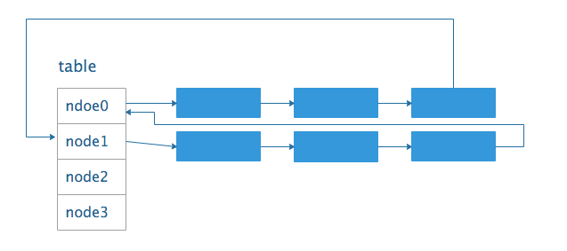

# 高并发程序设计

##  走入并行世界

### Java虚拟机中的线程

除了要执行main函数主线程，还需要做JIT编译，需要做垃圾回收，这三个在jvm里都是一个单独的线程

### 什么是多核CPU

即将多个独立的计算单元整合到单独的CPU中

### 同步和异步

同步方法调用一旦开始，调用者必须等到方法调用返回后，才能继续后续的操作；异步方法通常会在另一个线程中执行，不会阻碍调用者的工作

### 并发和并行

并发和并行都表示两个或者多个任务一起执行，但是侧重点不同，并发偏重于多个任务交替执行，而多个任务有可能还是串型的，并行才是真正意义上的“同时执行”。实际上，在真实环境中，并行只可能出现在拥有多个CPU的系统中

### 临界区

表示一种公共资源（共享数据），可以被多个线程使用，但每一次只能有一个线程使用它，一旦临界区资源被占用，其他线程要想使用这个资源就必须等待

### 饥饿

指某一个线程或多个线程因为种种原因无法获得所需要的资源，导致一直无法执行

### 活锁

线程主动将资源释放给其他资源使用，会导致资源不断地在两个线程间跳动，没有一个线程拿到资源正常执行

### 并发级别

1. 阻塞：一个线程是阻塞的，那么在其  他线程释放资源之前，当前线程无法继续执行
2. 无饥饿：线程之间是有优先级的，线程调度的时候总是会倾向于先满足高优先级的线程（可以参考一下公平锁的原理）
3.  无障碍：是最弱的非阻塞的调度。两个线程如果无障碍地执行，那么不会因为临界区的问题导致一方被挂起

> 大家一起修改共享数据，把数据该坏了怎么办？对于无障碍的线程来说，一旦检测到这种情况，它就会立即对自己所做的修改进行回滚，确保数据安全。

4. 无锁：所有线程都能尝试对临界区进行访问，但不同的是，无锁的并发保证必然有一个线程能够在有限步内完成操作离开临界区

> 在无锁的调用中，一个典型的特点就是可能会包含一个无穷循环。在这个循环中，线程会不断尝试修改共享变量。如果没有冲突，修改成功，那么程序退出，否则继续尝试修改。但无论如何，无锁的并行总能保证有一个线程is victor，不至于all failed，竞争失败的线程必须不断重试，直到自己success，否则会出现类似饥饿的情况

```java
/*无锁示意代码，如果修改不成功，那么循环用不停止*/
while(!atomicVar.compareAndSet(localVar,localVar+1)){
  localVar = atomicVar.get();
}
```

5. 无等待：无等待在无锁的基础上进一步扩展，它要求所有的线程必须在有限步内完成，这样就不会引起饥饿问题，如果超过这个步数，还可以进一步分解为有界无等待和线程无等待等几种，之间的区别只是对循环次数的限制不同

> 无等待的经典结构就是RCU，基本思想是对数据的读不加控制。因此，所有的读线程都是无等待的，它们既不会被锁定等待也不会引起任何冲突。但在写数据的时候，先取得原始数据的副本，接着只修改副本数据，修改完成后，在合适的时机写回数据。

### 有关并行的两个定律

 a. 为了获得更好的性能 b. 需要多个执行实体

>Amdahl定律：当串型化比例一定时，加速比是有上限的，不管堆叠多少个CPU计算，都不能突破这个上线
>
>Gustafson定律：如果可被并行化的代码所占比例足够大，那么加速比就能随着CPU的数量线性增长

### JMM的关键技术点

都是围绕着多线程的原子性、可见性和有序性来建立的

#### 原子性

指一个操作是不可中断的，即使是在多个线程一起执行的时候，一个操作一旦开始，就不会被其他线程干扰

> 对于一个静态变量i，当有两个线程同时赋值时，i的值只能为这两个线程赋的值其中一个，也就是说这两个线程之间是不存在干扰的，在这需要注意的是如果是32位系统，long型数据的读写不是原子性的（long型数据有64位），会存在线程间相互干扰，由于并行的关系，数字被写乱了，或者读串位了

#### 可见性

指当一个线程修改了某一个共享变量的值时，其他线程是否立即知道这个修改。（推荐了解MESI缓存一致性协议）

> Java程序在jdk1.2之前会直接从主内存拿取数据，在之后有了工作内存（即缓存），每次读取值会从工作内存中读取，当写入值的时候就会存在写入工作内存中没有更新主内存的值

#### 有序性

程序在执行时，可能会进行指令重排，重排后的指令与原指令的顺序未必一致。指令重排对于提高CPU处理性能是十分必要的，但是确实带来了乱序的问题

> 符合Happens-Before规则的指令不能重排
> 
> a. 程序顺序原则：一个线程内保证语义的串行性
> 
> b. volatile规则：volatile变量的写先于读发生，保证了可见性
> 
> c. 锁规则：解锁(unlock)必然发生在随后的加锁(lock)前 
> 
> d. 传递性：A先于B，B先于C，则A先于C
> 
> e. 线程的start方法先于它的每一个动作
> 
> f. 线程的所有操作先于线程的终结（Thread.join())
> 
> g. 线程的中断(interrupt)先于被中断程序的代码
> 
> h. 对象构造函数的执行、结束先于finalize()方法

## Java并行程序基础

###  进程和线程

进程是计算机中的程序关于某数据集合上的一次运行活动，是系统进行资源分配和调度的基本单位，是操作系统结构的基础。在早期，进程是程序的基本执行实体，程序是指令、数据及其组织形式的描述，进程是程序的实体，在目前，进程是线程的容器。线程就是轻量级进程，是 程序执行的最小单位，线程间的切换和调度的成本远远小于进程

```java
/**
线程的所有状态
注意：从NEW状态出发后，不能再回到NEW状态，TERMINATED同理
*/
public enum State {
  NWE,//刚刚创建的线程，还没开始执行
  RUNNABLE,//当调用start方法时，线程开始执行
  BLOCKED,//遇到了synchronized同步块
  WAITING,//无时间限制的等待
  TIMED_WAITING,//有时限的等待
  TERMINATED;//线程执行完成
} 
```

### 线程的基本操作

#### 新建线程

```java
Thread t1 = new Thread();
t1.start();
//调用start方法是开启一个线程，而调用run方法只是作为一个普通的方法调用	
```

#### 终止线程

在调用stop方法时，会直接终止线程，并释放这个线程所持有的锁，这些锁恰恰是用来维持对象一致性的。如果此时，写线程写入数据正写到一半，并强行终止，那么对象就会被写坏，同时，由于锁已经被释放，另外一个等待该锁的读线程就顺理成章的读到了这个不一致的对象，悲剧也就此发生。如果要停止一个线程，可以写一个方法来进行一个退出

#### 线程中断

不会使线程立即退出，而是给线程发送一个通知，告知目标线程需要退出。 

```java
public void interrupt();										 	//中断线程 
public boolean isInterrupted();						   	//判断是否被中断
public static boolean interrupted();					//判断是否被中断，并清除
/*如果希望t1在中断后退出，就必须为它增加相应的中断处理代码*/
Thread t1 = new Thread(){
  @Override
  public void run(){
    while(true){
      if(Thread,currentThread().isInterrupted()){
        System.out.println("Interrupted");
        break;
      }
      Thread.yield();
    }
  }
}
```

#### wait和notify

1. 这两个方法是在Object类，表示**任何对象**都可以调用这两个方法

2. 当在一个对象实例上调用wait方法后，当前线程就会在这个对象上等待，并进入阻塞状态，直到其他线程调用notify或者notifyAll方法为止，这时，该对象就成了多个线程之间的有效通信手段

3. wait工作过程：当一个线程调用了object.wait()方法，那么它就会进入object对象的等待队列，这个等待队列中，可能会有多个线程同时等待某一个对象，当object.notify()方法被调用时，会从这个等待队列中**随机**选择一个线程，并将其唤醒。注意：wait方法不能随便调用，必须包含在synchronized语句中，无论是wait还是notify都需要首先获得目标对象的一个监视器。

4. wait方法执行后，会释放监视器，目的是使其他等待在object对象上的线程不至于因为T1的休眠而全部无法执行。线程T2在notify方法调用前，也**必须**获得object对象的监视器，再尝试唤醒一个等待线程，假设唤醒T1，此时T1要做的第一件事就是重新获得obejct对象的监视器，也正是T1在wait方法执行前所持有的那个，**必须获得后才可以继续执行**

5. Object.wait()方法和Thread.sleep()方法都可以让线程等待若干时间，除wait方法可以被唤醒外，另外一个主要的区别就是wait方法会释放目标对象的锁，而**sleep方法不会释放任何资源**

6. suspend和resume

   > suspend在导致线程暂停的同时，并不会释放任何锁资源，其他任何线程想要访问被它占用的锁时，都会被牵连，导致无法正常继续运行，直到对应的线程上进行了resume操作，被挂起的线程才能继续，从而其它所有阻塞在相关锁上的线程也可以继续执行。但是，如果resume在suspend前执行，那么就会导致被挂起的线程很难再继续执行，并且锁不会被释放，导致整个系统工作不正常

#### join和yield

1. join，一个线程的输入可能非常依赖于另一个或者多个线程的输出，这个线程就必须要等待依赖线程执行完毕

   ```java
   /*表示无限等待，会一直阻塞当前线程，直到目标线程执行完毕*/
   public final void join() throws InterruptedExcepton
   /*如果超过给点时间目标线程还在执行，当前线程就会继续执行*/
   public final synchronized void join(long millis) throws InterruptedExcepton
     
   /*join方法的本质是让调用线程wait方法在当前线程对象实例上*/
   while(isAlive()){
     wait(0);
   }
   public class Solution {
       public volatile static int i = 0;
   		public static class AddThread extends Thread{
       @Override
       public void run() {
           Long start = System.currentTimeMillis();
           for (i=0;i<10000000;i++);
           Long end = System.currentTimeMillis();
           System.out.println(end - start);
       }
   }
   
       public static void main(String[] args) throws InterruptedException {
           AddThread addThread = new AddThread();
           addThread.start();
           //调用join方法，即让main线程处于等待(wait)状态，直到调用线程执行完毕方可继续执行
           addThread.join(99); //当end - start > 这个值时，可以看到i的值并非10000000
           System.out.println(i);
       }
   }
   ```

2. yield：使当前线程让出cpu，当前线程在让出cpu后，还会进行cpu资源的争夺

   ```java
   public class Solution {
       public volatile static int i = 0;
       public static class AddThread extends Thread{
       @Override
       public void run() {
           Long start = System.currentTimeMillis();
           for (i=0;i<10000000;i++);
           Long end = System.currentTimeMillis();
           System.out.println(end - start);
       }
   }
   
       public static void main(String[] args) throws InterruptedException {
           AddThread addThread = new AddThread();
           addThread.start();
           //调用yield方法，即让main线程放弃cpu，但调用线程还没有执行完毕就又抢回CPU，导致并未执行完毕
           addThread.yield(); 
           System.out.println(i);
       }
   }
   ```

### 线程组

将具有相同功能的线程放置在一个线程组里

```java
public class ThreadGroupName implements Runnable{
    public static void main(String[] args) {
        ThreadGroup tg = new ThreadGroup("PrintGroup");
        Thread t1 = new Thread(tg,new ThreadGroupName(),"T1");
        Thread t2 = new Thread(tg,new ThreadGroupName(),"T2");
        t1.start();
        t2.start();
        System.out.println(tg.activeCount()); //获得活动线程的总数
        tg.list();//打印这个线程组中所有的线程信息
    }

    @Override
    public void run() {
        String groupAndName = Thread.currentThread().getThreadGroup().getName() +"-"+ Thread.currentThread().getName();
        while (true) {
            System.out.println("I am " + groupAndName);
            try{
                Thread.sleep(3000);
            } catch (InterruptedException e) {
                e.printStackTrace();
            }
        }
    }
}
```

### 守护线程

系统的守护者，在后台默默地完成一些系统性的服务，比如垃圾回收线程，JIT线程就可以理解为守护线程，与之相对应的是用户线程，用户线程可以认为是系统的工作线程，它会完成这个线程应该要完成的业务操作。当一个Java应用内只有守护线程时，JVM就会自动退出

``` java
public class Demo01 {
    public static class DaemonT extends Thread{
        @Override
        public void run() {
            while (true) {
                System.out.println("I am alive");
                try{
                    Thread.sleep(1000);
                }catch (InterruptedException e){
                    e.printStackTrace();
                }
            }
        }
    }

    /**
     * 由于t被设置为守护线程，main为用户线程，所以main休眠2s后退出程序随之结束
     * 如果不设置t为守护线程，那么main线程结束后，t也会不断打印
     * @param args
     * @throws InterruptedException
     */
    public static void main(String[] args) throws InterruptedException {
        Thread t = new DaemonT();
        //t.setDaemon(true);
        t.start();
        Thread.sleep(3000);
    }
```

###  线程优先级

Java中的线程可以有自己的优先级，优先级高的线程在竞争资源时会更有优势（对比非公平锁），更可能抢占资源。

``` java
public final static int MIN_PRIORITY = 1;
public final static int NORM_PRIORITY = 5;    //如果不初始化优先级，则默认为5
public final static int MAX_PRIORITY = 10;    //高优先级总是比低优先级快
```

###  线程安全和synchronized

####  线程安全

多线程编程时的计算机程序代码中的一个概念。线程安全不是指线程的安全，而是内存的安全，因为操作系统都是多任务的，即多个进程同时进行，为了保证安全，每个进程只能访问分配给自己的内存空间，不能访问别的进程的。

在每个进程的内存空间都会有一块特殊的公共内存区域堆（内存），进程内的所有线程都可以访问到该区域，这就是造成问题的潜在原因。所以线程安全指的是，在堆内存中的数据由于可以被任何线程访问到，在没有限制的情况下存在被意外修改的风险。

要让公共区域堆内存中的数据对于每个线程都是安全的，可以使每个线程都拷贝一份数据进行处理从而不影响其它线程（参考ThreadLocal）。

####  synchronized

实现线程间的同步，对需要同步的代码加锁，使得每次只能有一个线程进入同步块，从而保证线程间的安全性。

用法：

1. 指定加锁对象：对给定对象加锁，进入同步代码前要获得给定对象的锁
2. 直接作用于实例方法：相当于对当前实例加锁，进入同步代码前要获得当前实例的锁
3. 直接作用于静态方法，相当于对当前类加锁，进入同步代码前要获得当前类的锁

``` java
public class AccountSync implements Runnable{
  static int i = 0;
  public synchronized void increase(){
    i++;
  }
  @Override
  public void run(){
    for(int i = 0 ; i < 10000000; increase() ,i++);
  }
  /*该程序新new了两个线程，这两个线程各有自己的对象锁，线程安全是无法保证的，可以将increase方法设为类方法，即对类加锁*/
  public static void main((String[] args){
    Thread t1 = new Thread(new AccountSync());
    Thread t2 = new Thread(new AccountSync());
    t1.start();t2.start();
    t1.join();t2.join(); //需要main等t1,t2执行完成后再退出，让main处于阻塞状态
    System.out.println(i);
  }
}
```

###  并发下的ArrayList

```java
public class Solution {
    static ArrayList<Integer> list = new ArrayList<>(10);
    public static class AddThread implements Runnable {
        @Override
        public void run() {
            for (int i = 0; i < 1000; list.add(i), i++) ;
        }

        public static void main(String[] args) throws InterruptedException {
            Thread t1 = new Thread(new AddThread());
            Thread t2 = new Thread(new AddThread());
            t1.start();
            t2.start();
            t1.join();
            t2.join(); //需要main等t1,t2执行完成后再退出
            System.out.println(list.size());
        }
    }
}
```

当使用t1和t2两个线程同时对HashMap进行put操作时，会出现3种情况：

1. 程序正常结束，即使并行程序有问题，也未必每次都会表现出来
2. 抛出异常ArrayIndexOutOfBoundsException，这是因为ArrayList在扩容过程中，内部一致性被破坏，但由于没有锁的保护，另外一个线程访问到了不一致的内部状态，出现异常
3. 输出的值与预期的值不一样

###  诡异的HashMap

当使用t1和t2两个线程同时对HashMap进行put操作时，会得到以下三种情况：

1. 程序正常结束，结果符合预期
2. 程序正常结束，结果不符合预期
3. 程序永远无法结束

打开jstack工具显示程序的线程信息，可以发现线程都处于Runnable状态，并且当前执行语句为put方法的的498行，可以发现由于多线程的冲突，这个链表的结构遭到了破坏，链表成环，此时通过next引用遍历，将形成死循环。

```java
for(Entry<K,V> e = table[i]; e != null ; e = e.next){...}
```



## JDK并发包

###  同步控制

同步控制是并发程序必不可少的重要手段。

####  重入锁

重入锁可以完全替代关键字synchronized。在5.0之前，重入锁的性能远远优于synchronized，从6.0开始，synchronized做了大量优化，使得两者的性能差距并不大，重入锁使用java.util.concurrent.locks.ReentrantLock类来实现

```java
public static ReentrantLock lock = new ReentrantLock();
lock.lock();
...
lock.unlock(); 
```

重入锁有显示的操作过程，开发人员必须手动指定何时加锁，何时释放锁，之所以叫重入锁，是因为这种锁对于同一个线程来说是可以反复进入的

```java
/*因此上面代码可以修改*/
public static ReentrantLock lock = new ReentrantLock();
lock.lock();
lock.lock();
...
lock.unlock(); 
lock.unlock();
```

在这种情况下，一个线程连续两次获得同一把锁是允许的，否则将会和自己产生死锁，程序就会卡死在第2次申请锁的过程中。

#####  中断响应

对于关键字synchronized，如果一个线程在等待锁，那么结果只有两种情况，要么获得锁继续执行，要么保持等待，如果是重入锁，还有另一种可能就是线程可以被中断，即在等待锁的过程中，可以根据需要取消对锁的请求

#####  锁申请等待限时

可以使用lock.tryLock(long time, TimeUnit unit)对锁进行一次限时的等待，如果超过这个时间还没有拿到锁就会让线程自动放弃，如果不设置参数即立即申请并且线程不等待，成功返回true，否则返回false

#####  公平锁

会按照时间的先后顺序，保证先到者先得，不会产生饥饿现象，只要排队，就会等到资源，synchronized是不支持公平锁的，重入锁允许我们对其公平性进行设置

```java
public ReetrantLock(boolean fair) //true为公平锁，默认为非公平，因为需要维护一个有序队列，需要消耗资源
```

#####  三个要素

1. 原子状态，使用CAS操作来存储当前锁的状态，判断锁是否已经被别的线程持有了
2. 等待队列，所有没有请求到锁的线程，会进入等待队列进行等待，待有线程释放锁后，系统就能从等待队列中唤醒一个线程继续工作
3. 阻塞原语park和unpark，用来挂起和恢复线程，后面介绍

####  Condition

```java
void await();//使当前线程等待，同时释放当前锁，类似于wait需要signal或signalAll
void awaitUninterruptibly();//类似于await，不会响应中断
long awaitNanos(long nanosTimeOut);
boolean wait(long time,TimeUnit unit);
boolean wait(Date deadline);
void signal();//唤醒一个线程
void signalAll();
```

####  信号量

信号量为多线程协作提供了更为强大的控制方法，从广义上来说，信号量是对锁的扩展，无论是内部锁synchronized还是重入锁ReentrantLock，一次都只允许一个线程访问一个资源，而信号量却可以指定多个线程同时访问某一个资源。

``` java
public Semapore(int permits);
public Semapore(int permits, boolean fair);
```

信号量的主要逻辑方法

``` java
public void acquire();//获得一个准入的许可，若无法获得，则会持续等待
public void acquireUninterruptibly();//不相应中断
public boolean tryAcquire();//尝试获得一个许可，如果成功返回true
public boolean tryAcquire(long timeout, TimeUnit unit);
public void release();//在线程访问资源结束后释放一个许可
```

```java
package Test;


import java.util.ArrayList;
import java.util.Vector;
import java.util.concurrent.ExecutorService;
import java.util.concurrent.Executors;
import java.util.concurrent.Semaphore;
import java.util.concurrent.locks.Condition;
import java.util.concurrent.locks.ReentrantLock;

/**
 *
 */
public class Demo01 implements Runnable{

    final Semaphore semp = new Semaphore(5);//声明了包含5个许可的信号量。

    @Override
    public void run() {
      /*程序会限制执行try里面的线程数*/
        try{
            semp.acquire();
            Thread.sleep(2000);
            System.out.println(Thread.currentThread().getId() + ":done!");
        }catch (InterruptedException e) {
            e.printStackTrace();
        }finally {
            semp.release();
        }
    }

    public static void main(String[] args) {
        ExecutorService exec = Executors.newFixedThreadPool(20);
        final Demo01 demo  = new Demo01();
        for (int i = 0; i < 20; i++) {
            exec.submit(demo);
        }
    }
}
```

####  读写锁ReadWriteLock

假如线程A1、A2、A3进行写操作，B1、B2、B3进行读操作。读写锁允许多个线程同时读，使得B1、B2、B3之间并行，但是考虑到数据完整性，写写操作和读写操作间依然是需要相互等待和持有锁的。

- 读-读：不阻塞
- 读-写：读阻塞写，写阻塞读
- 写-写：写写阻塞

####  Guava和RateLimiter

Guava是Google下的一个核心库，提供了一大批设计精良、使用方便的工具类。

RateLimiter是一款限流工具，任何应用和模块组件都有一定的访问速率上限，如果请求速率突破了这个上限，不但多余的请求无法处理，甚至会压垮系统使所有的请求均无法有效处理。

漏桶算法：利用一个缓存区，当有请求进入系统时，无论请求的速率如何，都先在缓存区内保存，然后以固定的流速流出缓存区进行处理。特点是无论外部请求压力如何，漏桶算法总是以固定的流速处理数据，漏桶的容积和流出的速率是该算法的两个重要参数。

令牌桶算法：反向的漏桶算法，该桶中存放的不是请求而是令牌，处理程序只有拿到令牌后才能对请求进行处理，如果没有令牌，那么处理程序要么等待令牌，要么丢弃请求。为了限制流速，该算法在每个单位时间产生一定量的令牌存入桶中。RateLimiter的设计思想就是采用了令牌桶。

###  线程池

线程池就是对线程的有效管理（线程复用），避免频繁开启和关闭线程时消耗系统的性能。当需要使用线程的时候可以从池子里拿一个空闲线程，完成后将该线程归还到线程池中，以便他人使用。即创建线程变成了从线程池获得空闲线程，关闭线程变成了向线程池归还线程。

Executor框架提供了各种类型的线程池：

```java
public static ExecutorService newFixedThreadPool(int nThreads);
public static ExecutorService newSingleThreadExecutor();
public static ExecutorService newCachedThreadPool();
public static ScheduledExecutorService newSingleThreadScheduledExecutor();
public static ScheduledExecutorService newScheduledThreadPool(int corePoolsize);
```

- newFixedThreadPool()：返回一个固定线程数量的线程池，该线程池中的线程数量始终不变。当有新任务提交时，线程池中若有空闲线程，则立即执行，若没有，则暂存在任务队列中，直到有线程空闲，再处理任务队列中的任务。
- newSingleThreadPool()：返回一个只有一个线程的线程池。
- newCacheThreadPool()：该方法返回一个可根据实际情况调整线程数量的线程池。线程池的线程数量不稳定，但若有空闲线程可以复用，则会优先使用可复用的线程。若所有线程都在工作，又有新的任务提交，则会创建新的线程处理任务，所有线程在当前任务执行完毕后，将返回线程池进行复用。
- newSingleThreadScheduledExecutor()：返回一个ScheduledExecutorService对象，线程池大小为1，该接口扩展了在给定时间执行某任务的功能。
- newScheduledThreadPool()：可以指定数量。

####  核心线程池的内部实现

无论是newFixedThreadPool()、newSingleThreadExecutor()还是newCachedThreadPool()，它们创建的线程有着完全不同的功能特点，但是内部实现均使用了ThreadPoolExecutor类。

```java
public ThreadPoolExecutor(int corePoolSize，int maximumPoolSize, long keepAliveTime, TimeUnit unit, BlockingQueue<Runnable> workQueue, ThreadFactory threadFactory, RejectExecutionHandler handler);
/*
corePoolSize :指定了线程中的线程数量；
maximumPoolSize :指定了线程池中的最大线程数量；
keepAliveTime :当线程池线程数量超过corePoolSize时，多余的空闲线程的存活时间；
unit :keepAliveTime的单位；
workQueue :任务队列，被提交但尚未被执行的任务；
threadFactory :线程工厂，用于创建线程，一般用默认的；
handler :拒绝策略，当任务太多时来不及处理，如何拒绝任务。
*/
```

#####  workQueue

- 直接提交的队列：SynchronousQueue，没有容量，每一个插入操作都要等待一个对应的删除操作，反之亦成立。如果使用该队列，则提交的任务不会被真实地保存，而总是将新任务提交给线程执行，如果没有空闲的进程，则尝试创建新的进程，如果进程数量已经达到最大，则执行拒绝策略。注意，若使用该队列，请将最大线程数量调至尽可能大，否则很容易执行拒绝策略。
- 有界的任务队列：ArrayBlockingQueue，该类构造函数必须带一个容量参数，表示该队列的最大容量。当使用该队列时，若有新的任务需要执行，如果线程池的实际线程数小于corePoolSize，则会优先创建新的线程，若大于，则会将新任务加入等待队列。若等待队列已满，则在总线程数不大于max的前提下，创建新的线程执行任务。若大于，则执行拒绝策略。
- 无界的任务队列：LinkedBlockingQueue，与有界队列相比，除非系统的资源耗尽，否则无界的任务队列不存在任务入队失败的情况。当有新的任务到来时，系统的线程数小于corePoolSize时，线程池会生成新的线程执行任务，但当系统的线程达到corePoolSize时，就不会继续增加了。若后续仍有新的任务加入，而又没有空闲的线程资源，则任务直接进入队列等待。若任务创建和处理的速度差异较大，无界队列会保存快速增长，直到耗尽系统资源。
- 优先任务队列：PriorityBlockingQueue，可以根据任务自身的优先级顺序先后执行，在确保系统性能的同时，也能有很好的质量保证。

#####  回顾

```java
newFixedThreadPool:
return new ThreadPoolExecutor(nTHreads, nThreads, 0L, TimeUnit.MILLISECONDS);
newSingleThreadExecutor:
return new ThreadPoolExecutor(1, 1, 0L, TimeUnit.MILLISECONDS,new LinkedBlockingQueue<Runnable>());
newCachedThreadPool:
return new ThreadPoolExecutor(0, Integer.MAX_VALUE, 60L, TimeUnit.SECONDS, new SynchronousQueue<Runnable>());
```

#####  线程池的核心调度

```java
public void execute(Runnable command){
  if (command == null) throw new NullPointerException();
  int c = ctl.get();
  /*当线程总数小于core时，会将任务通过addWorker方法直接调度执行*/
  if (workerCountOf(c) < corePoolSize) {
    if (addWorker(command, true)) return ;
    c = ctl.get();
  }
  /*否则就会offer进入等待队列*/
  if (isRunning(c) && workQueue.offer(command)) {
    int recheck = ctl.get();
    if (! isRunning(recheck) && remove(command)) {
      reject(command);
    }else if (workerCountOf(recheck) == 0) {
      addWorker(null, false);
    }
    /*如果进入等待队列失败就会执行拒绝策略*/
  }else if(!addWorker(command, false)) reject(command);
}
```

####  拒绝策略

拒绝策略是系统超负荷运行时的补救措施，通常由于压力太大而引起的，也就是线程池中的线程已经用完了，并且等待队列也无法放下新任务。

- AbortPolict：直接抛出异常，阻止系统正常工作。
- CallerRunsPolicy：只要线程池未关闭，该策略直接在调用线程中，运行当前被丢弃的任务。
- DiscardOldestPolicy：丢弃最老的一个请求，即马上执行的任务。
- DiscardPolicy：丢弃无法处理的任务，不予任何处理。

##  JDK的并发容器

###  简介

- ConcurrentHashMap：高效的并发HashMap，线程安全的HashMap。
- CopyOnWriteArrayList：在读多写少的场合，这个List的性能远远优于Vector。
- ConcurrentLinkedQueue：线程安全的LinkedList。
- BlockingQueue：是一个接口，JDK内部通过链表、数组等方式实现了这个接口。
- ConcurrentSkipListMap：跳表。

###  线程安全的HashMap

####  Collections加锁

```java
public static Map m = Collections.synchronizedMap(new HashMap());
//会生成一个名为SynchronizedMap的Map，它使用委托，将自己所有的Map相关的功能交给传入的HashMap实现，而自己则主要负责线程安全。
private static class SynchronizedMap<K,V> implements Map<K,V>,serializable{
  private final Map<K,V> m;    //Backing map
  final Object  mutex;         //Object on which to synchronize;
}
/*对于get方法，实现如下*/
public V get(Object key) {
  synchronized (mutex) {
    return m.get(key);
  }
}
/*可以得出它在多线程环境中的性能并不算太好，无论是对Map的读取或写入，都要获得mutex的锁*/
```

####  ConcurrentHashMap

内部进一步分成了若干个小的HashMap，称之为段（SegMent）。默认情况下，可以分为16个段。如果需要在ConcurrentHashMao类中增加一个新的表项，并不是将整个HashMap加锁，而是首先根据hashCode得到该表项应该被存放在哪个段中，然后对该段加锁，并完成put操作。在多线程环境中，如果多个线程同时进行put操作，只要被加入的表项不存放在同一个段中，线程间便可以做到真正的并行。

```java
public V put (K key, V value) {
  Segment<K,V> s;
  if (value == null) throw new NullPointerException();
  int hash = hash(key);
  int j = (hash >>> segmentShift) & segmentMask;
  if ((s = (segment<K,V)UNSAFE.getObject(segments, (j >> SSHFT) + SBASE)) == null)
    s = ensureSegment(j);
  return s.put(key, hash, value, false);
}
```

###  CouncurrentLinkedQueue

Node定义如下

```java
private static class Node<E> {
  volatile E item;
  volatile Node<E> next;
}
```

对Node进行操作时，使用到了CAS

```java
boolean casItem(E cmp, E val) {
	return UNSAFE.compareAndSwapObject(this, itemOffset, cmp, val);
}
/*表示设置当前Node的item值，需要两个参数，第一个是期望值，第二个为目标值。*/
```

offer方法

```java
public boolean offer(E e) {
  checkNotNull(e);
  final Node<E> newNode = new Node<E>(e);
  for (Node<E> t = tail, p = t;;) {
    Node<E> q = p.next;
    if (q == null ) {
      //p是最后一个节点
      if(p.casNext(null, newNode)) {
        if(p != t) {
          casTail(t, newNode);
        }
         return true;
      }
    }
      else if(p == q) {
        p = (t != (t = tail)) ? t :head;
      }else {
        p = (p != t && t != (t = tail)) ? t : q;
    }
  }
}

```

###  CopyOnWriteArrayList

对于该类来说，读诗不需要加锁的，写入也不会阻塞读取操作，只有写入和写入之间需要进行同步等待。在写入操作时，会进行一次自我复制，当list需要修改时，并不修改原有的内容，而是对原有的数据进行一次复制，将修改的内容写入副本中，再用副本替换掉原来的数据。

```java
private volatile transient Object[] array;
public E get(int index) {
  return get(getArrray(), index);
}
final Object[] getArray() {
  return array;
}
private E get(Object[] a, int index) {
  return (E) a[index];
}
/*读取操作没有任何同步控制和锁操作，理由是内部数组array不会发生修改*/

public boolean add(E e) {
  final ReentrantLock lock = this.lock;
  lock.lock();
  try{
    Object[] elements = getArray();
    int len = elements.length;
    /*将元素复制过来并且加入newElements*/
    Object[] newElements = Arrays.copyOf (elements, len+1);
    newElements[len] = e;
    /*array是volatile的，所以线程可以立即察觉到修改*/
    setArray(newElements);
    return true;
  }finally{
    lock.unlock();
  }
}  
```

## 锁的优化和注意事项

###  建议

####  减少锁持有时间

只在必要时进行同步，这样就能明显减少线程持有锁的时间，提高系统的吞吐量。

####  减小锁粒度

即减小锁定对象的范围，从而降低锁冲突的可能性，今儿提供系统的并发能力。对比ConcurrentHashMap、表锁-->行锁。

####  读写分离锁来替换独占锁

减小锁粒度是通过分割数据结构实现的，读写分离锁是通过对系统功能点的分割实现的。

####  锁粗化

虚拟机在遇到一连串连续地对同一个锁不断进行请求和释放的操作时，便会把所有的锁操作整合成对锁的一次请求，从而减少对锁的请求同步的次数。

```java
for(int i = 0 ; i < size; i++) {
  synchronized(lock) {
    ...
  }
}
/*意味着每次循环都要申请锁释放锁*/
synchronized(lock) {
  for(int i = 0; i < size; i++) {
    ...
  }
}
```

###  JVM中的锁优化

####  锁偏向

核心思想是如果一个线程获得了锁，那么锁就会进入偏向模式。当这个线程（只针对同一线程）再次请求锁时，无须再做任何同步操作。这样就节省了大量有关锁申请的操作，从而提高了程序性能。（在JVM参数中进行配置）

####  轻量级锁

如果偏向锁失败，那么虚拟机并不会立即挂起线程，将会使用一种称为轻量级锁的优化手段。简单的将对象头部作为指针指向持有锁的线程堆栈的内部，来判断一个线程是否持有对象锁。如果获得轻量级锁成功，则可以顺利进入临界区。如果轻量级锁加锁失败，那么就会膨胀为重量级锁。

####  自旋锁

当前线程暂时无法获得锁，而且什么时候可以获得锁是一个未知数，那么挂起一个线程将是得不偿失的操作，系统假设在不久的将来，线程可以得到这把锁。因此，虚拟机会让当前线程做几个空循环（自旋），在经过若干次循环后，如果可以得到锁，那么就顺利进入临界区，否则就会被挂起。

####  锁消除

是一种更彻底的锁优化，在JIT编译时，通过对运行上下文的扫描，去除不可能存在共享资源竞争的锁。通过锁消除，可以节省毫无意义的请求锁时间。

```java
public String[] createStrings() {
  Vector<String> v= new Vector<String>();
}
```

可以看出，v是一个单纯的局部变量，而局部变量是在线程栈上分配的，属于私有数据，不可能被其它线程访问，在这种情况下，内部所有加锁同步都是没有必要的。如果虚拟机检测到这种情况，那么就会将无用的锁操作去除。这涉及到一种技术为逃逸分析，逃逸分析就是观察某一变量是否会逃出某一作用域。

###  ThreadLocal

假设有100个人，一支笔，那我就需要想的是让每个人都想好自己要写的东西，再给他发笔，以防拿到笔后不知道做什么，这就是锁的思路。那么，我给每人一支笔就是ThreadLocal。

####  实现原理

set

```java
public void set(T value) {
  Thread t = Thread.currentThread();
  ThreadLocalMap map = getMap(t); //先获取这个线程的map
  if(map != null)  
    map.set(this, value); //放值进去，key为当前线程
  else
    createMap(t, value);
}
```

get

```java
public T get() {
  Thread t = Thread.currentThread();
  ThreadLocalMap map = getMap(t);
  if (map != null) {
    ThreadLocalMap.Entry e = map.getEntry(this);
    if (e != null) 
      return (T)e.value;
  }
  return setInitialValue();
}
```

ThreadLocalMap是一个类似HashMap的东西，更准确地说是类似WeakHashMap。ThreadLocalMap的实现使用了弱引用，弱引用是比强引用弱得多的引用，JVM载垃圾回收时，如果发现弱引用，就会立即回收。ThreadLocalMap内部由一系列Entry构成，每一个Entry都是WeakReference<ThreadLocal>。

```java
static class Entry extends WeakReference<ThreadLocal> {
  Object value;
  Entry(ThreadLocal k, Object v) {
    super(k);
    value = v;
  }
}
```

####  对性能的帮助

为每一个线程分配一个独立的对象对系统性能**也许**是有帮助的。当然，如果共享对象对于竞争的处理容易引起性能损失，我们还是应该考虑使用ThreadLocal为每个线程分配单独的对象。

###  无锁

####  CAS（Compare and Swap）：比较交换

与锁相比，使用比较交换会使程序看起来更加复杂一些，但由于其非阻塞性，它对死锁问题天生免疫，并且线程间的相互影响也远远比基于锁的方式要小。更为重要的是，使用无锁的方式完全没有锁竞争带来的系统开销，也没有线程间频繁调度带来的开销，因此，它要比基于锁的方式拥有更优越的性能。

它包含三个参数CAS(V, E, N)，其中V表示要更新的变量，E表示预期值，N表示新值。仅当V等于E时，才会将V的值设为N，如果V值和E值不同，说明已经有其他线程做了更新，则当前线程什么都不做，并且返回当前V的真实值。失败的线程不会被挂起，仅是被告知失败，并且允许再次尝试，当然也允许失败的线程放弃操作。

####  AtomicInteger：无锁的线程安全整数

该类就是使用CAS操作的线程安全的类型，与Integer不同，它是可变的，并且是线程安全的，对其进行修改等任何操作都是用CAS指令进行的。

```java
private volatile int value;             //使用volatile来保证可见性
private static final long valueOffset;  //保存着value字段在AtomicInteger对象中的偏移量
/*当前值加1，返回旧值，会一直尝试更新，直至成功*/
public final int incrementAndGet() {
  for (;;) {
    int current = get();
    int next = current + 1;
    if (compareAndSet(current, next)) 
      return next
  }
}
```

####  Java中的指针：sum.misc.Unsafe

首先看一下incrementAndGet()中的compareAndSet()方法的实现。

```java
public final boolean compareAndSet(int expect, int update) {
  /*该方法是一个本地方法*/
  return unsafe.compareAndSwapInt(this, valueOffset, expect, update);
}

```

虽然Java抛弃了指针，但是在关键时刻，类似指针的技术还是不可少的。这里的底层Unsafe类实现就是最好的例子，但是我们并不能获取到这个实例。

```java
public static Unsafe getUnsafe() {
  Class cc = Reflection.getCallerClass();
  if (cc.getClassLoader() != null) 
    throw new SecurityException("Unsafe");
  return theUnsafe;
}
```

根据类加载器的原理，应用程序的类由AppLoader加载，而系统核心类由Boostrap类加载，Bootstrap类加载器没有Java对象的对象，因此试图获得这个类加载器会返回null。所以当一个类的类加载器为null时，说明它是由Bootstrap类加载器加载的。

### AtomicReference

AtomicReference是对应的普通的对象引用，它可以保证在修改对象引用时的线程安全性。当前对象的值，不仅取决于当前值，还和对象的过程变化有关，这时AtomicReference就无能为力了。

比方说有一家蛋糕店，为了挽留客户，决定为贵宾卡里余额小于20的客户一次并且一次性赠送20元，如果使用AtomicReference就会导致当客户消费后小于20元则会继续充值。

```java
public class Main{
    static AtomicReference<Integer> money = new AtomicReference<>();
    static {
        money.set(19);
    }
    public static void main(String[] args) {
        for (int i = 0; i < 3; i++) {
            new Thread() {
                @Override
                public void run() {
                    while(true) {
                        while (true) {
                            Integer m = money.get();
                            if(m < 20) {
                                if(money.compareAndSet(m, m+20)) {
                                    System.out.println("充值成功，余额:" + money.get()+"yuan");
                                    break;
                                }
                            }else{
                                money.compareAndSet(m, m-20);
                                System.out.println("消费成功，余额:" + money.get() + "yuan");
                                break;
                            }
                        }
                    }
                }
            }.start();
        }

    }
}
```

可以使用AtomicStampedReference代替AtomicReference

###  死锁

####  死锁产生条件

- 互斥条件：指线程对已经获取到的资源进行排他性使用，即该资源同时只由一个线程占用。如果此时还有其他线程请求获取资源，则请求者只能等待，直至占有该资源的线程释放该资源。
- 请求并持有条件：指一个线程已经持有了至少一个资源，但又提出了新的资源请求，而新资源已被其他线程占有，所以当前线程会被阻塞，但被阻塞的同时并不释放自己获取资源。
- 不可剥夺条件：指线程获取到的资源在自己使用完之前不能被其他线程抢占，只有在自己使用完毕后才会释放。
- 环路等待条件：指在死锁时，必须存在一个线程---资源的环形链，即T0等待T1、T1等待T2.....Tn等待T0。

可以使用jps命令得到Java进程的iD，接着使用jstack得到线程的线程堆栈。